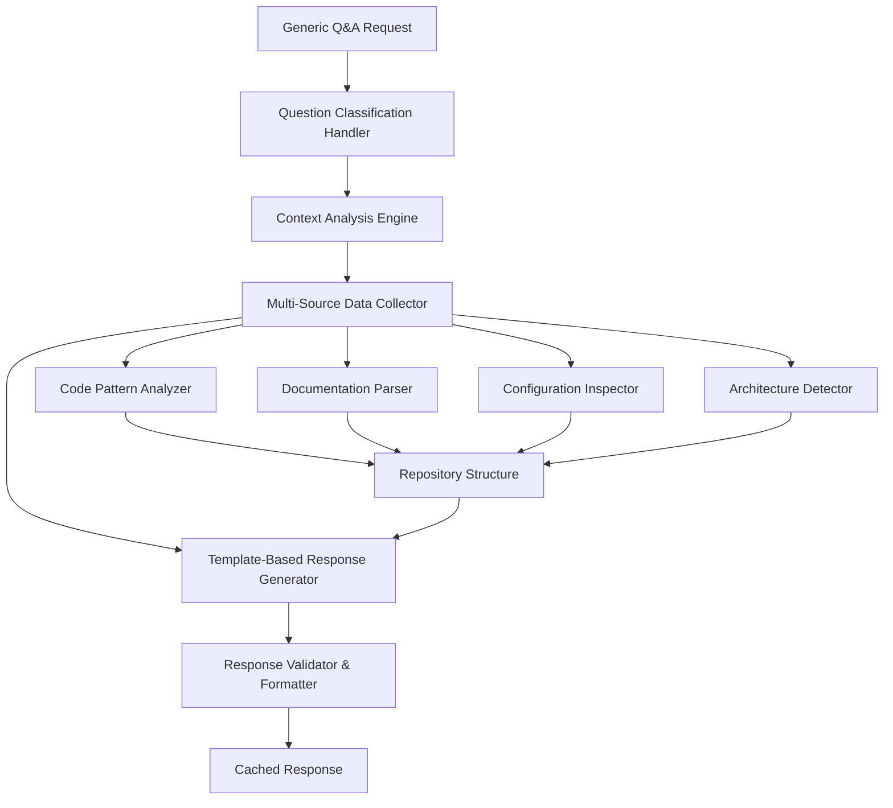

# Implementation Plan: AI Agent for Generic Project Q&A

**Issue Type:** Feature Enhancement  
**Priority:** High  
**Complexity:** Medium  
**Estimated Development Time:** 5-7 days  
**Created:** August 11, 2025  

## Overview

This implementation plan outlines the development of an AI Agent that can automatically answer generic project questions based on the framework defined in `docs/Q&A/generic-project-qa-template.md`. The agent will analyze the knowledge graph repository and provide intelligent, context-aware responses to common project architecture and implementation questions.

## Business Justification

The current Knowledge Graph Agent can answer specific technical questions about indexed codebases, but lacks the ability to provide structured responses to common architectural and implementation questions that developers frequently ask about projects. This enhancement will:

- **Reduce Onboarding Time**: New developers can get comprehensive project understanding instantly
- **Standardize Documentation**: Ensure consistent, up-to-date answers to common questions
- **Improve Developer Experience**: Provide immediate access to architectural decisions and implementation patterns
- **Enhanced Code Intelligence**: Bridge the gap between code analysis and business context understanding

## Requirements Analysis

### Core Functional Requirements

1. **Generic Question Processing**: Parse and understand 5 categories of generic questions
2. **Intelligent Context Analysis**: Analyze repository structure, code patterns, and documentation
3. **Structured Response Generation**: Provide comprehensive, well-formatted answers
4. **Template-Based Framework**: Support extensible question templates for different project types
5. **Integration with Existing System**: Seamlessly integrate with current RAG architecture

### Technical Requirements

1. **LangGraph Workflow Integration**: New workflow for generic Q&A processing
2. **Template Engine**: Configurable question templates with dynamic content generation
3. **Multi-Source Analysis**: Combine code analysis, documentation parsing, and configuration inspection
4. **Response Caching**: Cache generated responses for performance optimization
5. **API Endpoint Extension**: New REST endpoints for generic Q&A functionality

## Architecture Design

### High-Level Architecture



### Component Structure

```
src/
├── agents/
│   └── generic_qa/
│       ├── __init__.py
│       ├── question_classifier.py      # Classify questions into 5 categories
│       ├── context_analyzer.py         # Analyze repository context
│       ├── template_engine.py          # Generate responses from templates
│       └── response_formatter.py       # Format and validate responses
├── workflows/
│   └── generic_qa_workflow.py          # LangGraph workflow orchestration
├── analyzers/
│   ├── architecture_detector.py        # Detect project architecture patterns
│   ├── business_capability_analyzer.py # Analyze business domain
│   ├── api_endpoint_analyzer.py        # Analyze API structure
│   ├── data_model_analyzer.py          # Analyze data persistence patterns
│   └── operational_analyzer.py         # Analyze deployment and ops patterns
├── templates/
│   ├── dotnet_clean_architecture.json  # Template for .NET Clean Architecture
│   ├── react_spa.json                  # Template for React SPA projects
│   ├── python_fastapi.json             # Template for Python FastAPI projects
│   └── generic_template.json           # Fallback generic template
└── api/
    └── routes/
        └── generic_qa.py               # REST API endpoints
```

## Implementation Plan

### Phase 1: Foundation Components (Days 1-2)

#### 1.1 Question Classification System
**Location**: `src/agents/generic_qa/question_classifier.py`

```python
class QuestionClassifier:
    """Classifies generic questions into predefined categories"""
    
    QUESTION_CATEGORIES = {
        "business_capability": ["business", "domain", "entities", "scope"],
        "api_endpoints": ["endpoints", "routes", "API", "REST", "HTTP"],
        "data_modeling": ["database", "persistence", "data", "entities"],
        "workflows": ["workflow", "process", "operation", "create", "update"],
        "architecture": ["architecture", "layers", "structure", "deployment"]
    }
    
    async def classify_question(self, question: str) -> QuestionCategory:
        """Use LLM to classify question into one of 5 categories"""
        
    async def extract_question_intent(self, question: str) -> QuestionIntent:
        """Extract specific intent and context from question"""
```

#### 1.2 Architecture Detection Engine
**Location**: `src/analyzers/architecture_detector.py`

```python
class ArchitectureDetector:
    """Detects project architecture patterns from repository structure"""
    
    async def detect_architecture_pattern(self, repo_path: str) -> ArchitecturePattern:
        """Detect Clean Architecture, MVC, Microservices, etc."""
        
    async def analyze_project_structure(self, repo_path: str) -> ProjectStructure:
        """Analyze folder structure, dependencies, and patterns"""
        
    async def identify_technology_stack(self, repo_path: str) -> TechnologyStack:
        """Identify languages, frameworks, and tools used"""
```

#### 1.3 Template Engine Foundation
**Location**: `src/agents/generic_qa/template_engine.py`

```python
class TemplateEngine:
    """Generates responses using configurable templates"""
    
    async def load_template(self, architecture_type: str) -> QuestionTemplate:
        """Load appropriate template based on detected architecture"""
        
    async def generate_response(self, 
                              question_category: str, 
                              context_data: dict, 
                              template: QuestionTemplate) -> str:
        """Generate structured response using template and context"""
```

### Phase 2: Analysis Components (Days 3-4)

#### 2.1 Business Capability Analyzer
**Location**: `src/analyzers/business_capability_analyzer.py`

**Key Functions:**
- Analyze README and documentation for business domain
- Extract core entities from code models
- Identify bounded contexts and service boundaries
- Determine ID strategies and multi-tenancy patterns
- Analyze domain events and business rules

#### 2.2 API Endpoint Analyzer
**Location**: `src/analyzers/api_endpoint_analyzer.py`

**Key Functions:**
- Parse controller/route files to extract endpoints
- Analyze HTTP methods, status codes, and response patterns
- Identify pagination, filtering, and sorting strategies
- Extract authentication and authorization patterns
- Document API versioning and error handling approaches

#### 2.3 Data Model Analyzer
**Location**: `src/analyzers/data_model_analyzer.py`

**Key Functions:**
- Analyze entity models and data structures
- Identify persistence patterns (EF Core, Dapper, etc.)
- Extract repository and UoW patterns
- Analyze concurrency control strategies
- Document transaction and consistency patterns

#### 2.4 Operational Analyzer
**Location**: `src/analyzers/operational_analyzer.py`

**Key Functions:**
- Analyze Dockerfile and deployment configurations
- Extract logging, monitoring, and health check patterns
- Identify security implementations
- Document testing strategies
- Analyze CI/CD pipeline configurations

### Phase 3: LangGraph Workflow Integration (Day 5)

#### 3.1 Generic Q&A Workflow
**Location**: `src/workflows/generic_qa_workflow.py`

```python
class GenericQAWorkflow(BaseWorkflow):
    """LangGraph workflow for processing generic questions"""
    
    async def classify_question_step(self, state: WorkflowState) -> WorkflowState:
        """Step 1: Classify the incoming question"""
        
    async def analyze_context_step(self, state: WorkflowState) -> WorkflowState:
        """Step 2: Analyze repository context based on question type"""
        
    async def generate_response_step(self, state: WorkflowState) -> WorkflowState:
        """Step 3: Generate structured response using templates"""
        
    async def validate_and_format_step(self, state: WorkflowState) -> WorkflowState:
        """Step 4: Validate and format the final response"""
```

#### 3.2 Workflow State Management

```python
@dataclass
class GenericQAState:
    question: str
    question_category: str
    question_intent: dict
    repository_context: dict
    architecture_pattern: str
    analysis_results: dict
    generated_response: str
    formatted_response: dict
    confidence_score: float
    processing_metadata: dict
```

### Phase 4: API Integration (Day 6)

#### 4.1 REST API Endpoints
**Location**: `src/api/routes/generic_qa.py`

```python
@router.post("/generic-qa/ask", response_model=GenericQAResponse)
async def ask_generic_question(request: GenericQARequest) -> GenericQAResponse:
    """Process a generic project question and return structured response"""

@router.get("/generic-qa/templates", response_model=List[TemplateInfo])
async def list_available_templates() -> List[TemplateInfo]:
    """List available question templates for different project types"""

@router.post("/generic-qa/analyze-project", response_model=ProjectAnalysis)
async def analyze_project_structure(repo_identifier: str) -> ProjectAnalysis:
    """Analyze project structure and return detected patterns"""

@router.get("/generic-qa/categories", response_model=List[QuestionCategory])
async def get_question_categories() -> List[QuestionCategory]:
    """Get list of supported question categories with examples"""
```

#### 4.2 Request/Response Models

```python
class GenericQARequest(BaseModel):
    question: str = Field(..., description="Generic project question")
    repository_identifier: str = Field(..., description="Repository to analyze")
    preferred_template: Optional[str] = Field(None, description="Preferred response template")
    include_code_examples: bool = Field(True, description="Include code examples in response")

class GenericQAResponse(BaseModel):
    question: str
    question_category: str
    repository_context: ProjectContext
    structured_response: dict
    confidence_score: float
    sources: List[str]
    processing_time_ms: int
    template_used: str
```

### Phase 5: Template Configuration (Day 7)

#### 5.1 Template Structure
**Location**: `src/templates/`

Each template will be a JSON configuration defining:
- Question categories and prompts
- Analysis requirements for each category
- Response structure and formatting
- Code example templates
- Validation rules

#### 5.2 Example Template Structure

```json
{
  "template_name": "dotnet_clean_architecture",
  "architecture_patterns": ["Clean Architecture", "DDD", "CQRS"],
  "question_categories": {
    "business_capability": {
      "analysis_requirements": [
        "domain_models",
        "bounded_contexts",
        "aggregate_roots",
        "domain_events"
      ],
      "response_structure": {
        "scope": "string",
        "core_entities": "array",
        "ownership_and_slas": "object",
        "key_decisions": "object"
      }
    }
  }
}
```

## Technical Implementation Details

### Integration Points

1. **Existing Vector Store**: Leverage existing document embeddings for context
2. **LangGraph Workflows**: Integrate with existing workflow infrastructure
3. **FastAPI Routes**: Extend existing API with new endpoints
4. **Configuration System**: Use existing settings management
5. **Logging and Monitoring**: Integrate with existing observability stack

### Performance Considerations

1. **Response Caching**: Cache generated responses for identical questions
2. **Lazy Loading**: Load analysis components only when needed
3. **Parallel Processing**: Analyze different aspects concurrently
4. **Template Compilation**: Pre-compile templates for faster response generation

### Security and Validation

1. **Input Validation**: Validate question format and repository access
2. **Rate Limiting**: Implement rate limiting for generic Q&A endpoints
3. **Response Sanitization**: Ensure responses don't expose sensitive information
4. **Access Control**: Respect existing repository access controls

## Testing Strategy

### Unit Testing (Target: 90% Coverage)

1. **Question Classification Tests**: Test classification accuracy across question types
2. **Analysis Component Tests**: Test each analyzer with sample repositories
3. **Template Engine Tests**: Test response generation with various templates
4. **Workflow Tests**: Test LangGraph workflow execution and state transitions

### Integration Testing

1. **End-to-End Q&A Tests**: Test complete question processing workflow
2. **API Endpoint Tests**: Test all new REST endpoints
3. **Template Loading Tests**: Test template loading and compilation
4. **Performance Tests**: Test response time and caching effectiveness

### Test Data Requirements

1. **Sample Repositories**: Create sample projects for each supported architecture
2. **Question Test Suite**: Develop comprehensive question test cases
3. **Expected Response Templates**: Define expected responses for validation
4. **Performance Benchmarks**: Establish response time and accuracy benchmarks

## Success Criteria

### Functional Success Criteria

1. **Question Classification Accuracy**: ≥95% accuracy in classifying questions into correct categories
2. **Response Completeness**: All 5 question categories generate comprehensive responses
3. **Response Accuracy**: ≥90% accuracy in generated responses compared to manual analysis
4. **Template Coverage**: Support for at least 3 major architecture patterns

### Performance Success Criteria

1. **Response Time**: Average response time ≤3 seconds for generic questions
2. **Cache Hit Rate**: ≥80% cache hit rate for repeated questions
3. **API Availability**: ≥99.9% uptime for new endpoints
4. **Scalability**: Support concurrent processing of 10+ questions

### Quality Success Criteria

1. **Code Coverage**: ≥90% test coverage for all new components
2. **Documentation**: Complete API documentation and usage examples
3. **Error Handling**: Graceful handling of all error scenarios
4. **Backward Compatibility**: No breaking changes to existing functionality

## Deployment and Rollout Plan

### Phase 1: Development Environment
- Deploy in development environment with sample repositories
- Conduct internal testing and validation
- Gather feedback from development team

### Phase 2: Staging Environment
- Deploy to staging with production-like data
- Conduct performance and load testing
- Validate integration with existing systems

### Phase 3: Production Rollout
- Deploy behind feature flag for controlled rollout
- Monitor performance and error rates
- Gradually increase traffic percentage
- Full rollout after validation

## Monitoring and Observability

### Key Metrics

1. **Functional Metrics**:
   - Question classification accuracy
   - Response generation success rate
   - Average response time
   - Cache hit/miss rates

2. **Business Metrics**:
   - Number of generic questions processed
   - User satisfaction scores
   - Question category distribution
   - Template usage patterns

3. **Technical Metrics**:
   - API response times
   - Error rates by endpoint
   - Resource utilization
   - Cache performance

### Alerting Strategy

1. **High Severity**: API failures, authentication errors, workflow crashes
2. **Medium Severity**: High response times, low cache hit rates
3. **Low Severity**: Template loading failures, non-critical validation errors

## Risk Assessment and Mitigation

### Technical Risks

1. **Risk**: LLM response quality variations
   **Mitigation**: Implement response validation and quality scoring

2. **Risk**: Template complexity management
   **Mitigation**: Start with simple templates and iterate based on feedback

3. **Risk**: Performance impact on existing system
   **Mitigation**: Implement proper caching and resource isolation

### Business Risks

1. **Risk**: User expectations for response accuracy
   **Mitigation**: Clear documentation of capabilities and limitations

2. **Risk**: Maintenance overhead for templates
   **Mitigation**: Design self-updating templates with minimal manual intervention

## Post-Implementation Enhancement Opportunities

### Short-term Enhancements (Next 2-4 weeks)
1. **Interactive Q&A**: Support follow-up questions and clarifications
2. **Custom Templates**: Allow users to create custom question templates
3. **Bulk Analysis**: Process multiple repositories simultaneously
4. **Export Functionality**: Export generated responses to documentation formats

### Long-term Enhancements (Next 2-3 months)
1. **Machine Learning Integration**: Learn from user feedback to improve responses
2. **Visual Documentation**: Generate architecture diagrams and flowcharts
3. **Compliance Checking**: Validate architecture against best practices
4. **Cross-Repository Analysis**: Compare patterns across multiple repositories

## Conclusion

This implementation plan provides a comprehensive framework for developing an AI Agent capable of answering generic project questions with high accuracy and contextual awareness. The modular design ensures maintainability and extensibility, while the phased approach minimizes risk and allows for iterative improvement.

The integration with the existing Knowledge Graph Agent infrastructure leverages proven patterns and technologies, ensuring seamless deployment and operation. The success criteria and monitoring strategy provide clear metrics for measuring the effectiveness of the implementation.

**Expected Outcome**: A production-ready AI Agent that can intelligently answer common architectural and implementation questions, significantly improving developer onboarding and project understanding efficiency.
