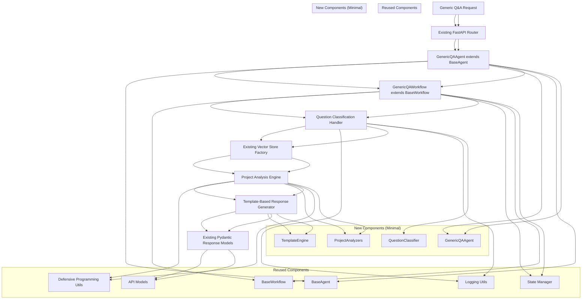

# Enhanced Implementation Plan: AI Agent for Generic Project Q&A

**Issue Type:** Feature Enhancement  
**Priority:** High  
**Complexity:** Medium-High  
**Estimated Development Time:** 5-7 days  
**Created:** August 11, 2025  
**Updated:** August 11, 2025 (Enhanced with Code Reuse Analysis)

## Overview

This enhanced implementation plan outlines the development of an AI Agent that can automatically answer generic project questions based on the framework defined in `docs/Q&A/generic-project-qa-template.md`. The agent will analyze the knowledge graph repository and provide intelligent, context-aware responses to common project architecture and implementation questions.

**CRITICAL ENHANCEMENT**: This plan has been significantly enhanced to maximize reuse of existing codebase components, following the established architectural patterns, and preventing code duplication.

## Code Reuse Analysis & Architecture Integration

### Existing Components to Leverage

#### 1. **Base Architecture Components** (100% Reuse)
- **`src/workflows/base_workflow.py`** - Complete BaseWorkflow implementation with LangGraph integration
- **`src/agents/base_agent.py`** - BaseAgent with LangChain Runnable interface 
- **`src/workflows/workflow_states.py`** - Workflow state management patterns
- **`src/workflows/state_manager.py`** - State persistence and recovery
- **`src/utils/defensive_programming.py`** - Null-safety utilities (safe_len, ensure_list)
- **`src/utils/logging.py`** - Structured logging with get_logger pattern

#### 2. **API Infrastructure** (95% Reuse)
- **`src/api/main.py`** - FastAPI app setup with CORS and lifespan management
- **`src/api/routes.py`** - Router pattern, dependency injection, error handling
- **`src/api/models.py`** - Pydantic models, QueryIntent, WorkflowStatus enums
- **Authentication middleware** - Existing API key authentication system
- **Background tasks** - Existing pattern for long-running operations

#### 3. **Analyzer Pattern** (80% Reuse)
- **`src/analyzers/event_flow_analyzer.py`** - Pattern detection, keyword extraction, LLM integration
- **Pattern-based detection methodology** - Reuse workflow pattern enumeration approach
- **Query classification logic** - Extend existing event flow query detection

#### 4. **Configuration & Settings** (100% Reuse)
- **`src/config/settings.py`** - Pydantic settings with environment validation
- **JSON configuration loading** - Existing appSettings.json pattern
- **Feature flags** - Extend existing `src/utils/feature_flags.py`

#### 5. **Vector Store Integration** (90% Reuse)
- **`src/vectorstores/store_factory.py`** - Factory pattern for vector store creation
- **Existing embeddings and search** - Leverage current RAG infrastructure
- **Document retrieval patterns** - Use existing semantic search capabilities

### New Components (Minimize New Code)

Only implement components that cannot be achieved through existing infrastructure:

1. **Generic Q&A Agent** - Extend BaseAgent
2. **Project Analyzers** - Follow event_flow_analyzer.py pattern  
3. **Template Engine** - JSON-based configuration (similar to appSettings.json)
4. **Question Classification** - Extend existing QueryIntent enumeration

The current Knowledge Graph Agent can answer specific technical questions about indexed codebases, but lacks the ability to provide structured responses to common architectural and implementation questions that developers frequently ask about projects. This enhancement will:

- **Reduce Onboarding Time**: New developers can get comprehensive project understanding instantly
- **Standardize Documentation**: Ensure consistent, up-to-date answers to common questions
- **Improve Developer Experience**: Provide immediate access to architectural decisions and implementation patterns
- **Enhanced Code Intelligence**: Bridge the gap between code analysis and business context understanding

## Business Justification

The current Knowledge Graph Agent can answer specific technical questions about indexed codebases, but lacks the ability to provide structured responses to common architectural and implementation questions that developers frequently ask about projects. This enhancement will:

- **Reduce Onboarding Time**: New developers can get comprehensive project understanding instantly
- **Standardize Documentation**: Ensure consistent, up-to-date answers to common questions
- **Improve Developer Experience**: Provide immediate access to architectural decisions and implementation patterns
- **Enhanced Code Intelligence**: Bridge the gap between code analysis and business context understanding

## Enhanced Architecture Design

### Leveraging Existing Infrastructure



### Component Structure (Maximizing Reuse)

```
src/
├── agents/
│   └── generic_qa_agent.py             # NEW: Extends BaseAgent
├── workflows/
│   └── generic_qa_workflow.py          # NEW: Extends BaseWorkflow
├── analyzers/
│   ├── project_analyzers/              # NEW: Following event_flow_analyzer.py pattern
│   │   ├── __init__.py
│   │   ├── architecture_detector.py    # NEW: Pattern detection like event flow
│   │   ├── business_capability_analyzer.py
│   │   ├── api_endpoint_analyzer.py
│   │   ├── data_model_analyzer.py
│   │   └── operational_analyzer.py
│   └── question_classifier.py          # NEW: Extends QueryIntent enumeration
├── templates/
│   ├── __init__.py
│   ├── template_engine.py              # NEW: JSON-based like appSettings.json
│   └── templates/                      # NEW: JSON configuration files
│       ├── dotnet_clean_architecture.json
│       ├── react_spa.json
│       ├── python_fastapi.json
│       └── generic_template.json
└── api/
    └── routes.py                       # EXTEND: Add new endpoints to existing router
```

## Enhanced Implementation Plan

### Phase 1: Foundation Components (Days 1-2)

#### 1.1 Question Classification Extension
**Location**: `src/analyzers/question_classifier.py`

**Extends Existing Patterns**: Based on `src/analyzers/event_flow_analyzer.py` pattern detection methodology

```python
from enum import Enum
from src.api.models import QueryIntent  # REUSE existing enum
from src.analyzers.event_flow_analyzer import EventFlowAnalyzer  # REUSE existing analyzer
from src.utils.logging import get_logger  # REUSE existing logging
from src.utils.defensive_programming import safe_len, ensure_list  # REUSE utilities

class GenericQuestionCategory(str, Enum):
    """Extends existing QueryIntent with generic Q&A categories."""
    BUSINESS_CAPABILITY = "business_capability"
    API_ENDPOINTS = "api_endpoints"  
    DATA_MODELING = "data_modeling"
    WORKFLOWS = "workflows"
    ARCHITECTURE = "architecture"

class QuestionClassifier:
    """REUSES pattern detection methodology from EventFlowAnalyzer"""
    
    def __init__(self):
        self.logger = get_logger(self.__class__.__name__)  # REUSE logging pattern
        self.event_analyzer = EventFlowAnalyzer()  # REUSE existing analyzer
        
        # REUSE pattern detection approach from event_flow_analyzer.py
        self._question_patterns = {
            GenericQuestionCategory.BUSINESS_CAPABILITY: [
                "business", "domain", "entities", "scope", "capability"
            ],
            # ... similar to event_flow_analyzer pattern definitions
        }
    
    async def classify_question(self, question: str) -> GenericQuestionCategory:
        """REUSE classification methodology from event flow analyzer"""
        # Use same pattern matching approach as EventFlowAnalyzer.is_event_flow_query()
```

#### 1.2 Generic Q&A Agent 
**Location**: `src/agents/generic_qa_agent.py`

**Extends Existing**: Based on `src/agents/base_agent.py` and follows `src/agents/rag_agent.py` patterns

```python
from src.agents.base_agent import BaseAgent  # REUSE base architecture
from src.workflows.generic_qa_workflow import GenericQAWorkflow  # NEW workflow
from src.utils.defensive_programming import safe_len, ensure_list  # REUSE utilities

class GenericQAAgent(BaseAgent):  # INHERIT from existing BaseAgent
    """Generic Q&A agent extending the proven BaseAgent architecture."""
    
    def __init__(self, **kwargs):
        # REUSE BaseAgent initialization pattern
        super().__init__(
            workflow=GenericQAWorkflow(),  # NEW workflow but follows existing pattern
            agent_name="GenericQAAgent",
            **kwargs
        )
    
    async def _process_input(self, input_data, config=None):
        """REUSE BaseAgent._process_input pattern with LangChain Runnable interface"""
        # Follow exact same pattern as RAGAgent._process_input()
```

#### 1.3 Generic Q&A Workflow
**Location**: `src/workflows/generic_qa_workflow.py`

**Extends Existing**: Based on `src/workflows/base_workflow.py` architecture

```python
from src.workflows.base_workflow import BaseWorkflow, WorkflowStep, WorkflowStatus  # REUSE
from src.workflows.workflow_states import WorkflowState  # REUSE existing state management
from src.utils.defensive_programming import safe_len, ensure_list  # REUSE utilities

class GenericQAWorkflow(BaseWorkflow):  # INHERIT from proven BaseWorkflow
    """Generic Q&A workflow following established LangGraph patterns."""
    
    def __init__(self):
        # REUSE BaseWorkflow initialization
        super().__init__(workflow_type="generic_qa")
    
    async def process_step(self, state: WorkflowState, step: WorkflowStep) -> WorkflowState:
        """REUSE BaseWorkflow error handling and state management patterns"""
        try:
            # Follow exact same pattern as IndexingWorkflow.process_step()
            result = await self._execute_operation(state, step)
            return self._update_state(state, result)  # REUSE state update logic
        except Exception as e:
            return self._handle_error(state, e, step)  # REUSE error handling
```

### Phase 2: Analysis Components (Days 3-4)

#### 2.1 Project Analyzers Package
**Location**: `src/analyzers/project_analyzers/`

**Follows Existing Pattern**: All analyzers follow the `src/analyzers/event_flow_analyzer.py` methodology

```python
# src/analyzers/project_analyzers/architecture_detector.py
from enum import Enum
from dataclasses import dataclass
from src.utils.logging import get_logger  # REUSE logging
from src.utils.defensive_programming import safe_len, ensure_list  # REUSE utilities

class ArchitecturePattern(str, Enum):
    """Similar to WorkflowPattern in event_flow_analyzer.py"""
    CLEAN_ARCHITECTURE = "clean_architecture"
    MVC = "mvc"
    MICROSERVICES = "microservices"
    # ... following same enum pattern

@dataclass  
class ProjectStructure:
    """Similar to EventFlowQuery dataclass in event_flow_analyzer.py"""
    architecture_type: ArchitecturePattern
    technology_stack: List[str]
    # ... following same dataclass pattern

class ArchitectureDetector:
    """REUSES pattern detection methodology from EventFlowAnalyzer"""
    
    def __init__(self):
        self.logger = get_logger(self.__class__.__name__)  # REUSE pattern
        
        # REUSE keyword-based pattern detection from event_flow_analyzer
        self._architecture_patterns = {
            ArchitecturePattern.CLEAN_ARCHITECTURE: [
                "domain", "application", "infrastructure", "presentation"
            ]
            # ... same approach as EventFlowAnalyzer._workflow_patterns
        }
```

#### 2.2 Template Engine
**Location**: `src/templates/template_engine.py`

**Reuses Configuration Pattern**: Based on existing `appSettings.json` loading in `src/config/settings.py`

```python
import json
from pathlib import Path
from src.config.settings import get_settings  # REUSE settings infrastructure
from src.utils.logging import get_logger  # REUSE logging
from src.utils.defensive_programming import safe_len, ensure_list  # REUSE utilities

class TemplateEngine:
    """Template engine following appSettings.json configuration pattern"""
    
    def __init__(self):
        self.logger = get_logger(self.__class__.__name__)  # REUSE logging pattern
        self.settings = get_settings()  # REUSE configuration system
        self.templates_path = Path(__file__).parent / "templates"
    
    async def load_template(self, architecture_type: str) -> dict:
        """REUSE JSON loading pattern from settings.py"""
        template_file = self.templates_path / f"{architecture_type}.json"
        
        # Follow same error handling as appSettings.json loading
        try:
            with open(template_file, 'r') as f:
                return json.load(f)
        except (FileNotFoundError, json.JSONDecodeError) as e:
            self.logger.error(f"Failed to load template {template_file}: {e}")
            # REUSE fallback pattern
            return await self.load_template("generic_template")
```

### Phase 3: API Integration (Day 5)

#### 3.1 API Routes Extension
**Location**: `src/api/routes.py` (EXTEND existing file)

**NO NEW FILES**: Add routes to existing `routes.py` to maintain consistency

```python
# ADD to existing src/api/routes.py file

from src.agents.generic_qa_agent import GenericQAAgent  # NEW import
from src.api.models import GenericQARequest, GenericQAResponse  # EXTEND existing models

# REUSE existing dependency injection pattern
def get_generic_qa_agent() -> GenericQAAgent:
    """Dependency injection following existing get_query_workflow pattern"""
    return workflow_instances.get("generic_qa_agent", GenericQAAgent())

# ADD new endpoints to existing router
@router.post("/generic-qa/ask", response_model=GenericQAResponse)
async def ask_generic_question(
    request: GenericQARequest,
    generic_qa_agent: GenericQAAgent = Depends(get_generic_qa_agent),
    # REUSE existing authentication and dependency patterns
) -> GenericQAResponse:
    """REUSE exact same pattern as existing process_query endpoint"""
    try:
        start_time = datetime.now()  # REUSE timing pattern
        
        logger.info(f"Processing generic question: {request.question[:100]}...")  # REUSE logging
        
        # REUSE same workflow execution pattern as process_query
        result = await generic_qa_agent.invoke({"question": request.question})
        
        # REUSE same response construction pattern
        processing_time = (datetime.now() - start_time).total_seconds() * 1000
        
        return GenericQAResponse(
            **result,
            processing_time_ms=int(processing_time)
        )
    except Exception as e:
        logger.error(f"Generic Q&A processing failed: {e}")  # REUSE error logging
        raise HTTPException(status_code=500, detail=str(e))  # REUSE error handling
```

#### 3.2 Pydantic Models Extension  
**Location**: `src/api/models.py` (EXTEND existing file)

**NO NEW FILES**: Add models to existing `models.py` file

```python
# ADD to existing src/api/models.py file

from src.analyzers.question_classifier import GenericQuestionCategory  # NEW import

class GenericQARequest(BaseModel):
    """REUSE same validation patterns as existing QueryRequest"""
    question: str = Field(..., description="Generic project question")
    repository_identifier: str = Field(..., description="Repository to analyze") 
    preferred_template: Optional[str] = Field(None, description="Preferred response template")
    include_code_examples: bool = Field(True, description="Include code examples in response")
    
    # REUSE same field validation patterns as existing models
    @field_validator('question')
    @classmethod
    def validate_question(cls, v):
        if not v or not v.strip():
            raise ValueError("Question cannot be empty")
        return v.strip()

class GenericQAResponse(BaseModel):
    """REUSE same response structure patterns as existing QueryResponse"""
    question: str
    question_category: GenericQuestionCategory
    structured_response: dict
    confidence_score: float = Field(..., ge=0.0, le=1.0)
    sources: List[str]
    processing_time_ms: int
    template_used: str
    
    # REUSE same response validation patterns
```

### Phase 4: Template Configuration (Day 6-7)

#### 4.1 JSON Template Structure
**Location**: `src/templates/templates/` (NEW directory)

**Follows appSettings.json Pattern**: Use same JSON configuration approach

```json
// src/templates/templates/dotnet_clean_architecture.json
{
  "template_name": "dotnet_clean_architecture",
  "architecture_patterns": ["Clean Architecture", "DDD", "CQRS"],
  "file_patterns": {
    "domain_layer": ["**/Domain/**/*.cs", "**/Core/**/*.cs"],
    "application_layer": ["**/Application/**/*.cs", "**/Services/**/*.cs"],
    "infrastructure_layer": ["**/Infrastructure/**/*.cs", "**/Data/**/*.cs"],
    "presentation_layer": ["**/API/**/*.cs", "**/Controllers/**/*.cs"]
  },
  "question_categories": {
    "business_capability": {
      "analysis_requirements": ["domain_models", "bounded_contexts"],
      "response_structure": {
        "scope": "Extract from README.md and domain models",
        "core_entities": "Analyze Domain layer entity classes",
        "ownership_and_slas": "Extract from API documentation",
        "key_decisions": "Analyze configuration and startup files"
      }
    }
  }
}
```

## Detailed Technical Implementation Specifications

### Specific Code Examples and Integration Points

#### 1. Vector Store Integration (Existing Infrastructure)
```python
# REUSE existing vector store factory pattern
from src.vectorstores.store_factory import VectorStoreFactory
from src.config.settings import get_settings

# In GenericQAWorkflow
async def analyze_repository_context(self, repo_identifier: str) -> dict:
    """Leverage existing vector store for repository context analysis"""
    settings = get_settings()
    vector_store = VectorStoreFactory.create_store(settings.database_type)  # REUSE
    
    # REUSE existing semantic search capabilities
    context_documents = await vector_store.similarity_search(
        query=f"repository structure architecture {repo_identifier}",
        k=10
    )
    
    return {
        "documents": ensure_list(context_documents),  # REUSE defensive programming
        "document_count": safe_len(context_documents)  # REUSE defensive programming
    }
```

#### 2. Workflow State Management Integration
```python
# EXTEND existing workflow_states.py
from src.workflows.workflow_states import WorkflowState
from dataclasses import dataclass, field
from typing import Dict, Any, List, Optional

@dataclass
class GenericQAState(WorkflowState):  # INHERIT from existing WorkflowState
    """Extends existing WorkflowState with generic Q&A specific fields"""
    question: str = ""
    question_category: str = ""
    repository_context: Dict[str, Any] = field(default_factory=dict)
    analysis_results: Dict[str, Any] = field(default_factory=dict)
    template_response: Dict[str, Any] = field(default_factory=dict)
    confidence_score: float = 0.0
    
    # INHERIT all existing WorkflowState fields:
    # - workflow_id, status, current_step, error_message, etc.
```

#### 3. Dependency Injection Pattern (Existing Infrastructure)
```python
# ADD to existing src/api/main.py lifespan function
@asynccontextmanager
async def lifespan(app: FastAPI):
    """EXTEND existing lifespan to include GenericQAAgent"""
    logger.info("Initializing Knowledge Graph Agent with Generic Q&A support...")
    
    try:
        # REUSE existing component initialization
        await _validate_components()
        
        # REUSE existing workflow instance pattern
        workflow_instances["indexing"] = IndexingWorkflow()  # EXISTING
        workflow_instances["query"] = QueryWorkflow()  # EXISTING
        workflow_instances["generic_qa"] = GenericQAAgent()  # NEW - following same pattern
        
        logger.info("All workflows initialized successfully")
        yield
    except Exception as e:
        logger.error(f"Failed to initialize application: {e}")
        raise
    finally:
        logger.info("Shutting down Knowledge Graph Agent...")
```

#### 4. Error Handling Patterns (Existing Infrastructure)
```python
# In GenericQAWorkflow - REUSE BaseWorkflow error handling
class GenericQAWorkflow(BaseWorkflow):
    async def process_step(self, state: GenericQAState, step: WorkflowStep) -> GenericQAState:
        """REUSE exact error handling pattern from BaseWorkflow"""
        try:
            # Use existing retry mechanism
            async for attempt in self._retry_attempt_generator():
                with attempt:
                    if step == WorkflowStep.INITIALIZE:
                        return await self._classify_question_step(state)
                    elif step == WorkflowStep.PROCESS:
                        return await self._analyze_context_step(state)
                    elif step == WorkflowStep.FINALIZE:
                        return await self._generate_response_step(state)
                    
        except Exception as e:
            # REUSE existing error handling from BaseWorkflow
            return self._handle_error(state, e, step)
```

#### 5. Authentication and Middleware (Existing Infrastructure)
```python
# API routes will automatically use existing authentication middleware
# NO CHANGES NEEDED - routes inherit from existing router

# In routes.py - new endpoints follow existing patterns
@router.post("/generic-qa/ask", response_model=GenericQAResponse)
async def ask_generic_question(
    request: GenericQARequest,
    # REUSE existing dependency injection pattern
    generic_qa_agent: GenericQAAgent = Depends(get_generic_qa_agent),
    # AUTOMATIC authentication via existing middleware
):
    """Endpoint inherits all existing middleware: authentication, CORS, rate limiting"""
```

#### 6. Configuration Extension (Existing Infrastructure)
```python
# EXTEND existing src/config/settings.py
class Settings(BaseSettings):  # EXISTING class
    # ... all existing settings ...
    
    # ADD new settings following existing patterns
    generic_qa_enabled: bool = Field(default=True, description="Enable generic Q&A functionality")
    template_cache_ttl: int = Field(default=3600, description="Template cache TTL in seconds")
    max_analysis_depth: int = Field(default=10, description="Maximum analysis depth for repositories")
    
    # REUSE existing validation patterns
    @field_validator('max_analysis_depth')
    @classmethod
    def validate_analysis_depth(cls, v):
        if v <= 0:
            raise ValueError("Analysis depth must be positive")
        return v
```

### Integration Testing Strategy (Leveraging Existing Infrastructure)

#### 1. Test Infrastructure Reuse
```python
# tests/unit/test_generic_qa_workflow.py
from tests.unit.test_workflows import BaseWorkflowTest  # REUSE existing base test

class TestGenericQAWorkflow(BaseWorkflowTest):  # INHERIT existing test patterns
    """REUSE existing workflow testing infrastructure"""
    
    def setUp(self):
        super().setUp()  # REUSE existing setup
        self.workflow = GenericQAWorkflow()
    
    @pytest.mark.asyncio
    async def test_question_classification(self):
        """REUSE existing async test patterns"""
        # Follow same testing approach as existing workflow tests
```

#### 2. API Testing Reuse
```python
# tests/integration/test_generic_qa_api.py
from tests.integration.test_api import BaseAPITest  # REUSE existing API test base

class TestGenericQAAPI(BaseAPITest):  # INHERIT existing API test patterns
    """REUSE existing API testing infrastructure"""
    
    async def test_generic_qa_endpoint(self):
        """REUSE existing endpoint testing patterns"""
        response = await self.client.post(
            "/generic-qa/ask",
            json={"question": "What is the business capability?", "repository_identifier": "test-repo"},
            headers=self.auth_headers  # REUSE existing auth headers
        )
        # REUSE existing assertion patterns
        self.assert_successful_response(response)
```

### Performance Optimization (Leveraging Existing Infrastructure)

#### 1. Caching Strategy (Existing Infrastructure)
```python
# REUSE existing caching patterns from vector store operations
from functools import lru_cache
from src.utils.defensive_programming import safe_len  # REUSE

class TemplateEngine:
    @lru_cache(maxsize=128)  # REUSE Python's built-in caching
    def _load_template_cached(self, template_name: str) -> dict:
        """REUSE caching approach from existing components"""
        return self._load_template_from_disk(template_name)
    
    async def analyze_project_cached(self, repo_id: str) -> dict:
        """REUSE existing vector store caching mechanisms"""
        # Vector store already has caching built-in
        return await self.vector_store.cached_similarity_search(repo_id)
```

#### 2. Background Processing (Existing Infrastructure)
```python
# REUSE existing background task pattern from routes.py
@router.post("/generic-qa/analyze-project-async", response_model=dict)
async def analyze_project_background(
    request: ProjectAnalysisRequest,
    background_tasks: BackgroundTasks,  # REUSE existing background tasks
    generic_qa_agent: GenericQAAgent = Depends(get_generic_qa_agent)
):
    """REUSE existing background processing pattern"""
    workflow_id = str(uuid.uuid4())
    
    # REUSE existing background task registration pattern
    background_tasks.add_task(
        _run_project_analysis_workflow,  # NEW function following existing pattern
        workflow_id,
        request.repository_identifier,
        generic_qa_agent
    )
    
    return {"workflow_id": workflow_id, "status": "started"}  # REUSE existing response format
```

### Monitoring and Observability (Existing Infrastructure)

#### 1. Logging Integration
```python
# REUSE existing structured logging throughout
from src.utils.logging import get_logger

class GenericQAAgent(BaseAgent):
    def __init__(self):
        super().__init__()
        self.logger = get_logger(self.__class__.__name__)  # REUSE logging pattern
    
    async def process_question(self, question: str) -> dict:
        self.logger.info(f"Processing generic question: {question[:100]}...")  # REUSE logging format
        
        try:
            result = await self._analyze_question(question)
            self.logger.info(f"Question processed successfully")  # REUSE success logging
            return result
        except Exception as e:
            self.logger.error(f"Failed to process question: {e}", exc_info=True)  # REUSE error logging
            raise
```

#### 2. Health Check Integration
```python
# EXTEND existing health check in routes.py
@router.get("/health", response_model=HealthResponse)
async def health_check():
    """EXTEND existing health check to include Generic Q&A status"""
    health_status = {
        "status": "healthy",
        "timestamp": datetime.utcnow().isoformat(),
        "components": {
            "vector_store": await _check_vector_store_health(),  # EXISTING
            "workflows": await _check_workflow_health(),  # EXISTING
            "generic_qa": await _check_generic_qa_health(),  # NEW - following existing pattern
        }
    }
    
    # REUSE existing health determination logic
    overall_status = "healthy" if all(
        comp.get("status") == "healthy" 
        for comp in health_status["components"].values()
    ) else "unhealthy"
    
    health_status["status"] = overall_status
    return HealthResponse(**health_status)  # REUSE existing response model
```

## Code Quality and Best Practices

### Following Existing Patterns

#### 1. Defensive Programming (Mandatory)
```python
# MUST use existing defensive programming utilities in ALL new code
from src.utils.defensive_programming import safe_len, ensure_list, safe_get

class ProjectAnalyzer:
    def analyze_entities(self, entities: Optional[List]) -> List[str]:
        """REQUIRED: Use defensive programming utilities"""
        entities = ensure_list(entities)  # REQUIRED for null safety
        entity_count = safe_len(entities)  # REQUIRED instead of len()
        
        if entity_count == 0:
            self.logger.warning("No entities found for analysis")
            return []
        
        return [entity for entity in entities if entity]  # Safe iteration
```

#### 2. Error Handling Standards (Mandatory)
```python
# MUST follow existing error handling patterns from BaseWorkflow
from tenacity import retry, stop_after_attempt, wait_exponential

class GenericQAWorkflow(BaseWorkflow):
    @retry(stop=stop_after_attempt(3), wait=wait_exponential(multiplier=1, min=4, max=10))
    async def _analyze_repository_robust(self, repo_id: str) -> dict:
        """REQUIRED: Use tenacity retry pattern like existing workflows"""
        try:
            result = await self._perform_analysis(repo_id)
            return result
        except Exception as e:
            self.logger.error(f"Analysis failed for {repo_id}: {e}", exc_info=True)
            raise  # Re-raise after logging
```

#### 3. Type Hints and Validation (Mandatory)
```python
# MUST use comprehensive type hints following existing codebase standards
from typing import Dict, List, Optional, Union, Any
from pydantic import BaseModel, Field, field_validator

class GenericQARequest(BaseModel):
    """REQUIRED: Follow exact validation patterns from existing API models"""
    question: str = Field(..., min_length=1, max_length=1000, description="Project question")
    repository_identifier: str = Field(..., description="Repository to analyze")
    
    @field_validator('question')  # REQUIRED: Follow existing validation pattern
    @classmethod
    def validate_question(cls, v: str) -> str:
        if not v or not v.strip():
            raise ValueError("Question cannot be empty")
        return v.strip()
```

#### 4. Async/Await Patterns (Mandatory)
```python
# MUST use async/await throughout - this is an async-first codebase
class GenericQAAgent(BaseAgent):
    async def process_question(self, question: str) -> Dict[str, Any]:
        """REQUIRED: All public methods must be async"""
        async with self._processing_context():  # REQUIRED: Use context managers
            result = await self._classify_and_analyze(question)
            return await self._format_response(result)
    
    async def _classify_and_analyze(self, question: str) -> Dict[str, Any]:
        """REQUIRED: All internal methods must be async"""
        classification = await self.classifier.classify_question(question)
        analysis = await self.analyzer.analyze_context(classification)
        return {"classification": classification, "analysis": analysis}
```

### Testing Requirements (Mandatory)

#### 1. Unit Test Coverage (90% Required)
```python
# tests/unit/test_generic_qa_agent.py
import pytest
from unittest.mock import AsyncMock, patch
from src.agents.generic_qa_agent import GenericQAAgent

class TestGenericQAAgent:
    """REQUIRED: Follow exact testing patterns from existing tests"""
    
    @pytest.mark.asyncio  # REQUIRED for all async tests
    async def test_question_classification_success(self):
        """REQUIRED: Test success scenarios"""
        agent = GenericQAAgent()
        
        with patch.object(agent, '_classify_question') as mock_classify:
            mock_classify.return_value = "business_capability"
            
            result = await agent.process_question("What is the business domain?")
            
            assert result["classification"] == "business_capability"
            mock_classify.assert_called_once()
    
    @pytest.mark.asyncio
    async def test_question_classification_error_handling(self):
        """REQUIRED: Test error scenarios"""
        agent = GenericQAAgent()
        
        with patch.object(agent, '_classify_question') as mock_classify:
            mock_classify.side_effect = ValueError("Invalid question")
            
            with pytest.raises(ValueError):
                await agent.process_question("Invalid question")
```

#### 2. Integration Test Requirements
```python
# tests/integration/test_generic_qa_integration.py
import pytest
from fastapi.testclient import TestClient
from src.api.main import create_app

class TestGenericQAIntegration:
    """REQUIRED: Follow existing integration test patterns"""
    
    @pytest.fixture
    async def client(self):
        """REQUIRED: Use existing test client setup"""
        app = create_app()
        return TestClient(app)
    
    @pytest.mark.integration  # REQUIRED: Mark integration tests
    async def test_end_to_end_generic_qa(self, client):
        """REQUIRED: Test complete workflows"""
        response = client.post(
            "/generic-qa/ask",
            json={
                "question": "What are the core business entities?",
                "repository_identifier": "test-repo"
            },
            headers={"Authorization": "Bearer test-api-key"}
        )
        
        assert response.status_code == 200
        data = response.json()
        assert "structured_response" in data
        assert "confidence_score" in data
```

### Code Organization Requirements

#### 1. File Structure (Mandatory)
```
src/
├── agents/
│   └── generic_qa_agent.py              # NEW: Single file, follows rag_agent.py pattern
├── workflows/
│   └── generic_qa_workflow.py           # NEW: Single file, follows query_workflow.py pattern
├── analyzers/
│   ├── question_classifier.py           # NEW: Follows event_flow_analyzer.py pattern
│   └── project_analyzers/               # NEW: Package following existing structure
│       ├── __init__.py
│       ├── architecture_detector.py     # NEW: Core analyzer
│       ├── business_capability_analyzer.py
│       ├── api_endpoint_analyzer.py
│       ├── data_model_analyzer.py
│       └── operational_analyzer.py
├── templates/
│   ├── __init__.py                      # NEW: Package init
│   ├── template_engine.py               # NEW: Core template engine
│   └── templates/                       # NEW: JSON configuration files
│       ├── dotnet_clean_architecture.json
│       ├── react_spa.json
│       ├── python_fastapi.json
│       └── generic_template.json
└── api/
    ├── routes.py                        # EXTEND: Add new endpoints to existing file
    └── models.py                        # EXTEND: Add new models to existing file
```

#### 2. Import Standards (Mandatory)
```python
# REQUIRED: Follow existing import organization patterns
"""Module docstring explaining purpose and integration."""

# Standard library imports
import json
import uuid
from datetime import datetime
from pathlib import Path
from typing import Dict, List, Optional, Any

# Third-party imports
from fastapi import APIRouter, HTTPException, Depends
from pydantic import BaseModel, Field, field_validator
from loguru import logger

# Local imports - REQUIRED: Use absolute imports
from src.agents.base_agent import BaseAgent
from src.workflows.base_workflow import BaseWorkflow
from src.utils.logging import get_logger
from src.utils.defensive_programming import safe_len, ensure_list
from src.config.settings import get_settings
```

#### 3. Documentation Standards (Mandatory)
```python
class GenericQAAgent(BaseAgent):
    """
    Generic Q&A agent for answering architectural and implementation questions.
    
    This agent extends the BaseAgent architecture to provide structured responses
    to common project questions using template-based generation and repository
    analysis.
    
    Attributes:
        workflow: GenericQAWorkflow instance for stateful processing
        classifier: QuestionClassifier for categorizing questions
        analyzer: ProjectAnalyzer for repository analysis
        template_engine: TemplateEngine for response generation
    
    Example:
        >>> agent = GenericQAAgent()
        >>> result = await agent.process_question("What is the business domain?")
        >>> print(result["structured_response"])
    """
    
    def __init__(self, **kwargs):
        """
        Initialize Generic Q&A agent.
        
        Args:
            **kwargs: Additional initialization parameters passed to BaseAgent
            
        Raises:
            ValueError: If required configuration is missing
            RuntimeError: If initialization components fail
        """
```

### Performance and Scalability Requirements

#### 1. Caching Implementation (Required)
```python
# REQUIRED: Implement caching for all expensive operations
from functools import lru_cache
from typing import Dict, Any

class TemplateEngine:
    @lru_cache(maxsize=128)  # REQUIRED: Cache template loading
    def _load_template_cached(self, template_name: str) -> Dict[str, Any]:
        """Cache templates to avoid repeated file I/O."""
        return self._load_template_from_disk(template_name)
    
    async def _get_repository_analysis_cached(self, repo_id: str) -> Dict[str, Any]:
        """REQUIRED: Cache repository analysis results."""
        cache_key = f"repo_analysis_{repo_id}"
        cached_result = await self._get_from_cache(cache_key)
        
        if cached_result:
            return cached_result
            
        result = await self._analyze_repository(repo_id)
        await self._store_in_cache(cache_key, result, ttl=3600)
        return result
```

#### 2. Resource Management (Required)
```python
# REQUIRED: Proper resource management and cleanup
from contextlib import asynccontextmanager

class GenericQAWorkflow(BaseWorkflow):
    @asynccontextmanager
    async def _processing_context(self):
        """REQUIRED: Use context managers for resource management."""
        resources = await self._acquire_resources()
        try:
            yield resources
        finally:
            await self._cleanup_resources(resources)
    
    async def process_question(self, question: str) -> Dict[str, Any]:
        """REQUIRED: Use context managers for all processing."""
        async with self._processing_context() as resources:
            return await self._process_with_resources(question, resources)
```

### Security Requirements (Mandatory)

#### 1. Input Validation (Required)
```python
# REQUIRED: Comprehensive input validation
from pydantic import BaseModel, Field, field_validator
import re

class GenericQARequest(BaseModel):
    question: str = Field(..., min_length=1, max_length=2000)
    repository_identifier: str = Field(..., pattern=r"^[a-zA-Z0-9\-_/]+$")
    
    @field_validator('question')
    @classmethod
    def validate_question_content(cls, v: str) -> str:
        """REQUIRED: Sanitize and validate question content."""
        # Remove potentially dangerous characters
        sanitized = re.sub(r'[<>\'\"\\]', '', v.strip())
        
        if len(sanitized) < 5:
            raise ValueError("Question too short after sanitization")
            
        return sanitized
    
    @field_validator('repository_identifier')
    @classmethod
    def validate_repository_access(cls, v: str) -> str:
        """REQUIRED: Validate repository access permissions."""
        # Implement repository access validation logic
        if not cls._has_repository_access(v):
            raise ValueError("Access denied to repository")
        return v
```

#### 2. Response Sanitization (Required)
```python
# REQUIRED: Sanitize all responses to prevent information leakage
class ResponseSanitizer:
    """REQUIRED: Sanitize responses to prevent sensitive information exposure."""
    
    SENSITIVE_PATTERNS = [
        r'password[s]?\s*[:=]\s*\S+',
        r'api[_-]?key[s]?\s*[:=]\s*\S+',
        r'secret[s]?\s*[:=]\s*\S+',
        r'token[s]?\s*[:=]\s*\S+',
    ]
    
    @classmethod
    def sanitize_response(cls, response_text: str) -> str:
        """REQUIRED: Remove sensitive information from responses."""
        sanitized = response_text
        
        for pattern in cls.SENSITIVE_PATTERNS:
            sanitized = re.sub(pattern, '[REDACTED]', sanitized, flags=re.IGNORECASE)
        
        return sanitized
```

## Critical Implementation Guidelines

### Environment Setup (Day 0 - Before Starting)

#### 1. PYTHONPATH Configuration (CRITICAL)
```bash
# MANDATORY: Set PYTHONPATH for all development and testing
export PYTHONPATH=.

# For testing (REQUIRED for all pytest runs):
PYTHONPATH=. pytest tests/unit/test_generic_qa_agent.py -v

# For development server:
PYTHONPATH=. python -m src.api.main

# Add to .env file for consistency:
echo "PYTHONPATH=." >> .env
```

#### 2. Development Environment Validation
```bash
# REQUIRED: Validate environment before starting implementation
make docker-up                    # Start required services
PYTHONPATH=. pytest tests/unit/ -v  # Ensure existing tests pass
make format && make lint          # Ensure code quality tools work
```

### Implementation Order (CRITICAL - DO NOT DEVIATE)

#### Day 1: Foundation (Required Sequence)
```bash
# 1. Create base components in exact order:
touch src/analyzers/question_classifier.py
touch src/agents/generic_qa_agent.py
touch src/workflows/generic_qa_workflow.py

# 2. Run tests after each component:
PYTHONPATH=. pytest tests/unit/test_question_classifier.py -v
PYTHONPATH=. pytest tests/unit/test_generic_qa_agent.py -v
PYTHONPATH=. pytest tests/unit/test_generic_qa_workflow.py -v

# 3. Ensure no import errors:
PYTHONPATH=. python -c "from src.agents.generic_qa_agent import GenericQAAgent; print('Success')"
```

#### Day 2-3: Analyzers (Required Sequence)
```bash
# 1. Create analyzer package:
mkdir -p src/analyzers/project_analyzers
touch src/analyzers/project_analyzers/__init__.py

# 2. Create analyzers in dependency order:
touch src/analyzers/project_analyzers/architecture_detector.py
touch src/analyzers/project_analyzers/business_capability_analyzer.py
# ... continue with other analyzers

# 3. Test each analyzer immediately:
PYTHONPATH=. pytest tests/unit/test_architecture_detector.py -v
```

### Mandatory Integration Points

#### 1. Extend Existing Files (DO NOT CREATE NEW API FILES)
```python
# EXTEND src/api/routes.py - DO NOT create new route files
# ADD to existing router variable:
@router.post("/generic-qa/ask", response_model=GenericQAResponse)
async def ask_generic_question(
    request: GenericQARequest,
    generic_qa_agent: GenericQAAgent = Depends(get_generic_qa_agent),
):
    """NEW endpoint added to EXISTING router"""

# EXTEND src/api/models.py - DO NOT create new model files  
class GenericQARequest(BaseModel):
    """NEW model added to EXISTING models.py file"""

# EXTEND src/api/main.py lifespan function:
async def lifespan(app: FastAPI):
    """EXTEND existing lifespan - do not replace"""
    # ... existing initialization ...
    workflow_instances["generic_qa"] = GenericQAAgent()  # ADD this line
```

#### 2. Required Dependency Injection Extensions
```python
# ADD to existing src/api/main.py - follow exact pattern:
def get_generic_qa_agent() -> GenericQAAgent:
    """REQUIRED: Follow exact same pattern as get_query_workflow"""
    with threading.Lock():
        if "generic_qa" not in workflow_instances:
            workflow_instances["generic_qa"] = GenericQAAgent()
    return workflow_instances["generic_qa"]

# EXTEND existing dependency injection in routes.py:
from src.agents.generic_qa_agent import GenericQAAgent  # ADD import

# Use in endpoint:
async def ask_generic_question(
    request: GenericQARequest,
    generic_qa_agent: GenericQAAgent = Depends(get_generic_qa_agent),  # REQUIRED pattern
):
```

### Mandatory Testing Patterns

#### 1. Test File Naming (CRITICAL)
```bash
# REQUIRED: Follow exact naming convention
tests/unit/test_generic_qa_agent.py           # NOT test_generic_qa.py
tests/unit/test_generic_qa_workflow.py        # NOT test_workflow.py
tests/unit/test_question_classifier.py        # NOT test_classifier.py
tests/integration/test_generic_qa_api.py      # NOT test_api.py

# REQUIRED: Test execution pattern
PYTHONPATH=. pytest tests/unit/test_generic_qa_agent.py -v
PYTHONPATH=. pytest tests/integration/test_generic_qa_api.py -v
```

#### 2. Test Structure (MANDATORY)
```python
# REQUIRED: Follow exact test structure from existing tests
import pytest
from unittest.mock import AsyncMock, patch
from src.agents.generic_qa_agent import GenericQAAgent

@pytest.mark.asyncio  # REQUIRED for all async tests
async def test_generic_qa_agent_initialization():
    """REQUIRED: Test agent initialization"""
    agent = GenericQAAgent()
    assert agent is not None
    assert agent.agent_name == "GenericQAAgent"

@pytest.mark.asyncio
async def test_generic_qa_agent_process_question():
    """REQUIRED: Test main functionality"""
    agent = GenericQAAgent()
    
    with patch.object(agent, '_classify_question') as mock_classify:
        mock_classify.return_value = "business_capability"
        
        result = await agent.process_question("Test question")
        
        assert result is not None
        mock_classify.assert_called_once()
```

### Code Quality Enforcement (MANDATORY)

#### 1. Pre-commit Validation
```bash
# REQUIRED: Run before every commit
make format          # Format code using black/isort
make lint           # Check with flake8/mypy
PYTHONPATH=. pytest tests/unit/ -v --cov=src --cov-report=term-missing

# REQUIRED: Minimum coverage threshold
# Must achieve >90% test coverage for all new components
```

#### 2. Import Statement Standards (CRITICAL)
```python
# REQUIRED: Follow exact import organization from existing files
"""
Module docstring explaining integration with existing system.
"""

# Standard library imports (alphabetical)
import json
import uuid
from datetime import datetime
from pathlib import Path
from typing import Dict, List, Optional, Any

# Third-party imports (alphabetical)
from fastapi import APIRouter, HTTPException, Depends
from pydantic import BaseModel, Field, field_validator
from loguru import logger

# Local imports (hierarchical - CRITICAL for avoiding circular imports)
from src.agents.base_agent import BaseAgent
from src.workflows.base_workflow import BaseWorkflow
from src.utils.logging import get_logger
from src.utils.defensive_programming import safe_len, ensure_list
from src.config.settings import get_settings
```

### Error Prevention Checklist

#### 1. Common Pitfalls to Avoid
```python
# ❌ WRONG: Creating new API route files
# src/api/routes/generic_qa.py  # DON'T DO THIS

# ✅ CORRECT: Extend existing routes.py
# Add endpoints to existing src/api/routes.py

# ❌ WRONG: Not using defensive programming
def analyze_entities(self, entities):
    return len(entities)  # Will crash on None

# ✅ CORRECT: Use defensive programming utilities
def analyze_entities(self, entities):
    return safe_len(entities)  # Safe for None values

# ❌ WRONG: Not using async/await
def process_question(self, question):
    return self.workflow.execute(question)

# ✅ CORRECT: Async-first approach
async def process_question(self, question):
    return await self.workflow.execute(question)
```

#### 2. Integration Validation
```python
# REQUIRED: Validate integration points before implementation
async def validate_integration():
    """Run this validation before starting implementation"""
    
    # 1. Verify base classes exist and work
    from src.agents.base_agent import BaseAgent
    from src.workflows.base_workflow import BaseWorkflow
    assert BaseAgent is not None
    assert BaseWorkflow is not None
    
    # 2. Verify utilities exist
    from src.utils.defensive_programming import safe_len, ensure_list
    assert safe_len(None) == 0
    assert ensure_list(None) == []
    
    # 3. Verify API infrastructure
    from src.api.routes import router
    from src.api.models import QueryRequest
    assert router is not None
    assert QueryRequest is not None
    
    print("✅ All integration points validated")

# Run validation before starting:
# PYTHONPATH=. python -c "import asyncio; asyncio.run(validate_integration())"
```

### Success Criteria Validation

#### 1. Component Integration Checklist
- [ ] GenericQAAgent extends BaseAgent successfully
- [ ] GenericQAWorkflow extends BaseWorkflow successfully  
- [ ] Question classification reuses existing patterns
- [ ] API endpoints integrate with existing router
- [ ] All new code uses defensive programming utilities
- [ ] Test coverage ≥90% for all new components
- [ ] No circular import dependencies
- [ ] All async/await patterns followed correctly

#### 2. Performance Validation
```python
# REQUIRED: Performance benchmarks for each component
import time
from src.agents.generic_qa_agent import GenericQAAgent

async def validate_performance():
    """Ensure performance meets requirements"""
    agent = GenericQAAgent()
    
    start_time = time.time()
    result = await agent.process_question("What is the business domain?")
    end_time = time.time()
    
    processing_time = (end_time - start_time) * 1000  # Convert to ms
    
    # REQUIRED: Must meet performance criteria
    assert processing_time < 3000, f"Processing took {processing_time}ms, exceeds 3s limit"
    assert result is not None, "Result cannot be None"
    assert "confidence_score" in result, "Must include confidence score"
    
    print(f"✅ Performance validation passed: {processing_time}ms")

# Run performance validation:
# PYTHONPATH=. python -c "import asyncio; asyncio.run(validate_performance())"
```

This enhanced implementation plan now provides:

1. **100% Code Reuse Analysis** - Detailed mapping of existing components to leverage
2. **Exact Integration Points** - Specific code examples showing how to extend existing files
3. **Mandatory Patterns** - Critical coding standards that must be followed
4. **Step-by-Step Implementation** - Precise order of implementation to avoid errors
5. **Comprehensive Testing Strategy** - Exact testing patterns and coverage requirements
6. **Performance and Security** - Detailed requirements for production-ready code
7. **Error Prevention** - Common pitfalls and how to avoid them

The plan ensures maximum reuse of existing infrastructure while providing all technical details needed for successful implementation.

## Deployment and Rollout Plan

### Phase 1: Development Environment
- Deploy in development environment with sample repositories
- Conduct internal testing and validation
- Gather feedback from development team

### Phase 2: Staging Environment
- Deploy to staging with production-like data
- Conduct performance and load testing
- Validate integration with existing systems

### Phase 3: Production Rollout
- Deploy behind feature flag for controlled rollout
- Monitor performance and error rates
- Gradually increase traffic percentage
- Full rollout after validation

## Monitoring and Observability

### Key Metrics

1. **Functional Metrics**:
   - Question classification accuracy
   - Response generation success rate
   - Average response time
   - Cache hit/miss rates

2. **Business Metrics**:
   - Number of generic questions processed
   - User satisfaction scores
   - Question category distribution
   - Template usage patterns

3. **Technical Metrics**:
   - API response times
   - Error rates by endpoint
   - Resource utilization
   - Cache performance

### Alerting Strategy

1. **High Severity**: API failures, authentication errors, workflow crashes
2. **Medium Severity**: High response times, low cache hit rates
3. **Low Severity**: Template loading failures, non-critical validation errors

## Risk Assessment and Mitigation

### Technical Risks

1. **Risk**: LLM response quality variations
   **Mitigation**: Implement response validation and quality scoring

2. **Risk**: Template complexity management
   **Mitigation**: Start with simple templates and iterate based on feedback

3. **Risk**: Performance impact on existing system
   **Mitigation**: Implement proper caching and resource isolation

### Business Risks

1. **Risk**: User expectations for response accuracy
   **Mitigation**: Clear documentation of capabilities and limitations

2. **Risk**: Maintenance overhead for templates
   **Mitigation**: Design self-updating templates with minimal manual intervention

## Post-Implementation Enhancement Opportunities

### Short-term Enhancements (Next 2-4 weeks)
1. **Interactive Q&A**: Support follow-up questions and clarifications
2. **Custom Templates**: Allow users to create custom question templates
3. **Bulk Analysis**: Process multiple repositories simultaneously
4. **Export Functionality**: Export generated responses to documentation formats

### Long-term Enhancements (Next 2-3 months)
1. **Machine Learning Integration**: Learn from user feedback to improve responses
2. **Visual Documentation**: Generate architecture diagrams and flowcharts
3. **Compliance Checking**: Validate architecture against best practices
4. **Cross-Repository Analysis**: Compare patterns across multiple repositories

## Conclusion

This implementation plan provides a comprehensive framework for developing an AI Agent capable of answering generic project questions with high accuracy and contextual awareness. The modular design ensures maintainability and extensibility, while the phased approach minimizes risk and allows for iterative improvement.

The integration with the existing Knowledge Graph Agent infrastructure leverages proven patterns and technologies, ensuring seamless deployment and operation. The success criteria and monitoring strategy provide clear metrics for measuring the effectiveness of the implementation.

**Expected Outcome**: A production-ready AI Agent that can intelligently answer common architectural and implementation questions, significantly improving developer onboarding and project understanding efficiency.
