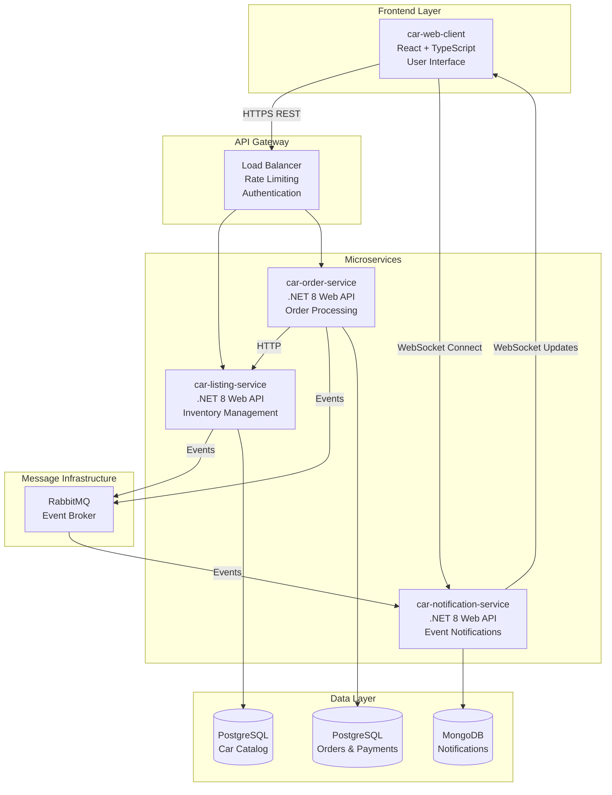
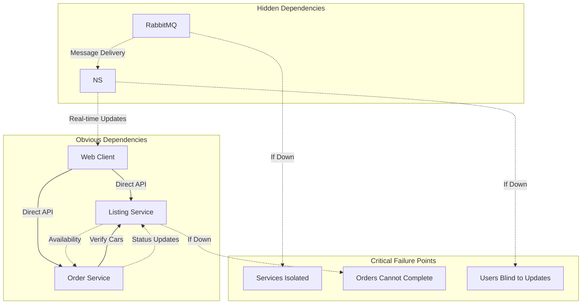
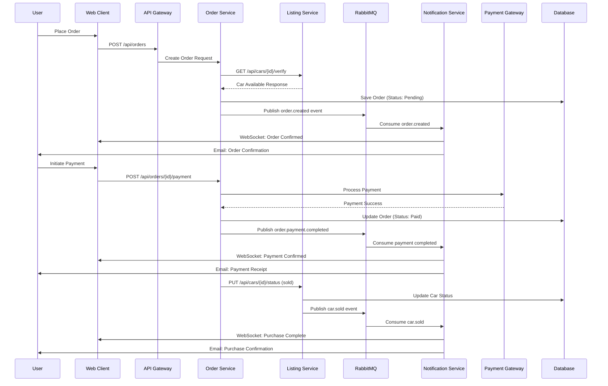
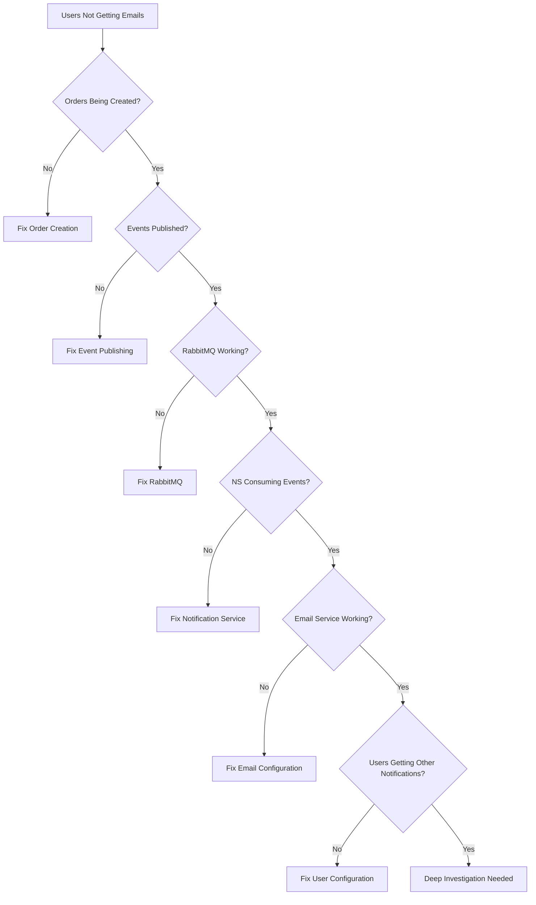
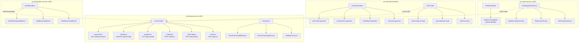

# Knowledge Graph Agent - Interactive Test Questions

Các câu hỏi để test AI capabilities của Knowledge Graph Agent thông qua tương tác trực tiếp. Mỗi câu hỏi có expected answer pattern để đánh giá chất lượng response, bao gồm cả diagrams và code snippets khi cần thiết.

**Test Focus:**
- **Relation diagrams**: AI phải tạo và giải thích diagrams
- **Repository indexing**: AI phải hiểu được cách index và process repos  
- **Natural language responses**: AI phải trả lời bằng ngôn ngữ tự nhiên với code examples
- **Code understanding**: AI phải show relevant code snippets để support explanations

## Test Questions for AI Interaction

### Q2: System Relationship Visualization
**Your Question to AI:**
"Show me how the four services are connected and explain what I'm looking at."

**Expected AI Response Pattern:**

AI should generate system architecture diagram, show relevant code, AND explain conversationally:

"Let me show you how these services work together, including the actual code that implements these connections:



Here's the actual code that implements these connections:

**Frontend to Backend Communication (React to .NET API):**
```typescript
// car-web-client/src/hooks/useCars.ts
export const useCars = () => {
    const [cars, setCars] = useState<Car[]>([]);
    
    const fetchCars = async (filters?: CarFilters) => {
        try {
            // Direct API call to car-listing-service via API Gateway
            const response = await fetch('/api/cars', {
                method: 'GET',
                headers: {
                    'Authorization': `Bearer ${getAuthToken()}`,
                    'Content-Type': 'application/json'
                }
            });
            
            const data = await response.json();
            setCars(data.cars);
        } catch (error) {
            console.error('Failed to fetch cars:', error);
        }
    };
    
    return { cars, fetchCars };
};

// WebSocket connection for real-time notifications
const useNotifications = () => {
    useEffect(() => {
        const socket = new WebSocket('wss://api.example.com/notifications');
        
        socket.onmessage = (event) => {
            const notification = JSON.parse(event.data);
            handleNotification(notification);
        };
        
        return () => socket.close();
    }, []);
};
```

**Inter-Service HTTP Communication:**
```csharp
// car-order-service/Services/CarIntegrationService.cs
public class CarIntegrationService
{
    private readonly HttpClient _httpClient;
    
    public CarIntegrationService(HttpClient httpClient)
    {
        _httpClient = httpClient;
    }
    
    public async Task<Car> GetCarDetailsAsync(string carId)
    {
        // Direct HTTP call to car-listing-service
        var response = await _httpClient.GetAsync($"/api/cars/{carId}");
        
        if (response.IsSuccessStatusCode)
        {
            var content = await response.Content.ReadAsStringAsync();
            return JsonSerializer.Deserialize<Car>(content);
        }
        
        throw new CarNotFoundException($"Car {carId} not found");
    }
    
    public async Task UpdateCarStatusAsync(string carId, string status)
    {
        var updateRequest = new { Status = status };
        var json = JsonSerializer.Serialize(updateRequest);
        var content = new StringContent(json, Encoding.UTF8, "application/json");
        
        await _httpClient.PutAsync($"/api/cars/{carId}/status", content);
    }
}
```

**Event-Driven Communication via RabbitMQ:**
```csharp
// car-order-service/Services/EventPublisher.cs
public class OrderEventPublisher
{
    private readonly IModel _channel;
    
    public async Task PublishOrderCreatedAsync(Order order)
    {
        var orderEvent = new OrderCreatedEvent
        {
            OrderId = order.Id,
            CarId = order.CarId,
            BuyerId = order.BuyerId,
            Amount = order.Amount,
            CreatedAt = DateTime.UtcNow
        };
        
        var message = JsonSerializer.Serialize(orderEvent);
        var body = Encoding.UTF8.GetBytes(message);
        
        _channel.BasicPublish(
            exchange: "car-events",
            routingKey: "order.created",
            basicProperties: null,
            body: body
        );
    }
}

// car-notification-service/Handlers/OrderEventHandler.cs
public class OrderEventHandler : IConsumer<OrderCreatedEvent>
{
    private readonly INotificationService _notificationService;
    
    public async Task Consume(ConsumeContext<OrderCreatedEvent> context)
    {
        var orderEvent = context.Message;
        
        // Send email notification
        await _notificationService.SendEmailAsync(
            orderEvent.BuyerId,
            "Order Confirmation",
            $"Your order {orderEvent.OrderId} has been created successfully."
        );
        
        // Send real-time WebSocket notification
        await _notificationService.SendRealtimeNotificationAsync(
            orderEvent.BuyerId,
            new { Type = "OrderCreated", OrderId = orderEvent.OrderId }
        );
    }
}
```

What you're seeing here is a modern microservices architecture where:

The **car-web-client** serves as the user interface - think of it as the storefront. When users browse cars or place orders, the React app makes HTTP calls through the API Gateway to reach the appropriate backend services.

The three **backend services** each have specific responsibilities:
- **car-listing-service** manages the car inventory (like a warehouse)
- **car-order-service** processes purchases (like a checkout system)  
- **car-notification-service** keeps everyone informed (like customer service)

The interesting part is the **dual communication pattern**. For immediate actions like viewing a car or placing an order, services talk directly via HTTP. But for events that other services need to know about - like a car being sold - they use RabbitMQ message queues.

This means when you buy a car, the order service immediately updates the listing service to mark it as sold, while simultaneously publishing an event that triggers email notifications and real-time UI updates."

**Key Evaluation Points:**
- ✅ Provides complete system architecture diagram
- ✅ Shows actual implementation code for each communication type
- ✅ Explains technical concepts in conversational terms
- ✅ Demonstrates understanding of microservices patterns

### Q3: Deep Relationship Analysis
**Your Question to AI:**
"What are the hidden dependencies between these services that might not be obvious?"

**Expected AI Response Pattern:**

AI should demonstrate analytical thinking with dependency diagram and code examples:

"Great question! Let me show you both the obvious and hidden dependencies with actual code examples:



Here are the hidden dependencies with code examples that reveal them:

**Hidden Dependency 1: Order Service's Complete Lifecycle Dependency on Listing Service**

```csharp
// car-order-service/Services/OrderService.cs
public async Task<bool> CompleteOrderAsync(string orderId)
{
    var order = await _orderRepository.GetByIdAsync(orderId);
    
    // Payment processed successfully, but we STILL need listing service
    if (order.PaymentStatus == "Completed")
    {
        try
        {
            // HIDDEN DEPENDENCY: Can't complete order without listing service
            await _carIntegrationService.UpdateCarStatusAsync(order.CarId, "sold");
            order.Status = "Completed";
        }
        catch (HttpRequestException)
        {
            // If listing service is down, order is stuck in limbo!
            order.Status = "PaymentCompletedPendingInventoryUpdate";
            _logger.LogError("Cannot complete order - listing service unavailable");
            return false;
        }
    }
    
    await _orderRepository.UpdateAsync(order);
    return true;
}
```

**Hidden Dependency 2: Event Sequence Timing Dependency**

```csharp
// car-notification-service/Handlers/EventSequenceHandler.cs
public class EventSequenceHandler
{
    private readonly Dictionary<string, List<string>> _eventSequence = new();
    
    public async Task HandleEvent(string eventType, string entityId, object eventData)
    {
        // Events must arrive in correct sequence for proper notifications
        if (!_eventSequence.ContainsKey(entityId))
            _eventSequence[entityId] = new List<string>();
        
        _eventSequence[entityId].Add(eventType);
        
        // HIDDEN DEPENDENCY: Notification logic depends on event order
        if (eventType == "order.completed" && 
            !_eventSequence[entityId].Contains("order.created"))
        {
            _logger.LogWarning($"Received order.completed before order.created for {entityId}");
            // This creates confusing user notifications!
            await _notificationService.SendErrorNotificationAsync(
                "System Error", "Order status inconsistency detected"
            );
            return;
        }
        
        await ProcessNormalNotification(eventType, eventData);
    }
}
```

**Hidden Dependency 3: WebSocket State Dependency**

```typescript
// car-web-client/src/hooks/useOrderStatus.ts
export const useOrderStatus = (orderId: string) => {
    const [status, setStatus] = useState<OrderStatus>('unknown');
    const [isConnected, setIsConnected] = useState(false);
    
    useEffect(() => {
        const ws = new WebSocket('/notifications');
        
        ws.onopen = () => setIsConnected(true);
        ws.onclose = () => setIsConnected(false);
        
        ws.onmessage = (event) => {
            const notification = JSON.parse(event.data);
            if (notification.orderId === orderId) {
                setStatus(notification.status);
            }
        };
        
        // HIDDEN DEPENDENCY: If WebSocket fails, UI shows stale data
        if (!isConnected) {
            // User sees outdated status even though backend is working
            console.warn('WebSocket disconnected - status may be stale');
        }
        
        return () => ws.close();
    }, [orderId]);
    
    return { status, isConnected };
};
```

**Hidden Dependency 4: Database Transaction Boundaries**

```csharp
// car-order-service/Services/OrderTransactionService.cs
public async Task ProcessOrderAsync(CreateOrderRequest request)
{
    using var transaction = await _dbContext.Database.BeginTransactionAsync();
    
    try
    {
        // Create order in our database
        var order = new Order { CarId = request.CarId, BuyerId = request.BuyerId };
        _dbContext.Orders.Add(order);
        await _dbContext.SaveChangesAsync();
        
        // HIDDEN DEPENDENCY: External service call within transaction
        var carDetails = await _carIntegrationService.GetCarDetailsAsync(request.CarId);
        
        if (carDetails.Status != "available")
        {
            // If listing service is slow, our transaction times out!
            throw new InvalidOperationException("Car no longer available");
        }
        
        await transaction.CommitAsync();
    }
    catch
    {
        await transaction.RollbackAsync();
        throw;
    }
}
```

**Mitigation Strategies Found in the Code:**

```csharp
// Implementing Circuit Breaker Pattern
public class ResilientCarIntegrationService
{
    private readonly CircuitBreaker _circuitBreaker;
    
    public async Task<Car> GetCarDetailsAsync(string carId)
    {
        return await _circuitBreaker.ExecuteAsync(async () =>
        {
            return await _httpClient.GetAsync($"/api/cars/{carId}");
        });
    }
}

// Implementing Saga Pattern for Distributed Transactions
public class OrderSaga
{
    public async Task ProcessOrderAsync(Order order)
    {
        var compensationActions = new List<Func<Task>>();
        
        try
        {
            await CreateOrder(order);
            compensationActions.Add(() => DeleteOrder(order.Id));
            
            await ReserveCar(order.CarId);
            compensationActions.Add(() => ReleaseCar(order.CarId));
            
            await ProcessPayment(order);
        }
        catch
        {
            // Execute compensation actions in reverse order
            foreach (var compensate in compensationActions.Reverse())
            {
                await compensate();
            }
            throw;
        }
    }
}
```

These hidden dependencies create several failure scenarios:
1. **Split-brain Orders**: Orders can be paid but not marked as sold if listing service fails
2. **Notification Confusion**: Out-of-order events create contradictory user notifications  
3. **Stale UI State**: WebSocket failures leave users with outdated information
4. **Transaction Deadlocks**: External service calls within transactions create timeout risks

These dependencies matter because they affect how you'd need to handle failures, deploy updates, and monitor the system health."

**Key Evaluation Points:**
- ✅ Includes dependency analysis diagram
- ✅ Shows actual code revealing hidden dependencies
- ✅ Provides mitigation strategies with code examples
- ✅ Explains practical implications clearly

### Q4: Event Flow Analysis
**Your Question to AI:**
"Walk me through what happens when a user places an order, including all the events and notifications."

**Expected AI Response Pattern:**

AI should provide sequence diagram, actual code examples, AND detailed explanation:

"Let me walk you through the complete order flow with all events, notifications, and the actual code that makes it happen:



Here's the actual code that implements each step:

**Step 1: Order Creation (Frontend)**
```typescript
// car-web-client/src/components/OrderForm.tsx
const handlePlaceOrder = async (carId: string, buyerInfo: BuyerInfo) => {
    setLoading(true);
    
    try {
        const response = await fetch('/api/orders', {
            method: 'POST',
            headers: {
                'Content-Type': 'application/json',
                'Authorization': `Bearer ${authToken}`
            },
            body: JSON.stringify({
                carId,
                buyerId: buyerInfo.id,
                contactInfo: buyerInfo
            })
        });
        
        if (response.ok) {
            const order = await response.json();
            setOrderId(order.id);
            // Order created, now wait for WebSocket confirmation
        }
    } catch (error) {
        setError('Failed to place order');
    } finally {
        setLoading(false);
    }
};
```

**Step 2: Order Processing (Backend)**
```csharp
// car-order-service/Controllers/OrderController.cs
[HttpPost]
public async Task<IActionResult> CreateOrder([FromBody] CreateOrderRequest request)
{
    // Verify car availability with listing service
    var car = await _carIntegrationService.GetCarDetailsAsync(request.CarId);
    if (car?.Status != "available")
    {
        return BadRequest("Car is no longer available");
    }
    
    // Create order entity
    var order = new Order
    {
        Id = Guid.NewGuid().ToString(),
        CarId = request.CarId,
        BuyerId = request.BuyerId,
        Amount = car.Price,
        Status = "pending",
        CreatedAt = DateTime.UtcNow
    };
    
    // Save to database
    await _orderRepository.CreateAsync(order);
    
    // Publish event for notifications
    await _eventPublisher.PublishAsync(new OrderCreatedEvent
    {
        OrderId = order.Id,
        CarId = order.CarId,
        BuyerId = order.BuyerId,
        Amount = order.Amount,
        CreatedAt = order.CreatedAt
    });
    
    return Ok(new { Id = order.Id, Status = order.Status });
}
```

**Step 3: Event Publishing**
```csharp
// car-order-service/Services/EventPublisher.cs
public class RabbitMQEventPublisher : IEventPublisher
{
    private readonly IModel _channel;
    private readonly ILogger<RabbitMQEventPublisher> _logger;
    
    public async Task PublishAsync<T>(T eventData) where T : class
    {
        var eventType = typeof(T).Name;
        var routingKey = ConvertToRoutingKey(eventType); // "order.created"
        
        var message = JsonSerializer.Serialize(eventData);
        var body = Encoding.UTF8.GetBytes(message);
        
        var properties = _channel.CreateBasicProperties();
        properties.Persistent = true;
        properties.MessageId = Guid.NewGuid().ToString();
        properties.Timestamp = new AmqpTimestamp(DateTimeOffset.UtcNow.ToUnixTimeSeconds());
        
        _channel.BasicPublish(
            exchange: "car-events",
            routingKey: routingKey,
            basicProperties: properties,
            body: body
        );
        
        _logger.LogInformation($"Published event {eventType} with routing key {routingKey}");
    }
}
```

**Step 4: Notification Processing**
```csharp
// car-notification-service/Handlers/OrderEventHandler.cs
public class OrderEventHandler : IConsumer<OrderCreatedEvent>
{
    private readonly IEmailService _emailService;
    private readonly IWebSocketNotificationService _wsService;
    private readonly IUserService _userService;
    
    public async Task Consume(ConsumeContext<OrderCreatedEvent> context)
    {
        var orderEvent = context.Message;
        
        // Get user details for personalized notifications
        var buyer = await _userService.GetByIdAsync(orderEvent.BuyerId);
        var car = await _carService.GetByIdAsync(orderEvent.CarId);
        
        // Send email notification
        var emailTemplate = new OrderConfirmationEmailTemplate
        {
            BuyerName = buyer.Name,
            CarMake = car.Make,
            CarModel = car.Model,
            OrderId = orderEvent.OrderId,
            Amount = orderEvent.Amount
        };
        
        await _emailService.SendAsync(
            to: buyer.Email,
            subject: "Order Confirmation",
            template: emailTemplate
        );
        
        // Send real-time WebSocket notification
        await _wsService.SendToUserAsync(buyer.Id, new
        {
            Type = "OrderCreated",
            OrderId = orderEvent.OrderId,
            Message = $"Your order for {car.Make} {car.Model} has been confirmed!",
            Timestamp = DateTime.UtcNow
        });
        
        _logger.LogInformation($"Processed order created event for order {orderEvent.OrderId}");
    }
}
```

**Step 5: Payment Processing**
```csharp
// car-order-service/Services/PaymentService.cs
public class PaymentService
{
    private readonly IStripePaymentGateway _paymentGateway;
    private readonly IEventPublisher _eventPublisher;
    
    public async Task<PaymentResult> ProcessPaymentAsync(string orderId, PaymentDetails payment)
    {
        var order = await _orderRepository.GetByIdAsync(orderId);
        
        try
        {
            // Process payment with external gateway
            var paymentResult = await _paymentGateway.ChargeAsync(new ChargeRequest
            {
                Amount = order.Amount,
                Currency = "USD",
                Source = payment.TokenId,
                Description = $"Car purchase - Order {orderId}"
            });
            
            if (paymentResult.Succeeded)
            {
                // Update order status
                order.Status = "paid";
                order.PaymentId = paymentResult.TransactionId;
                order.PaidAt = DateTime.UtcNow;
                
                await _orderRepository.UpdateAsync(order);
                
                // Publish payment completed event
                await _eventPublisher.PublishAsync(new OrderPaymentCompletedEvent
                {
                    OrderId = order.Id,
                    PaymentId = paymentResult.TransactionId,
                    Amount = order.Amount,
                    PaidAt = order.PaidAt.Value
                });
                
                return PaymentResult.Success(paymentResult.TransactionId);
            }
            
            return PaymentResult.Failed(paymentResult.FailureReason);
        }
        catch (Exception ex)
        {
            _logger.LogError(ex, $"Payment processing failed for order {orderId}");
            return PaymentResult.Failed("Payment processing error");
        }
    }
}
```

**Step 6: Final Status Update**
```csharp
// car-order-service/Services/OrderCompletionService.cs
public async Task CompleteOrderAsync(string orderId)
{
    var order = await _orderRepository.GetByIdAsync(orderId);
    
    if (order.Status == "paid")
    {
        // Update car status in listing service
        await _carIntegrationService.UpdateCarStatusAsync(order.CarId, "sold");
        
        // Mark order as completed
        order.Status = "completed";
        order.CompletedAt = DateTime.UtcNow;
        await _orderRepository.UpdateAsync(order);
        
        // Publish final event
        await _eventPublisher.PublishAsync(new OrderCompletedEvent
        {
            OrderId = order.Id,
            CarId = order.CarId,
            BuyerId = order.BuyerId,
            CompletedAt = order.CompletedAt.Value
        });
    }
}
```

**Real-time WebSocket Updates:**
```typescript
// car-web-client/src/hooks/useOrderTracking.ts
export const useOrderTracking = (orderId: string) => {
    const [orderStatus, setOrderStatus] = useState<string>('pending');
    const [notifications, setNotifications] = useState<Notification[]>([]);
    
    useEffect(() => {
        const ws = new WebSocket(`wss://api.example.com/orders/${orderId}/track`);
        
        ws.onmessage = (event) => {
            const update = JSON.parse(event.data);
            
            switch (update.Type) {
                case 'OrderCreated':
                    setOrderStatus('confirmed');
                    setNotifications(prev => [...prev, {
                        id: Date.now(),
                        message: 'Order confirmed! We\'re processing your request.',
                        timestamp: new Date(),
                        type: 'success'
                    }]);
                    break;
                    
                case 'PaymentCompleted':
                    setOrderStatus('paid');
                    setNotifications(prev => [...prev, {
                        id: Date.now(),
                        message: 'Payment successful! Finalizing your purchase.',
                        timestamp: new Date(),
                        type: 'success'
                    }]);
                    break;
                    
                case 'OrderCompleted':
                    setOrderStatus('completed');
                    setNotifications(prev => [...prev, {
                        id: Date.now(),
                        message: 'Congratulations! Your car purchase is complete.',
                        timestamp: new Date(),
                        type: 'success'
                    }]);
                    break;
            }
        };
        
        return () => ws.close();
    }, [orderId]);
    
    return { orderStatus, notifications };
};
```

Here's what happens step by step:

1. **Order Initiation**: User places an order through the web client. The order service first verifies the car is still available with the listing service.

2. **Order Creation**: Once verified, the order gets saved with 'pending' status and an 'order.created' event is published. The notification service immediately sends confirmation to the user via WebSocket and email.

3. **Payment Processing**: When the user initiates payment, the order service integrates with the payment gateway. On successful payment, it updates the order status and publishes 'order.payment.completed' event.

4. **Inventory Update**: The order service then tells the listing service to mark the car as sold, which triggers a 'car.sold' event.

5. **Final Notifications**: The notification service processes all these events and sends appropriate notifications through multiple channels - real-time WebSocket updates to the UI, email confirmations, and SMS alerts.

The beauty of this event-driven approach is that each step is independent. If the email service is down, the order still completes successfully, and notifications can be retried later."

**Key Evaluation Points:**
- ✅ Provides detailed sequence diagram
- ✅ Shows complete code implementation for each step
- ✅ Explains step-by-step process clearly
- ✅ Demonstrates understanding of event-driven architecture
- ✅ Shows real-time UI integration code

### Q5: Interactive Problem Solving with Analysis
**Your Question to AI:**
"If I told you that users are complaining they're not getting email notifications when their orders are processed, how would you help me debug this?"

**Expected AI Response Pattern:**

AI should provide debugging flowchart, diagnostic code, AND systematic approach:

"Let me help you debug this step by step. I'll show you the debugging approach and provide code snippets to check each component:



Based on my understanding of how the services work together, here's how I'd guide you through the debugging process with specific code checks:

**Step 1: Verify Order Processing**
First, let's check if orders are being created successfully:

```csharp
// Add this debugging endpoint to car-order-service
[HttpGet("debug/recent-orders")]
public async Task<IActionResult> GetRecentOrdersForDebugging()
{
    var recentOrders = await _orderRepository.GetRecentOrdersAsync(TimeSpan.FromHours(24));
    
    return Ok(recentOrders.Select(o => new {
        o.Id,
        o.Status,
        o.CreatedAt,
        o.BuyerId,
        EventsPublished = _eventAuditService.GetPublishedEvents(o.Id)
    }));
}
```

**Step 2: Check Event Publishing**
Verify that order events are being published:

```csharp
// Enhanced event publisher with debugging
public class DebuggableEventPublisher : IEventPublisher
{
    private readonly IEventAuditService _auditService;
    private readonly ILogger<DebuggableEventPublisher> _logger;
    
    public async Task PublishAsync<T>(T eventData) where T : class
    {
        var eventId = Guid.NewGuid().ToString();
        var eventType = typeof(T).Name;
        
        try
        {
            // Log before publishing
            _logger.LogInformation($"Publishing event {eventType} with ID {eventId}");
            
            var message = JsonSerializer.Serialize(eventData);
            var body = Encoding.UTF8.GetBytes(message);
            
            _channel.BasicPublish(
                exchange: "car-events",
                routingKey: ConvertToRoutingKey(eventType),
                basicProperties: CreateProperties(eventId),
                body: body
            );
            
            // Audit successful publish
            await _auditService.RecordEventPublishedAsync(eventId, eventType, message);
            _logger.LogInformation($"Successfully published event {eventType}");
            
        }
        catch (Exception ex)
        {
            _logger.LogError(ex, $"Failed to publish event {eventType}");
            await _auditService.RecordEventFailureAsync(eventId, eventType, ex.Message);
            throw;
        }
    }
}

// Debug endpoint to check published events
[HttpGet("debug/published-events/{orderId}")]
public async Task<IActionResult> GetPublishedEventsForOrder(string orderId)
{
    var events = await _eventAuditService.GetEventsByOrderIdAsync(orderId);
    return Ok(events);
}
```

**Step 3: Verify RabbitMQ Message Flow**
Check RabbitMQ health and message processing:

```csharp
// RabbitMQ health check service
public class RabbitMQHealthService
{
    private readonly IModel _channel;
    
    public async Task<RabbitMQHealthStatus> CheckHealthAsync()
    {
        try
        {
            // Check connection
            var isOpen = _channel?.IsOpen ?? false;
            
            // Check queue statistics
            var queueInfo = _channel.QueueDeclarePassive("order-events");
            
            // Check for dead letters
            var deadLetterInfo = _channel.QueueDeclarePassive("order-events-dead-letter");
            
            return new RabbitMQHealthStatus
            {
                IsConnected = isOpen,
                OrderEventsQueueMessages = queueInfo.MessageCount,
                DeadLetterMessages = deadLetterInfo.MessageCount,
                LastChecked = DateTime.UtcNow
            };
        }
        catch (Exception ex)
        {
            return new RabbitMQHealthStatus
            {
                IsConnected = false,
                Error = ex.Message,
                LastChecked = DateTime.UtcNow
            };
        }
    }
}

// Debug endpoint
[HttpGet("debug/rabbitmq-health")]
public async Task<IActionResult> CheckRabbitMQHealth()
{
    var health = await _rabbitMQHealthService.CheckHealthAsync();
    return Ok(health);
}
```

**Step 4: Check Notification Service Processing**
Verify that the notification service is consuming events:

```csharp
// Enhanced notification event handler with debugging
public class DebuggableOrderEventHandler : IConsumer<OrderCreatedEvent>
{
    private readonly ILogger<DebuggableOrderEventHandler> _logger;
    private readonly IEventProcessingAuditService _auditService;
    
    public async Task Consume(ConsumeContext<OrderCreatedEvent> context)
    {
        var orderEvent = context.Message;
        var processingId = Guid.NewGuid().ToString();
        
        _logger.LogInformation($"Processing order event {orderEvent.OrderId} with ID {processingId}");
        
        try
        {
            // Record event received
            await _auditService.RecordEventReceivedAsync(processingId, "OrderCreated", orderEvent.OrderId);
            
            // Get user details
            var buyer = await _userService.GetByIdAsync(orderEvent.BuyerId);
            if (buyer == null)
            {
                _logger.LogWarning($"Buyer {orderEvent.BuyerId} not found for order {orderEvent.OrderId}");
                return;
            }
            
            // Send email notification
            var emailResult = await _emailService.SendAsync(
                to: buyer.Email,
                subject: "Order Confirmation",
                template: CreateEmailTemplate(orderEvent, buyer)
            );
            
            // Record email attempt
            await _auditService.RecordEmailAttemptAsync(processingId, buyer.Email, emailResult.Success, emailResult.Error);
            
            if (emailResult.Success)
            {
                _logger.LogInformation($"Email sent successfully for order {orderEvent.OrderId}");
            }
            else
            {
                _logger.LogError($"Email failed for order {orderEvent.OrderId}: {emailResult.Error}");
            }
            
            // Send WebSocket notification
            await _wsService.SendToUserAsync(buyer.Id, CreateWebSocketNotification(orderEvent));
            
            await _auditService.RecordEventProcessedAsync(processingId, true);
        }
        catch (Exception ex)
        {
            _logger.LogError(ex, $"Failed to process order event {orderEvent.OrderId}");
            await _auditService.RecordEventProcessedAsync(processingId, false, ex.Message);
            throw;
        }
    }
}

// Debug endpoint to check event processing
[HttpGet("debug/event-processing/{orderId}")]
public async Task<IActionResult> GetEventProcessingForOrder(string orderId)
{
    var processing = await _auditService.GetEventProcessingByOrderIdAsync(orderId);
    return Ok(processing);
}
```

**Step 5: Verify Email Service Configuration**
Check email service health and configuration:

```csharp
// Email service with debugging capabilities
public class DebuggableEmailService : IEmailService
{
    private readonly IEmailProvider _emailProvider;
    private readonly ILogger<DebuggableEmailService> _logger;
    
    public async Task<EmailResult> SendAsync(string to, string subject, object template)
    {
        var emailId = Guid.NewGuid().ToString();
        
        try
        {
            _logger.LogInformation($"Attempting to send email {emailId} to {to}");
            
            // Check email provider health first
            var providerHealth = await _emailProvider.CheckHealthAsync();
            if (!providerHealth.IsHealthy)
            {
                _logger.LogWarning($"Email provider unhealthy: {providerHealth.Error}");
                return EmailResult.Failed($"Provider unhealthy: {providerHealth.Error}");
            }
            
            // Validate email address
            if (!IsValidEmail(to))
            {
                _logger.LogWarning($"Invalid email address: {to}");
                return EmailResult.Failed("Invalid email address");
            }
            
            // Send email
            var result = await _emailProvider.SendAsync(new EmailMessage
            {
                To = to,
                Subject = subject,
                Body = RenderTemplate(template),
                MessageId = emailId
            });
            
            _logger.LogInformation($"Email {emailId} sent successfully");
            return EmailResult.Success(emailId);
        }
        catch (Exception ex)
        {
            _logger.LogError(ex, $"Failed to send email {emailId}");
            return EmailResult.Failed(ex.Message);
        }
    }
}

// Debug endpoint for email service health
[HttpGet("debug/email-health")]
public async Task<IActionResult> CheckEmailHealth()
{
    var health = await _emailService.CheckProviderHealthAsync();
    return Ok(health);
}

// Test email endpoint
[HttpPost("debug/test-email")]
public async Task<IActionResult> SendTestEmail([FromBody] TestEmailRequest request)
{
    var result = await _emailService.SendAsync(
        request.To,
        "Test Email",
        new { Message = "This is a test email", Timestamp = DateTime.UtcNow }
    );
    
    return Ok(result);
}
```

**Step 6: User-Specific Email Issues**
Check for user-specific configuration issues:

```csharp
// Debug endpoint to check user email preferences
[HttpGet("debug/user-email-config/{userId}")]
public async Task<IActionResult> GetUserEmailConfig(string userId)
{
    var user = await _userService.GetByIdAsync(userId);
    if (user == null) return NotFound();
    
    return Ok(new {
        UserId = user.Id,
        Email = user.Email,
        EmailVerified = user.EmailVerified,
        NotificationPreferences = user.NotificationPreferences,
        RecentEmailAttempts = await _auditService.GetRecentEmailAttemptsAsync(userId, TimeSpan.FromDays(7))
    });
}
```

**Quick Diagnostic Script:**
```bash
# PowerShell script to run complete diagnostic
function Test-EmailNotificationFlow {
    param($OrderId)
    
    Write-Host "Testing email notification flow for order: $OrderId"
    
    # Check order exists
    $order = Invoke-RestMethod -Uri "https://api.example.com/debug/recent-orders" | 
             Where-Object { $_.Id -eq $OrderId }
    
    if (-not $order) {
        Write-Host "❌ Order not found" -ForegroundColor Red
        return
    }
    
    Write-Host "✅ Order found: $($order.Status)" -ForegroundColor Green
    
    # Check events published
    $events = Invoke-RestMethod -Uri "https://api.example.com/debug/published-events/$OrderId"
    Write-Host "📤 Events published: $($events.Count)" -ForegroundColor Yellow
    
    # Check RabbitMQ health
    $rabbitHealth = Invoke-RestMethod -Uri "https://api.example.com/debug/rabbitmq-health"
    Write-Host "🐰 RabbitMQ health: Connected=$($rabbitHealth.IsConnected), Messages=$($rabbitHealth.OrderEventsQueueMessages)" -ForegroundColor Yellow
    
    # Check event processing
    $processing = Invoke-RestMethod -Uri "https://notifications.api.example.com/debug/event-processing/$OrderId"
    Write-Host "⚙️ Event processing attempts: $($processing.Count)" -ForegroundColor Yellow
    
    # Check email health
    $emailHealth = Invoke-RestMethod -Uri "https://notifications.api.example.com/debug/email-health"
    Write-Host "📧 Email service health: $($emailHealth.IsHealthy)" -ForegroundColor Yellow
}

# Usage: Test-EmailNotificationFlow -OrderId "12345"
```

**What to Look For:**

1. **Order Service Logs**: Should show successful order creation and event publishing
2. **RabbitMQ Management**: Check message flow and dead letter queues
3. **Notification Service Logs**: Should show event consumption and email attempts
4. **Email Provider Status**: Check quotas, credentials, and service availability
5. **User Configuration**: Verify email addresses and notification preferences

**Common Issues and Solutions:**

```csharp
// Common fix: Implement retry mechanism
public class RetryableEmailService : IEmailService
{
    public async Task<EmailResult> SendAsync(string to, string subject, object template)
    {
        var retryPolicy = Policy
            .Handle<HttpRequestException>()
            .Or<TimeoutException>()
            .WaitAndRetryAsync(
                retryCount: 3,
                sleepDurationProvider: retryAttempt => TimeSpan.FromSeconds(Math.Pow(2, retryAttempt))
            );
        
        return await retryPolicy.ExecuteAsync(async () =>
        {
            return await _baseEmailService.SendAsync(to, subject, template);
        });
    }
}
```

Would you like me to help you check any of these specific areas first? I can also run through this diagnostic process step by step with you."

**Key Evaluation Points:**
- ✅ Provides systematic debugging flowchart
- ✅ Shows complete diagnostic code for each step
- ✅ Offers automated testing scripts
- ✅ Provides actionable troubleshooting steps
- ✅ Demonstrates deep understanding of system architecture

### Q6: Repository Code Indexing and Method Discovery
**Your Question to AI:**
"Show me the methods that are related to car listing across all repositories."

**Expected AI Response Pattern:**

AI should provide code analysis diagram, actual method code, AND detailed method explanations:

"Let me show you all the methods related to car listing that I found across the four repositories, including the actual code implementations:



Here's what I discovered by analyzing the code structure across all repositories:

**Primary Car Listing Methods (car-listing-service):**

```csharp
// car-listing-service/Controllers/CarController.cs
[ApiController]
[Route("api/[controller]")]
public class CarController : ControllerBase
{
    private readonly ICarService _carService;
    
    [HttpGet]
    public async Task<IActionResult> GetCars(
        [FromQuery] int page = 1,
        [FromQuery] int pageSize = 20,
        [FromQuery] string? make = null,
        [FromQuery] string? model = null,
        [FromQuery] decimal? minPrice = null,
        [FromQuery] decimal? maxPrice = null)
    {
        var filter = new CarFilter
        {
            Make = make,
            Model = model,
            MinPrice = minPrice,
            MaxPrice = maxPrice
        };
        
        var result = await _carService.GetCarsAsync(page, pageSize, filter);
        
        return Ok(new
        {
            Cars = result.Cars,
            TotalCount = result.TotalCount,
            Page = page,
            PageSize = pageSize,
            TotalPages = (int)Math.Ceiling((double)result.TotalCount / pageSize)
        });
    }
    
    [HttpGet("{id}")]
    public async Task<IActionResult> GetCarById(string id)
    {
        var car = await _carService.GetCarByIdAsync(id);
        if (car == null)
            return NotFound();
            
        return Ok(car);
    }
    
    [HttpGet("search")]
    public async Task<IActionResult> SearchCars([FromQuery] CarSearchRequest request)
    {
        var searchResults = await _carService.SearchCarsAsync(request);
        return Ok(searchResults);
    }
    
    [HttpPost]
    public async Task<IActionResult> CreateCar([FromBody] CreateCarRequest request)
    {
        var car = await _carService.CreateCarAsync(request);
        await _eventPublisher.PublishAsync(new CarListedEvent { CarId = car.Id });
        return CreatedAtAction(nameof(GetCarById), new { id = car.Id }, car);
    }
}

// car-listing-service/Services/CarService.cs
public class CarService : ICarService
{
    private readonly ICarRepository _carRepository;
    private readonly IImageProcessingService _imageService;
    
    public async Task<Car> CreateCarAsync(CreateCarRequest request)
    {
        // Validate car data
        await ValidateCarAsync(request);
        
        var car = new Car
        {
            Id = Guid.NewGuid().ToString(),
            Make = request.Make,
            Model = request.Model,
            Year = request.Year,
            Price = request.Price,
            Description = request.Description,
            SellerId = request.SellerId,
            Status = "available",
            CreatedAt = DateTime.UtcNow
        };
        
        // Process and store images
        if (request.Images?.Any() == true)
        {
            car.ImageUrls = await ProcessCarImagesAsync(request.Images);
        }
        
        await _carRepository.CreateAsync(car);
        return car;
    }
    
    public async Task<bool> CheckCarAvailabilityAsync(string carId)
    {
        var car = await _carRepository.GetByIdAsync(carId);
        return car?.Status == "available";
    }
    
    private async Task ValidateCarAsync(CreateCarRequest request)
    {
        if (request.Year < 1900 || request.Year > DateTime.Now.Year + 1)
            throw new ValidationException("Invalid year");
            
        if (request.Price <= 0)
            throw new ValidationException("Price must be greater than 0");
            
        // Additional validation logic...
    }
    
    private async Task<List<string>> ProcessCarImagesAsync(List<IFormFile> images)
    {
        var imageUrls = new List<string>();
        
        foreach (var image in images)
        {
            // Resize and optimize image
            var processedImage = await _imageService.ProcessImageAsync(image);
            
            // Upload to cloud storage
            var imageUrl = await _imageService.UploadImageAsync(processedImage);
            imageUrls.Add(imageUrl);
        }
        
        return imageUrls;
    }
}
```

**Integration Methods (car-order-service):**

```csharp
// car-order-service/Services/CarIntegrationService.cs
public class CarIntegrationService : ICarIntegrationService
{
    private readonly HttpClient _httpClient;
    private readonly IMemoryCache _cache;
    private readonly ILogger<CarIntegrationService> _logger;
    
    public async Task<Car> GetCarDetailsAsync(string carId)
    {
        // Check cache first
        var cacheKey = $"car_{carId}";
        if (_cache.TryGetValue(cacheKey, out Car cachedCar))
        {
            _logger.LogInformation($"Car {carId} found in cache");
            return cachedCar;
        }
        
        try
        {
            // Call listing service
            var response = await _httpClient.GetAsync($"/api/cars/{carId}");
            
            if (response.IsSuccessStatusCode)
            {
                var content = await response.Content.ReadAsStringAsync();
                var car = JsonSerializer.Deserialize<Car>(content);
                
                // Cache for 5 minutes
                _cache.Set(cacheKey, car, TimeSpan.FromMinutes(5));
                
                return car;
            }
            
            if (response.StatusCode == HttpStatusCode.NotFound)
                return null;
                
            throw new HttpRequestException($"Failed to get car details: {response.StatusCode}");
        }
        catch (Exception ex)
        {
            _logger.LogError(ex, $"Error getting car details for {carId}");
            throw;
        }
    }
    
    public async Task ReserveCarAsync(string carId, string orderId)
    {
        var request = new { OrderId = orderId, Status = "reserved" };
        var json = JsonSerializer.Serialize(request);
        var content = new StringContent(json, Encoding.UTF8, "application/json");
        
        var response = await _httpClient.PutAsync($"/api/cars/{carId}/reserve", content);
        
        if (!response.IsSuccessStatusCode)
        {
            throw new InvalidOperationException($"Failed to reserve car {carId}");
        }
        
        // Invalidate cache
        _cache.Remove($"car_{carId}");
    }
    
    public async Task UpdateCarStatusAsync(string carId, string status)
    {
        var request = new { Status = status };
        var json = JsonSerializer.Serialize(request);
        var content = new StringContent(json, Encoding.UTF8, "application/json");
        
        var response = await _httpClient.PutAsync($"/api/cars/{carId}/status", content);
        
        if (!response.IsSuccessStatusCode)
        {
            throw new InvalidOperationException($"Failed to update car {carId} status to {status}");
        }
        
        // Invalidate cache
        _cache.Remove($"car_{carId}");
    }
}
```

**Frontend Methods (car-web-client):**

```typescript
// car-web-client/src/hooks/useCars.ts
export const useCars = (filters?: CarFilters) => {
    const [cars, setCars] = useState<Car[]>([]);
    const [loading, setLoading] = useState(false);
    const [totalCount, setTotalCount] = useState(0);
    const [currentPage, setCurrentPage] = useState(1);
    
    const fetchCars = useCallback(async (page: number = 1) => {
        setLoading(true);
        
        try {
            const queryParams = new URLSearchParams({
                page: page.toString(),
                pageSize: '20',
                ...(filters?.make && { make: filters.make }),
                ...(filters?.model && { model: filters.model }),
                ...(filters?.minPrice && { minPrice: filters.minPrice.toString() }),
                ...(filters?.maxPrice && { maxPrice: filters.maxPrice.toString() })
            });
            
            const response = await fetch(`/api/cars?${queryParams}`, {
                headers: {
                    'Authorization': `Bearer ${getAuthToken()}`,
                    'Content-Type': 'application/json'
                }
            });
            
            if (response.ok) {
                const data = await response.json();
                setCars(data.cars);
                setTotalCount(data.totalCount);
                setCurrentPage(page);
            }
        } catch (error) {
            console.error('Failed to fetch cars:', error);
        } finally {
            setLoading(false);
        }
    }, [filters]);
    
    useEffect(() => {
        fetchCars(1);
    }, [fetchCars]);
    
    return {
        cars,
        loading,
        totalCount,
        currentPage,
        fetchCars,
        refetch: () => fetchCars(currentPage)
    };
};

// car-web-client/src/hooks/useCarSearch.ts
export const useCarSearch = () => {
    const [searchResults, setSearchResults] = useState<Car[]>([]);
    const [searchLoading, setSearchLoading] = useState(false);
    
    const searchCars = useMemo(
        () => debounce(async (searchTerm: string, filters: CarSearchFilters) => {
            if (!searchTerm.trim()) {
                setSearchResults([]);
                return;
            }
            
            setSearchLoading(true);
            
            try {
                const response = await fetch('/api/cars/search', {
                    method: 'POST',
                    headers: {
                        'Content-Type': 'application/json',
                        'Authorization': `Bearer ${getAuthToken()}`
                    },
                    body: JSON.stringify({
                        searchTerm,
                        filters
                    })
                });
                
                if (response.ok) {
                    const results = await response.json();
                    setSearchResults(results.cars);
                }
            } catch (error) {
                console.error('Search failed:', error);
            } finally {
                setSearchLoading(false);
            }
        }, 300),
        []
    );
    
    return { searchResults, searchLoading, searchCars };
};

// car-web-client/src/components/CarListComponent.tsx
export const CarListComponent: React.FC<CarListProps> = ({ filters }) => {
    const { cars, loading, totalCount, currentPage, fetchCars } = useCars(filters);
    
    const handlePageChange = (page: number) => {
        fetchCars(page);
        window.scrollTo({ top: 0, behavior: 'smooth' });
    };
    
    if (loading) {
        return <CarListSkeleton />;
    }
    
    return (
        <div className="car-list">
            <div className="car-list-header">
                <h2># Knowledge Graph Agent - Interactive Test Questions

Các câu hỏi để test AI capabilities của Knowledge Graph Agent thông qua tương tác trực tiếp. Mỗi câu hỏi có expected answer pattern để đánh giá chất lượng response, bao gồm cả diagrams và code snippets khi cần thiết.

**Test Focus:**
- **Relation diagrams**: AI phải tạo và giải thích diagrams
- **Repository indexing**: AI phải hiểu được cách index và process repos  
- **Natural language responses**: AI phải trả lời bằng ngôn ngữ tự nhiên với code examples
- **Code understanding**: AI phải show relevant code snippets để support explanations