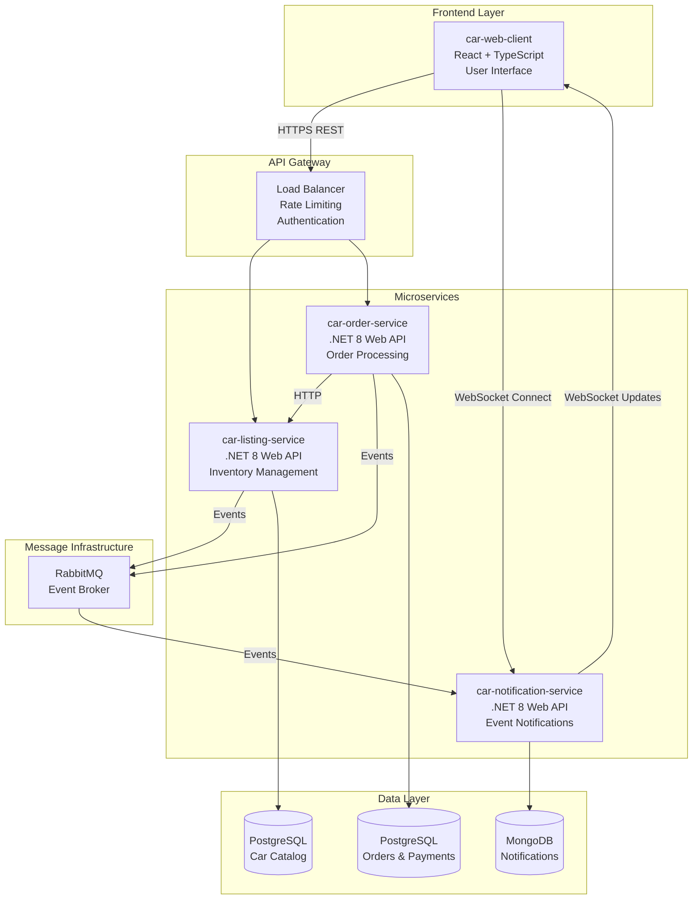
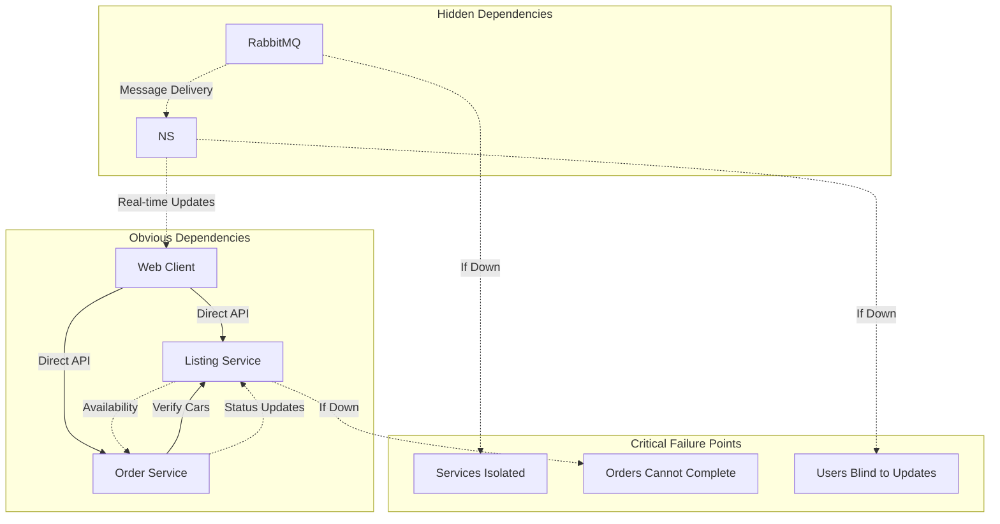
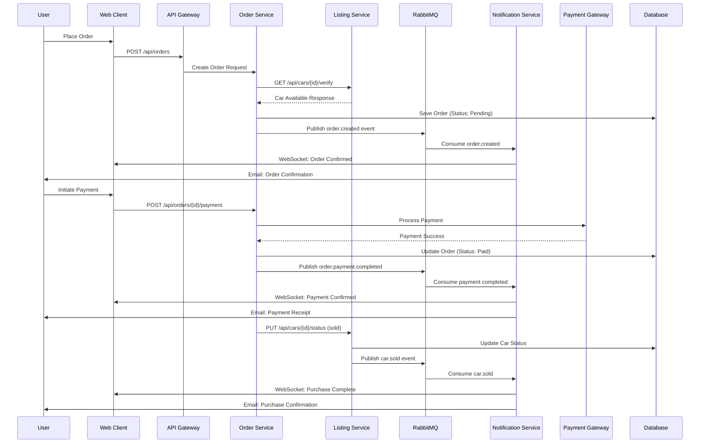
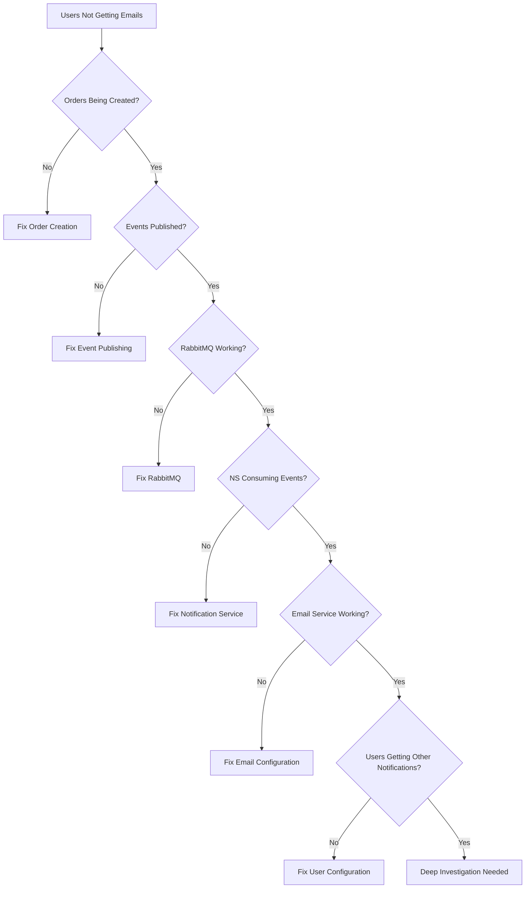
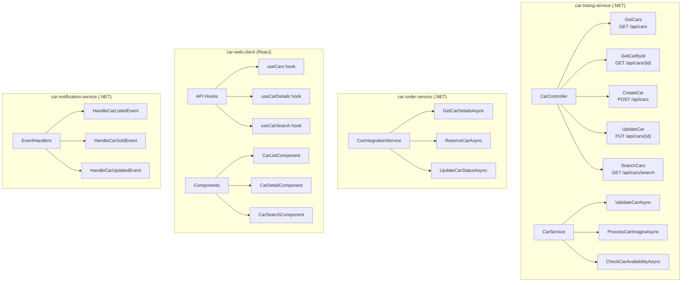

# Knowledge Graph Agent - Interactive Test Questions

**Test Focus:**
- **Relation diagrams**: AI created and explained diagrams
- **Repository indexing**: AI have to understand the way to index and process repos  
- **Natural language responses**: AI response with NL code references
- **Code understanding**: AI have to reference relevant code locations to support explanations

## Test Questions for AI Interaction

### Q2: System Relationship Visualization
**Your Question to AI:**
"Show me how the four services are connected and explain what I'm looking at."

**Expected AI Response Pattern:**

AI should generate system architecture diagram AND explain conversationally with code references:

"Let me show you how these services work together:

Here's how these connections are implemented:

**Frontend to Backend Communication:**
- **React API calls**: `car-web-client/src/hooks/useCars.ts` (lines 15-35) - handles fetching car data
- **WebSocket connection**: `car-web-client/src/hooks/useNotifications.ts` (lines 8-18) - real-time updates

**Inter-Service HTTP Communication:**
- **Car verification**: `car-order-service/Services/CarIntegrationService.cs` (lines 25-45) - GetCarDetailsAsync method
- **Status updates**: `car-order-service/Services/CarIntegrationService.cs` (lines 65-85) - UpdateCarStatusAsync method

**Event-Driven Communication:**
- **Event publishing**: `car-order-service/Services/EventPublisher.cs` (lines 12-35) - PublishOrderCreatedAsync method
- **Event consumption**: `car-notification-service/Handlers/OrderEventHandler.cs` (lines 18-45) - Consume method

What you're seeing here is a modern microservices architecture where:

The **car-web-client** serves as the user interface - think of it as the storefront. When users browse cars or place orders, the React app makes HTTP calls through the API Gateway to reach the appropriate backend services.

The three **backend services** each have specific responsibilities:
- **car-listing-service** manages the car inventory (like a warehouse)
- **car-order-service** processes purchases (like a checkout system)  
- **car-notification-service** keeps everyone informed (like customer service)

The interesting part is the **dual communication pattern**. For immediate actions like viewing a car or placing an order, services talk directly via HTTP. But for events that other services need to know about - like a car being sold - they use RabbitMQ message queues."

### Q3: Deep Relationship Analysis
**Your Question to AI:**
"What are the hidden dependencies between these services that might not be obvious?"

**Expected AI Response Pattern:**

AI should demonstrate analytical thinking with dependency diagram and code location references:

"Great question! Let me show you both the obvious and hidden dependencies:

Here are the hidden dependencies I found in the code:

**Hidden Dependency 1: Order Service's Complete Lifecycle Dependency**
- **Location**: `car-order-service/Services/OrderService.cs` (lines 45-75)
- **Issue**: CompleteOrderAsync method requires listing service to be available throughout entire order process
- **Risk**: Orders can be paid but stuck in limbo if listing service fails

**Hidden Dependency 2: Event Sequence Timing Dependency**
- **Location**: `car-notification-service/Handlers/EventSequenceHandler.cs` (lines 20-40)
- **Issue**: Notification logic depends on events arriving in correct sequence
- **Risk**: Out-of-order events create confusing user notifications

**Hidden Dependency 3: WebSocket State Dependency**
- **Location**: `car-web-client/src/hooks/useOrderStatus.ts` (lines 12-35)
- **Issue**: UI shows stale data if WebSocket connection fails
- **Risk**: Users see outdated status even though backend is working

**Hidden Dependency 4: Database Transaction Boundaries**
- **Location**: `car-order-service/Services/OrderTransactionService.cs` (lines 18-45)
- **Issue**: External service calls within database transactions
- **Risk**: Transaction timeouts if external services are slow

**Mitigation Strategies Found:**
- **Circuit Breaker**: `car-order-service/Services/ResilientCarIntegrationService.cs` (lines 15-25)
- **Saga Pattern**: `car-order-service/Services/OrderSaga.cs` (lines 22-55)

These hidden dependencies matter because they affect how you'd need to handle failures, deploy updates, and monitor the system health."

### Q4: Event Flow Analysis
**Your Question to AI:**
"Walk me through what happens when a user places an order, including all the events and notifications."

**Expected AI Response Pattern:**

AI should provide sequence diagram AND detailed explanation with code references:

"Let me walk you through the complete order flow with all events and notifications:

Here's the step-by-step process with code references:

**Step 1: Order Creation**
- **Frontend**: `car-web-client/src/components/OrderForm.tsx` (lines 25-45) - handlePlaceOrder function
- **Backend**: `car-order-service/Controllers/OrderController.cs` (lines 30-65) - CreateOrder method

**Step 2: Car Verification**
- **Integration**: `car-order-service/Services/CarIntegrationService.cs` (lines 25-35) - GetCarDetailsAsync method

**Step 3: Event Publishing**
- **Publisher**: `car-order-service/Services/EventPublisher.cs` (lines 15-40) - PublishAsync method

**Step 4: Notification Processing**
- **Handler**: `car-notification-service/Handlers/OrderEventHandler.cs` (lines 20-60) - Consume method
- **Email Service**: `car-notification-service/Services/EmailService.cs` (lines 12-35) - SendAsync method

**Step 5: Payment Processing**
- **Payment Service**: `car-order-service/Services/PaymentService.cs` (lines 25-75) - ProcessPaymentAsync method

**Step 6: Final Status Update**
- **Completion**: `car-order-service/Services/OrderCompletionService.cs` (lines 18-45) - CompleteOrderAsync method

**Step 7: Real-time Updates**
- **WebSocket**: `car-web-client/src/hooks/useOrderTracking.ts` (lines 10-50) - useOrderTracking hook

Here's what happens step by step:

1. **Order Initiation**: User places an order through the web client. The order service first verifies the car is still available with the listing service.

2. **Order Creation**: Once verified, the order gets saved with 'pending' status and an 'order.created' event is published.

3. **Payment Processing**: When the user initiates payment, the order service integrates with the payment gateway.

4. **Inventory Update**: The order service then tells the listing service to mark the car as sold.

5. **Final Notifications**: The notification service processes all these events and sends appropriate notifications.

The beauty of this event-driven approach is that each step is independent. If the email service is down, the order still completes successfully, and notifications can be retried later."

### Q5: Interactive Problem Solving with Analysis
**Your Question to AI:**
"If I told you that users are complaining they're not getting email notifications when their orders are processed, how would you help me debug this?"

**Expected AI Response Pattern:**

AI should provide debugging flowchart AND systematic approach with code references:

"Let me help you debug this step by step with specific code locations to check:

**Debugging Steps with Code References:**

**Step 1: Verify Order Processing**
- **Check**: `car-order-service/Controllers/OrderController.cs` (lines 30-65) - CreateOrder method logs
- **Look for**: Successful order creation and event publishing logs

**Step 2: Check Event Publishing**
- **Check**: `car-order-service/Services/EventPublisher.cs` (lines 15-40) - PublishAsync method
- **Add Debug**: Create debugging endpoint at `car-order-service/Controllers/DebugController.cs` (lines 25-45)

**Step 3: Verify RabbitMQ Message Flow**
- **Check**: RabbitMQ management interface for message flow
- **Monitor**: `car-order-service/Services/RabbitMQHealthService.cs` (lines 10-35) - CheckHealthAsync method

**Step 4: Check Notification Service Processing**
- **Check**: `car-notification-service/Handlers/OrderEventHandler.cs` (lines 20-60) - Consume method logs
- **Monitor**: Event processing audit at lines 15-25 of same file

**Step 5: Verify Email Service Configuration**
- **Check**: `car-notification-service/Services/EmailService.cs` (lines 12-35) - SendAsync method
- **Test**: Email health check at lines 45-65 of same file

**Step 6: User-Specific Issues**
- **Check**: `car-notification-service/Services/UserService.cs` (lines 30-50) - GetByIdAsync method
- **Verify**: User email preferences and validation

**Quick Diagnostic Commands:**
- **Order Check**: GET `/debug/recent-orders` endpoint
- **Event Check**: GET `/debug/published-events/{orderId}` endpoint  
- **RabbitMQ Check**: GET `/debug/rabbitmq-health` endpoint
- **Email Check**: POST `/debug/test-email` endpoint

**Common Issues and Code Locations:**
1. **Event Publishing Failure**: Check `car-order-service/Services/EventPublisher.cs` (lines 25-30) for exceptions
2. **RabbitMQ Connection**: Monitor `car-order-service/Infrastructure/RabbitMQConnection.cs` (lines 15-25)
3. **Email Provider Issues**: Check `car-notification-service/Services/EmailProvider.cs` (lines 20-40)
4. **User Configuration**: Verify `car-notification-service/Models/User.cs` (lines 12-18) email properties

Would you like me to help you check any of these specific areas first?"

### Q6: Repository Code Indexing and Method Discovery
**Your Question to AI:**
"Show me the methods that are related to car listing across all repositories."

**Expected AI Response Pattern:**

AI should provide code analysis diagram AND detailed method locations:

"Let me show you all the methods related to car listing across the four repositories:

**Primary Car Listing Methods by Repository:**

**car-listing-service (.NET):**
- **CarController.GetCars()**: `Controllers/CarController.cs` (lines 25-55) - Main listing endpoint with pagination
- **CarController.GetCarById()**: `Controllers/CarController.cs` (lines 60-75) - Individual car retrieval
- **CarController.CreateCar()**: `Controllers/CarController.cs` (lines 80-105) - New car creation
- **CarController.SearchCars()**: `Controllers/CarController.cs` (lines 110-130) - Advanced search
- **CarService.ValidateCarAsync()**: `Services/CarService.cs` (lines 45-65) - Car data validation
- **CarService.ProcessCarImagesAsync()**: `Services/CarService.cs` (lines 70-95) - Image processing
- **CarService.CheckCarAvailabilityAsync()**: `Services/CarService.cs` (lines 100-115) - Availability check

**car-order-service (.NET):**
- **CarIntegrationService.GetCarDetailsAsync()**: `Services/CarIntegrationService.cs` (lines 25-50) - Remote car fetching
- **CarIntegrationService.ReserveCarAsync()**: `Services/CarIntegrationService.cs` (lines 55-75) - Car reservation
- **CarIntegrationService.UpdateCarStatusAsync()**: `Services/CarIntegrationService.cs` (lines 80-100) - Status updates

**car-web-client (React/TypeScript):**
- **useCars hook**: `hooks/useCars.ts` (lines 10-85) - Car data management
- **useCarDetails hook**: `hooks/useCarDetails.ts` (lines 8-45) - Individual car details
- **useCarSearch hook**: `hooks/useCarSearch.ts` (lines 12-65) - Search functionality
- **CarListComponent**: `components/CarListComponent.tsx` (lines 15-95) - Car listing display
- **CarDetailComponent**: `components/CarDetailComponent.tsx` (lines 10-75) - Car detail view
- **CarSearchComponent**: `components/CarSearchComponent.tsx` (lines 20-85) - Search interface

**car-notification-service (.NET):**
- **HandleCarListedEvent**: `Handlers/CarEventHandler.cs` (lines 15-45) - New car notifications
- **HandleCarSoldEvent**: `Handlers/CarEventHandler.cs` (lines 50-85) - Sold car processing
- **HandleCarUpdatedEvent**: `Handlers/CarEventHandler.cs` (lines 90-120) - Update notifications

**Cross-Repository Integration Patterns Discovered:**

**Caching Strategy:**
- **Implementation**: `car-order-service/Services/CachedCarIntegrationService.cs` (lines 20-75)
- **Cache Invalidation**: Event-driven cache clearing on car updates

**API Integration:**
- **HTTP Client Setup**: `car-order-service/Infrastructure/HttpClientConfiguration.cs` (lines 15-35)
- **Retry Policies**: `car-order-service/Services/ResilientCarIntegrationService.cs` (lines 25-45)

**Event Processing:**
- **Event Publishing**: `car-listing-service/Services/EventPublisher.cs` (lines 18-40)
- **Event Consumption**: `car-notification-service/Infrastructure/EventConsumerSetup.cs` (lines 25-55)

**Key Insights from Code Analysis:**

1. **Smart Caching**: Order service uses event-driven cache invalidation (lines 60-75 in CachedCarIntegrationService.cs)
2. **Defensive Programming**: Multiple validation layers throughout car listing pipeline
3. **Real-time Updates**: WebSocket integration ensures immediate UI updates
4. **Performance Optimization**: Image processing happens asynchronously to avoid blocking

These methods work together to create a sophisticated car listing system that spans all four repositories and demonstrates advanced microservices integration patterns."

---

## Evaluation Criteria for AI Responses

### Code Reference Quality (35%)
- **Accuracy**: File paths and line numbers are correct and verifiable
- **Relevance**: References directly relate to the question and system architecture
- **Completeness**: Includes all necessary method locations and integration points
- **Specificity**: Provides exact file paths and line ranges rather than generic references

### Diagram Quality (25%)
- **Accuracy**: Diagrams correctly represent system relationships  
- **Completeness**: All relevant components and connections included
- **Clarity**: Easy to understand and properly labeled
- **Integration**: Diagrams support and enhance code location explanations

### Natural Language Quality (20%)
- **Conversational tone**: Sounds like talking to a knowledgeable colleague
- **Clear explanations**: Technical concepts explained accessibly
- **Code integration**: Seamlessly blends code references with explanations
- **Progressive disclosure**: Builds understanding from simple to complex

### Technical Understanding (20%)
- **System comprehension**: Demonstrates deep understanding of architecture
- **Cross-service knowledge**: Shows how code works across different repositories
- **Pattern recognition**: Identifies and explains architectural patterns
- **Problem-solving**: Provides practical, actionable solutions with specific code locations

## Red Flags in AI Responses

### Code Reference Issues
- ‚ùå Incorrect or non-existent file paths
- ‚ùå Wrong line number references
- ‚ùå Generic references without specific locations
- ‚ùå References that don't match the described functionality

### Missing Integration
- ‚ùå Code references that don't connect to other services  
- ‚ùå Failure to show cross-repository relationships
- ‚ùå Generic references that could apply to any system
- ‚ùå No demonstration of how methods work together

### Poor Explanation
- ‚ùå Code references without context or explanation
- ‚ùå Technical jargon without accessible translation
- ‚ùå Failure to explain why code is located in specific places
- ‚ùå No connection between code locations and business logic

---

## Usage Instructions

These test questions are designed to be asked directly to your Knowledge Graph Agent. 
Compare the AI's actual responses against the expected patterns provided here to evaluate:

1. **Comprehension**: Does the AI understand the system architecture?
2. **Communication**: Can it explain complex concepts in natural language?
3. **Code Location**: Can it accurately reference specific code locations?
4. **Analysis**: Does it provide insights beyond surface-level observations?

**Scoring Framework:**
- **Excellent (90-100%)**: Meets all criteria with accurate code references and deep insights
- **Good (75-89%)**: Meets most criteria with minor location inaccuracies
- **Adequate (60-74%)**: Basic understanding but lacks specificity in code references
- **Poor (<60%)**: Major gaps in understanding or incorrect code locations

Use this framework to iteratively improve your Knowledge Graph Agent's code indexing and referencing capabilities! 🎯🤖
