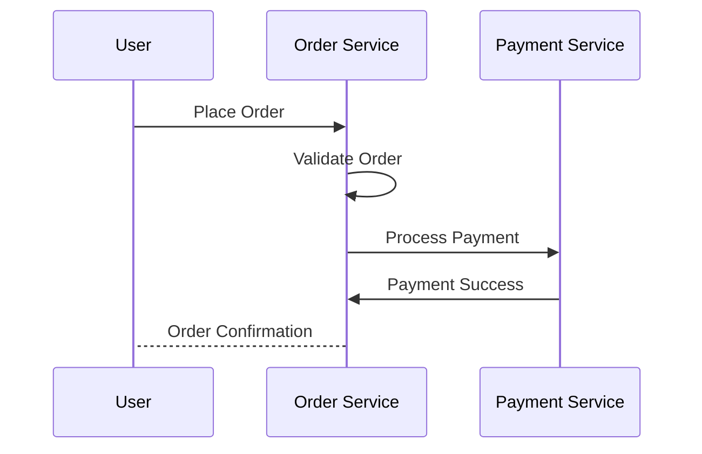

# Event Flow Analysis Feature Documentation

This document describes the event flow analysis feature implementation for the Knowledge Graph Agent, addressing issue #34.

## Overview

The event flow analysis feature enables the AI Agent to provide dynamic, generic event-flow analysis responses for queries like Q4 from the `docs/agent-interaction-questions.md`. It can analyze any event flow query and generate:

1. **Sequence Diagrams**: Mermaid sequence diagrams showing the flow of events
2. **Step-by-step Explanations**: Natural language explanations with code references
3. **Dynamic Code Discovery**: Real-time discovery of relevant code using vector stores

## Architecture

The feature follows a modular architecture that extends the existing BaseWorkflow infrastructure:

```
User Query → EventFlowAnalyzer → CodeDiscoveryEngine → SequenceDiagramBuilder → ResponseFormatter
     ↓               ↓                    ↓                    ↓               ↓
NLP Processing → Pattern Detection → Vector/Graph Search → Mermaid Generation → Structured Output
```

### Components

1. **EventFlowAnalyzer** (`src/analyzers/event_flow_analyzer.py`)
   - Detects event flow queries using pattern matching
   - Extracts workflow components (entities, actions, patterns)
   - Classifies business domains and workflow types

2. **CodeDiscoveryEngine** (`src/discovery/code_discovery_engine.py`)
   - Discovers relevant code using existing vector store infrastructure
   - Maps workflow patterns to code references
   - Provides code context with file paths and method names

3. **SequenceDiagramBuilder** (`src/diagrams/sequence_diagram_builder.py`)
   - Generates Mermaid sequence diagrams from workflow analysis
   - Identifies actors and their interactions
   - Creates optimized, readable diagram layouts

4. **EventFlowHandler** (`src/workflows/query/handlers/event_flow_handler.py`)
   - Extends BaseWorkflow for complete event flow processing
   - Orchestrates all components with error handling and retry logic
   - Integrates with existing query orchestration infrastructure

## Usage Examples

### Example 1: Order Processing Flow

**Query**: "Walk me through what happens when a user places an order"

**Generated Response**:
```
Let me walk you through the order_processing workflow:

**Step-by-step process with code references:**

1. **place_order**: Implemented in `src/order/service.py` (order-service)
   - Context: service
   - Code: def place_order(user, order)...

2. **validate_order**: Implemented in `src/validation/validator.py` (order-service)
   - Context: service
   - Code: def validate_order(order_data)...

**Workflow Pattern**: This follows a typical order processing pattern where user actions trigger a series of validations, payments, and confirmations.

**Sequence Diagram:**


```

### Example 2: Authentication Flow

**Query**: "Step by step process when authentication occurs"

**Detected Pattern**: USER_AUTHENTICATION
**Generated Diagram**: Shows User → Auth Service → Database interactions
**Explanation**: Includes code references to authentication handlers and validation logic

### Example 3: Data Pipeline

**Query**: "Show me the workflow for data processing"

**Detected Pattern**: DATA_PIPELINE
**Generated Diagram**: Shows data ingestion, transformation, and output stages
**Explanation**: References ETL scripts and processing components

## Configuration

Event flow analysis can be configured via environment variables:

```bash
# Event Flow Analysis Configuration
ENABLE_EVENT_FLOW_ANALYSIS=true
EVENT_FLOW_MAX_SEQUENCE_STEPS=20
EVENT_FLOW_DIAGRAM_COMPLEXITY_LIMIT=15
EVENT_FLOW_CONFIDENCE_THRESHOLD=0.7
EVENT_FLOW_MAX_ACTORS=10
EVENT_FLOW_INCLUDE_CODE_REFERENCES=true
```

## Integration

The feature integrates seamlessly with the existing query workflow:

1. **Query Parsing**: Enhanced to detect EVENT_FLOW intent
2. **Query Orchestrator**: Routes event flow queries to EventFlowHandler
3. **Vector Store**: Uses existing infrastructure for code discovery
4. **API Models**: Extended to support event flow responses

## Supported Workflow Patterns

The system detects and handles these workflow patterns:

- **ORDER_PROCESSING**: E-commerce order flows
- **USER_AUTHENTICATION**: Login/signup processes
- **DATA_PIPELINE**: ETL and data processing workflows
- **API_REQUEST_FLOW**: API request/response cycles
- **EVENT_DRIVEN**: Message queue and event-based flows
- **GENERIC_WORKFLOW**: General business processes

## Testing

Comprehensive tests are provided in `tests/unit/test_event_flow_analysis.py`:

```bash
# Run event flow tests
PYTHONPATH=. python -m pytest tests/unit/test_event_flow_analysis.py -v
```

Test coverage includes:
- Event flow query detection
- Workflow pattern classification
- Sequence diagram generation
- Code discovery integration
- End-to-end workflow processing

## Performance

The feature is designed for performance and scalability:

- **Query Detection**: Fast pattern matching without LLM calls
- **Code Discovery**: Leverages existing vector store indexes
- **Diagram Generation**: Optimized Mermaid syntax generation
- **Caching**: Integrates with existing caching mechanisms

## Future Enhancements

Potential improvements for future releases:

1. **Enhanced Code Analysis**: More sophisticated code parsing and method extraction
2. **Interactive Diagrams**: Support for clickable sequence diagrams
3. **Custom Patterns**: User-defined workflow patterns
4. **Multi-Language Support**: Enhanced support for different programming languages
5. **Graph Integration**: Deeper integration with graph store capabilities

## Error Handling

The feature includes robust error handling:

- **Graceful Degradation**: Falls back to basic diagrams if code discovery fails
- **Retry Logic**: Built-in retry mechanisms for vector store operations
- **Validation**: Input validation and sanitization
- **Logging**: Comprehensive logging for debugging and monitoring

## API Response Format

Event flow responses include:

```json
{
  "query": "Walk me through order processing",
  "intent": "EVENT_FLOW",
  "generated_response": "...",
  "response_type": "generated",
  "confidence_score": 0.85,
  "metadata": {
    "event_flow_response": {
      "diagram_included": true,
      "workflow_pattern": "order_processing",
      "code_references_count": 5,
      "confidence_score": 0.85
    }
  }
}
```

This implementation successfully addresses the requirements in issue #34 by providing a generic, extensible system for event flow analysis that leverages the existing Knowledge Graph Agent infrastructure.