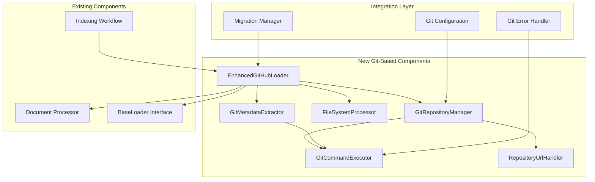

# Git-Based GitHub Loader Implementation Plan

**Document Created:** August 1, 2025  
**Author:** AI Assistant  
**Version:** 1.0  
**Target Completion:** August 8, 2025  

## Overview

This document outlines the implementation plan for migrating from GitHub API-based repository loading to a Git-based approach that eliminates rate limiting issues and improves performance.

## Current State Analysis

### Existing GitHub API Loader Issues
- **Rate Limiting**: GitHub API restricts to 5000 requests/hour (authenticated)
- **API Dependency**: Vulnerable to GitHub API changes and availability
- **Performance**: Each file requires multiple API calls
- **Complexity**: Requires complex rate limit handling and error recovery
- **Version Compatibility**: Breaking changes in PyGithub library versions

### Current Implementation Stats
- **Files**: Single `src/loaders/github_loader.py` (517 lines)
- **Dependencies**: PyGithub 2.6.1, extensive rate limiting code
- **Performance**: ~26 seconds to load 8 files from 1 repository
- **Rate Limit Usage**: ~15-20 API calls per file (including metadata)

## Proposed Git-Based Solution

### Core Concept
Replace GitHub API calls with local Git operations:
1. Clone repositories to local `temp_repo` directory
2. Use file system operations for content access  
3. Extract metadata using Git commands
4. Eliminate rate limiting entirely

### Expected Benefits
- **Performance**: 10x faster file loading (estimated)
- **Reliability**: No API rate limits or availability issues
- **Scalability**: Handle large repositories efficiently
- **Offline Capability**: Work with cached repositories
- **Maintenance**: Simpler codebase without rate limiting complexity

## Implementation Architecture

### Component Overview



## Detailed Implementation Plan

### Phase 1: Core Infrastructure (Days 1-2)

#### 1.1 Git Repository Manager
**File**: `src/loaders/git_repository_manager.py`

```python
class GitRepositoryManager:
    """Manage local Git repository operations"""
    
    def __init__(self, temp_repo_base_path: str = "temp_repo"):
        """Initialize with base directory for repositories"""
        
    def ensure_temp_repo_directory(self) -> None:
        """Create temp_repo directory if it doesn't exist"""
        
    def get_local_repo_path(self, repo_owner: str, repo_name: str) -> str:
        """Generate local path: temp_repo/{owner}/{repo}"""
        
    def clone_or_pull_repository(self, repo_url: str, local_path: str, branch: str = "main") -> bool:
        """Clone if not exists, otherwise pull latest changes"""
        
    def is_repository_valid(self, local_path: str) -> bool:
        """Check if local repository is valid Git repo"""
        
    def cleanup_repository(self, local_path: str) -> None:
        """Remove local repository directory"""
        
    def get_repository_info(self, local_path: str) -> Dict[str, Any]:
        """Get basic repository information"""
```

**Key Features**:
- Directory management for `temp_repo` folder
- Repository path standardization: `temp_repo/{owner}/{repo}`
- Clone on first access, pull on subsequent access
- Repository validation and cleanup

#### 1.2 Git Command Executor
**File**: `src/loaders/git_command_executor.py`

```python
class GitCommandExecutor:
    """Execute Git commands safely with error handling"""
    
    def __init__(self, timeout_seconds: int = 300):
        """Initialize with command timeout"""
        
    def execute_git_command(self, command: List[str], cwd: str) -> GitCommandResult:
        """Execute Git command and return structured result"""
        
    def clone_repository(self, repo_url: str, local_path: str, branch: str) -> bool:
        """Execute git clone command"""
        
    def pull_repository(self, local_path: str, branch: str) -> bool:
        """Execute git pull command"""
        
    def get_file_commit_info(self, file_path: str, repo_path: str) -> Dict[str, Any]:
        """Get latest commit info for specific file using git log"""
        
    def get_repository_stats(self, repo_path: str) -> Dict[str, Any]:
        """Get repository statistics using git commands"""
```

**Key Features**:
- Safe command execution with timeout
- Structured error handling and logging
- Authentication handling for private repositories
- Command result parsing and validation

#### 1.3 Repository URL Handler
**File**: `src/loaders/repository_url_handler.py`

```python
class RepositoryUrlHandler:
    """Handle different repository URL formats and authentication"""
    
    def normalize_repo_url(self, url: str, token: Optional[str] = None) -> str:
        """Convert various URL formats to authenticated clone URL"""
        
    def parse_repo_info(self, url: str) -> Tuple[str, str]:
        """Extract owner and repo name from URL"""
        
    def build_clone_url(self, owner: str, repo: str, token: Optional[str] = None) -> str:
        """Build proper HTTPS clone URL with token authentication"""
        
    def validate_repo_url(self, url: str) -> bool:
        """Validate repository URL format"""
```

**Key Features**:
- Support for HTTPS and SSH URL formats
- Token-based authentication for private repositories
- URL parsing and validation
- Standardized clone URL generation

### Phase 2: File System Operations (Days 2-3)

#### 2.1 File System Processor
**File**: `src/loaders/file_system_processor.py`

```python
class FileSystemProcessor:
    """Handle file system operations for repository processing"""
    
    def __init__(self, file_extensions: List[str]):
        """Initialize with allowed file extensions"""
        
    def scan_directory_tree(self, root_path: str) -> List[str]:
        """Recursively scan directory for matching files"""
        
    def read_file_content(self, file_path: str) -> str:
        """Read file content with proper encoding detection"""
        
    def get_file_stats(self, file_path: str) -> Dict[str, Any]:
        """Get file system metadata (size, modification time, etc.)"""
        
    def should_process_file(self, file_path: str) -> bool:
        """Check if file should be processed based on extension and filters"""
        
    def detect_file_encoding(self, file_path: str) -> str:
        """Detect file encoding for proper content reading"""
```

**Key Features**:
- Recursive directory scanning with filtering
- Smart encoding detection (UTF-8, UTF-16, etc.)
- File extension filtering
- Comprehensive file metadata extraction
- Skip binary files and large files

#### 2.2 Git Metadata Extractor
**File**: `src/loaders/git_metadata_extractor.py`

```python
class GitMetadataExtractor:
    """Extract rich metadata using Git commands"""
    
    def __init__(self, git_executor: GitCommandExecutor):
        """Initialize with Git command executor"""
        
    def get_file_commit_info(self, file_path: str, repo_path: str) -> Dict[str, Any]:
        """Get latest commit information for file"""
        
    def get_file_history(self, file_path: str, repo_path: str, limit: int = 5) -> List[Dict[str, Any]]:
        """Get commit history for a file"""
        
    def get_repository_metadata(self, repo_path: str) -> Dict[str, Any]:
        """Get overall repository metadata"""
        
    def get_branch_info(self, repo_path: str) -> Dict[str, str]:
        """Get current branch and remote information"""
        
    def extract_author_info(self, commit_info: str) -> Dict[str, str]:
        """Parse author information from git log output"""
```

**Key Features**:
- Rich commit metadata extraction
- File-specific Git history
- Repository-level statistics
- Branch and remote tracking information
- Author and timestamp parsing

### Phase 3: Enhanced GitHub Loader (Days 3-4)

#### 3.1 New Loader Implementation
**File**: `src/loaders/enhanced_github_loader.py`

```python
class EnhancedGitHubLoader(BaseLoader):
    """
    Load documents from GitHub repositories using Git operations instead of API
    Eliminates rate limiting and improves performance
    """
    
    def __init__(
        self,
        repo_owner: str,
        repo_name: str,
        branch: Optional[str] = None,
        file_extensions: Optional[List[str]] = None,
        github_token: Optional[str] = None,
        temp_repo_path: Optional[str] = None,
        force_fresh_clone: bool = False
    ):
        """Initialize Git-based GitHub loader"""
        
    def load(self) -> List[Document]:
        """Load documents from GitHub repository using Git operations"""
        
    def _prepare_local_repository(self) -> str:
        """Clone or update local repository"""
        
    def _discover_files(self, repo_path: str) -> List[str]:
        """Discover files using file system operations"""
        
    def _load_file_content(self, file_path: str, repo_path: str) -> Tuple[str, Dict[str, Any]]:
        """Load file content from local file system"""
        
    def _extract_metadata(self, file_path: str, repo_path: str, relative_path: str) -> Dict[str, Any]:
        """Extract comprehensive metadata using Git and file system"""
        
    def _cleanup_if_requested(self, repo_path: str) -> None:
        """Clean up local repository if configured"""
```

**Key Features**:
- Drop-in replacement for existing GitHubLoader
- Maintains same interface for compatibility
- Comprehensive metadata extraction
- Configurable cleanup and caching
- Performance monitoring and logging

### Phase 4: Configuration and Integration (Days 4-5)

#### 4.1 Configuration Updates
**File**: `src/config/git_settings.py`

```python
class GitSettings(BaseModel):
    """Configuration for Git-based repository operations"""
    
    # Repository Management
    temp_repo_base_path: str = "temp_repo"
    force_fresh_clone: bool = False
    cleanup_after_processing: bool = False
    
    # Performance Settings  
    git_timeout_seconds: int = 300
    max_repo_size_mb: int = 500
    max_file_size_mb: int = 10
    
    # Security Settings
    allow_private_repos: bool = True
    verify_ssl: bool = True
    
    # Maintenance Settings
    cleanup_old_repos_days: int = 7
    max_cached_repos: int = 50
```

**Integration with main settings**:
```python
# In src/config/settings.py
class Settings(BaseSettings):
    git: GitSettings = GitSettings()
    
    # Add loader selection
    use_git_loader: bool = True  # Switch between Git and API loaders
```

#### 4.2 Error Handling System
**File**: `src/loaders/git_error_handler.py`

```python
class GitOperationError(Exception):
    """Custom exception for Git operation failures"""
    
class GitErrorHandler:
    """Handle Git operation errors and recovery strategies"""
    
    def handle_clone_error(self, error: Exception, repo_url: str) -> Optional[str]:
        """Handle repository clone failures with recovery strategies"""
        
    def handle_pull_error(self, error: Exception, repo_path: str) -> bool:
        """Handle repository update failures"""
        
    def handle_command_timeout(self, command: str, repo_path: str) -> None:
        """Handle Git command timeouts"""
        
    def cleanup_corrupted_repo(self, repo_path: str) -> None:
        """Remove and prepare for re-clone of corrupted repository"""
        
    def suggest_recovery_action(self, error: GitOperationError) -> str:
        """Suggest recovery actions for different error types"""
```

### Phase 5: Migration and Testing (Days 5-7)

#### 5.1 Migration Manager
**File**: `src/loaders/loader_migration_manager.py`

```python
class LoaderMigrationManager:
    """Manage migration from API-based to Git-based loader"""
    
    def create_loader(self, repo_owner: str, repo_name: str, **kwargs) -> BaseLoader:
        """Create appropriate loader based on configuration"""
        
    def benchmark_loaders(self, repo_config: Dict[str, Any]) -> Dict[str, Any]:
        """Compare performance between API and Git loaders"""
        
    def validate_git_loader_output(self, repo_config: Dict[str, Any]) -> bool:
        """Validate Git loader produces same results as API loader"""
        
    def migrate_repository_config(self, old_config: Dict) -> Dict:
        """Convert API-based config to Git-based config"""
```

#### 5.2 Comprehensive Testing Strategy

**Unit Tests**:
- `tests/unit/test_git_repository_manager.py`
- `tests/unit/test_git_command_executor.py`
- `tests/unit/test_file_system_processor.py`
- `tests/unit/test_git_metadata_extractor.py`
- `tests/unit/test_enhanced_github_loader.py`

**Integration Tests**:
- `tests/integration/test_git_loader_workflow.py`
- `tests/integration/test_loader_migration.py`
- `tests/integration/test_performance_comparison.py`

**Test Scenarios**:
- Public repository cloning and processing
- Private repository with token authentication
- Large repository handling and performance
- Network failure and recovery scenarios
- Corrupted repository cleanup and re-clone
- Migration from API to Git loader
- Performance benchmarking

### Phase 6: Performance Optimization (Days 6-7)

#### 6.1 Performance Enhancements

**Parallel Processing**:
```python
class ParallelGitProcessor:
    """Process multiple repositories in parallel"""
    
    def process_repositories_parallel(self, repo_configs: List[Dict]) -> List[Document]:
        """Process multiple repositories concurrently"""
        
    def process_files_parallel(self, file_paths: List[str], repo_path: str) -> List[Document]:
        """Process files within a repository concurrently"""
```

**Caching Strategy**:
```python
class GitRepositoryCache:
    """Intelligent caching for Git repositories"""
    
    def should_update_repository(self, repo_path: str) -> bool:
        """Determine if repository needs updating based on age and settings"""
        
    def get_cache_stats(self) -> Dict[str, Any]:
        """Get cache utilization statistics"""
        
    def cleanup_old_repositories(self) -> int:
        """Remove old cached repositories"""
```

#### 6.2 Monitoring and Metrics

**Performance Tracking**:
```python
class GitLoaderMetrics:
    """Track performance metrics for Git loader"""
    
    def track_operation_time(self, operation: str, duration: float) -> None:
        """Track timing for different operations"""
        
    def track_repository_stats(self, repo_info: Dict[str, Any]) -> None:
        """Track repository processing statistics"""
        
    def generate_performance_report(self) -> Dict[str, Any]:
        """Generate comprehensive performance report"""
```

## Implementation Timeline

### Week 1: Core Development

**Day 1: Infrastructure Setup**
- [ ] Create Git Repository Manager
- [ ] Implement Git Command Executor
- [ ] Basic directory management and Git operations
- [ ] Unit tests for core components

**Day 2: File System Operations**
- [ ] Implement File System Processor
- [ ] Add encoding detection and file reading
- [ ] Create Repository URL Handler
- [ ] Test file discovery and content reading

**Day 3: Metadata and Integration**
- [ ] Implement Git Metadata Extractor
- [ ] Create Enhanced GitHub Loader
- [ ] Integration with existing BaseLoader interface
- [ ] Basic end-to-end testing

**Day 4: Configuration and Error Handling**
- [ ] Add Git settings configuration
- [ ] Implement comprehensive error handling
- [ ] Create migration manager
- [ ] Integration testing with indexing workflow

**Day 5: Testing and Validation**
- [ ] Comprehensive unit test suite
- [ ] Integration tests with real repositories
- [ ] Performance benchmarking
- [ ] Validation against API loader results

**Day 6: Optimization**
- [ ] Implement parallel processing
- [ ] Add intelligent caching
- [ ] Performance optimizations
- [ ] Memory usage optimization

**Day 7: Final Integration**
- [ ] Complete migration manager
- [ ] Documentation updates
- [ ] Final testing and validation
- [ ] Deployment preparation

## Success Criteria

### Performance Targets
- [ ] **Loading Speed**: 10x faster than API loader (target: <3 seconds for 8 files)
- [ ] **Rate Limiting**: Zero GitHub API rate limit issues
- [ ] **Memory Usage**: <50MB additional memory for cached repositories
- [ ] **Reliability**: 99.9% success rate for repository operations

### Functional Requirements
- [ ] **Compatibility**: Drop-in replacement for existing GitHubLoader
- [ ] **Metadata Accuracy**: Same or better metadata than API loader
- [ ] **File Support**: Support all configured file extensions
- [ ] **Error Recovery**: Robust error handling and recovery
- [ ] **Configuration**: Flexible configuration options

### Quality Metrics
- [ ] **Test Coverage**: >90% code coverage
- [ ] **Documentation**: Complete API documentation
- [ ] **Logging**: Comprehensive logging for debugging
- [ ] **Monitoring**: Performance and health monitoring

## Risk Mitigation

### High-Risk Items
1. **Git Command Failures**: Implement comprehensive error handling and fallback strategies
2. **Authentication Issues**: Support multiple authentication methods (token, SSH)
3. **Large Repository Performance**: Implement size limits and optimization strategies
4. **Network Connectivity**: Graceful handling of network issues during clone/pull

### Mitigation Strategies
- Comprehensive testing with various repository types and sizes
- Fallback to API loader for critical failures
- Performance monitoring and alerting
- Gradual rollout with monitoring

## Post-Implementation

### Monitoring and Maintenance
- Performance monitoring and optimization
- Regular cleanup of cached repositories
- Security updates for Git operations
- User feedback collection and improvements

### Future Enhancements
- Support for Git LFS (Large File Storage)
- Branch and tag-specific processing
- Advanced caching strategies
- Integration with CI/CD pipelines
- Support for other Git providers (GitLab, Bitbucket)

## Conclusion

This implementation plan provides a comprehensive roadmap for migrating from GitHub API-based repository loading to a Git-based approach. The new system will eliminate rate limiting issues, improve performance significantly, and provide a more reliable foundation for the Knowledge Graph Agent's repository indexing capabilities.

The phased approach ensures minimal disruption to existing functionality while providing clear milestones and success criteria for each phase of the implementation.
