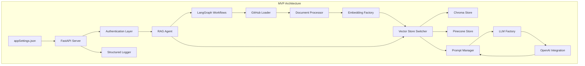

# Knowledge Graph Agent MVP Implementation Plan (2 Weeks)

**Project:** Knowledge Graph Agent  
**Timeline:** 2 Weeks (July 19 - August 2, 2025)  
**Target:** Minimum Viable Product (MVP)  
**Document Version:** 2.1
**Date Created:** July 19, 2025  
**Date Updated:** July 23, 2025

## Executive Summary

This implementation plan delivers a focused 2-week MVP for the Knowledge Graph Agent that provides core functionality: indexing GitHub repositories and enabling RAG-based querying through a REST API. The plan prioritizes working software over comprehensive features to meet the tight deadline while establishing a solid foundation for future enhancements.

## MVP Scope Definition

### In Scope (MVP Features)
- ✅ GitHub repository indexing from appSettings.json configuration (multiple repositories)
- ✅ GitHub integration for private repository access
- ✅ LangChain framework with LangGraph workflows
- ✅ LangGraph used for orchestrating stateful indexing and query workflows
- ✅ Document chunking and embedding generation with configurable strategies (language-aware for .NET and React)
- ✅ Language-aware chunking support for .NET (C#) and React (JS/TS) files
- ✅ Metadata-enriched chunks: includes file_path, chunk_type, language, lines, tokens, and code symbols (e.g., class_name, function_name, component_name)
- ✅ Pinecone and Chroma vector storage with runtime switching (DATABASE_TYPE)
- ✅ RAG query processing with OpenAI integration
- ✅ LLM and Embedding factory patterns for provider abstraction
- ✅ REST API with authentication middleware (API key)
- ✅ Prompt Manager for context injection and formatting
- ✅ Environment-based configuration with comprehensive validation
- ✅ Structured logging and health monitoring
- ✅ Base agent architecture with extensible patterns
- ✅ Web UI chatbot interface

### Out of Scope (Post-MVP)
- ❌ Advanced chunking strategies (semantic, context-aware)
- ❌ Multiple LLM provider support beyond OpenAI
- ❌ Advanced authentication (OAuth, RBAC)
- ❌ Comprehensive monitoring and metrics dashboard
- ❌ Incremental indexing capabilities
- ❌ Advanced error recovery mechanisms
- ❌ Performance optimization and horizontal scaling
- ❌ GitHub Enterprise specific features

## Technical Architecture (MVP)

### System Overview


### Technology Stack
- **Backend Framework:** FastAPI with authentication middleware
- **AI/ML Framework:** LangChain with LangGraph workflows
- **Repository Integration:** GitHub integration
- **Vector Database:** Chroma, Pinecone (runtime switchable)
- **LLM Provider:** OpenAI (GPT-4o-mini) via factory pattern
- **Embeddings:** OpenAI text-embedding-ada-002 via factory pattern
- **Configuration:** Pydantic with appSettings.json and environment variables
- **Logging:** Structured logging with configurable levels
- **Containerization:** Docker with production-ready configuration

## Project Structure (MVP-Aligned)

```
knowledge-graph-agent/
├── src/
│   ├── config/
│   │   ├── __init__.py
│   │   └── settings.py              # Environment-based configuration with validation
│   ├── loaders/
│   │   ├── __init__.py
│   │   └── github_loader.py         # GitHub integration for multiple repositories
│   ├── processors/
│   │   ├── __init__.py
│   │   ├── document_processor.py    # Document chunking with metadata enrichment
│   │   ├── chunking_strategy.py     # Language-aware chunking (.NET & React)
│   │   └── metadata_extractor.py    # Extract code symbols and metadata
│   ├── vectorstores/
│   │   ├── __init__.py
│   │   ├── base_store.py           # Vector store abstraction
│   │   ├── chroma_store.py         # Chroma vector storage
│   │   ├── pinecone_store.py       # Pinecone vector storage
│   │   └── store_factory.py        # Runtime switching (DATABASE_TYPE)
│   ├── llm/
│   │   ├── __init__.py
│   │   ├── llm_factory.py          # LLM provider factory pattern
│   │   ├── embedding_factory.py    # Embedding provider factory pattern
│   │   └── openai_provider.py      # OpenAI LLM and embedding implementation
│   ├── agents/
│   │   ├── __init__.py
│   │   ├── base_agent.py           # Base agent architecture with extensible patterns
│   │   └── rag_agent.py            # RAG query processing with OpenAI integration
│   ├── workflows/
│   │   ├── __init__.py
│   │   ├── indexing_workflow.py    # LangGraph stateful indexing workflow
│   │   └── query_workflow.py       # LangGraph stateful query workflow
│   ├── utils/
│   │   ├── __init__.py
│   │   ├── logging.py              # Structured logging and health monitoring
│   │   ├── helpers.py              # Utility functions
│   │   └── prompt_manager.py       # Context injection and formatting
│   └── api/
│       ├── __init__.py
│       ├── main.py                 # FastAPI application entry point
│       ├── routes.py               # REST API endpoints
│       ├── models.py               # Pydantic request/response models
│       └── middleware.py           # Authentication middleware (API key)
├── web/
│   ├── Dockerfile                  # Container configuration
│   ├── index.html                  # Main chatbot UI interface
├── tests/
│   ├── __init__.py
│   ├── unit/                       # Unit tests for core components
│   │   ├── test_chunking.py        # Language-aware chunking tests
│   │   ├── test_metadata.py        # Metadata extraction tests
│   │   └── test_factories.py       # Factory pattern tests
│   └── integration/                # Integration tests
│       ├── test_github_loader.py   # GitHub integration tests
│       ├── test_vectorstore.py     # Vector store switching tests
│       └── test_workflows.py       # LangGraph workflow tests
├── appSettings.json                # Multiple repository configuration
├── requirements.txt                # Core Python dependencies
├── requirements-dev.txt            # Development and testing dependencies
├── .env.example                    # Environment variables template
├── Dockerfile                      # Container configuration
├── docker-compose.yml              # Development environment
├── docker-compose.prod.yml         # Production environment
├── main.py                         # Application entry point
└── README.md                       # Quick start and configuration guide
```

## Implementation Timeline (MVP-Focused)

### Week 1: Core Infrastructure & Document Processing

#### **Day 1-2: Project Foundation & Configuration**

**Task 1.1: MVP Project Setup (4 hours)**
- Create MVP-aligned project directory structure with tests/
- Initialize Python project with core dependencies for MVP features
- Set up version control with .gitignore for Python/Docker
- Configure development environment with Docker support

**Task 1.2: Dependency Management & Environment (6 hours)**
- Create `requirements.txt` with MVP-focused dependencies:
  - fastapi[all] (REST API with authentication middleware)
  - langchain + langgraph (LangChain framework with workflows)
  - chromadb + pinecone-client (vector storage with runtime switching)
  - openai (OpenAI integration for RAG)
  - python-dotenv + pydantic (environment-based configuration)
  - uvicorn[standard] + httpx + python-multipart
- Create `requirements-dev.txt` with testing dependencies
- Create comprehensive `.env.example` with all MVP configuration variables

**Task 1.3: Environment-Based Configuration (8 hours)**
- Implement `src/config/settings.py` with comprehensive Pydantic validation
- Support for OpenAI, Chroma, Pinecone, and GitHub credentials
- AppSettings.json parser for multiple repository configuration
- Add DATABASE_TYPE runtime switcher for vector stores
- Configuration validation with detailed error messages
- Structured logging configuration with health monitoring support

#### **Day 3-4: GitHub Integration & Language-Aware Processing**

**Task 1.4: GitHub Integration for Multiple Repositories (10 hours)**
- Implement `src/loaders/github_loader.py` with GitHub API integration
- Support multiple repositories from appSettings.json configuration
- Private repository access with GitHub token authentication
- Configurable file extensions from environment settings
- Metadata extraction (file_path, repository info, commit info, language detection)
- Error handling for API rate limits and network issues
- Batch processing for efficient repository indexing

**Task 1.5: LLM and Embedding Factory Patterns (8 hours)**
- Create `src/llm/llm_factory.py` for LLM provider abstraction
- Create `src/llm/embedding_factory.py` for embedding provider abstraction
- Implement `src/llm/openai_provider.py` for OpenAI-specific integration
- Support for multiple OpenAI model configurations via environment
- Error handling and retry logic for API failures
- Token usage tracking and monitoring for cost optimization

#### **Day 5: Language-Aware Document Processing & Vector Storage**

**Task 1.6: Language-Aware Document Processing with Metadata (10 hours)**
- Create `src/processors/document_processor.py` with metadata enrichment
- Implement `src/processors/chunking_strategy.py` with language-aware strategies:
  - .NET (C#): Class and method-based chunking with symbol extraction
  - React (JS/TS): Function and component-based chunking with JSX support
  - Generic: Recursive character splitter for other languages
- Create `src/processors/metadata_extractor.py` for code symbol extraction
- Extract and preserve metadata per chunk:
  - `file_path`, `chunk_type`, `language`, `line_start`, `line_end`
  - `class_name`, `function_name`, `component_name`, `tokens`, `repository`
- Unit tests for language-aware chunking logic

**Task 1.7: Vector Storage with Runtime Switching (8 hours)**
- Implement `src/vectorstores/base_store.py` for vector store abstraction
- Implement `src/vectorstores/chroma_store.py` for Chroma integration
- Implement `src/vectorstores/pinecone_store.py` for Pinecone integration
- Create `src/vectorstores/store_factory.py` for runtime DATABASE_TYPE switching
- Document embedding using factory pattern with metadata preservation
- Batch upsert functionality with error recovery
- Connection management and health checks for both vector stores

### Metadata Schema for Chunks

Each chunk will include structured metadata for retrieval relevance, traceability, and future enhancements:

```json
{
  "repository": "org/repo",
  "file_path": "src/services/UserService.cs",
  "chunk_type": "method",
  "language": "csharp",
  "class_name": "UserService",
  "function_name": "GetUserById",
  "line_start": 48,
  "line_end": 61,
  "tokens": 210
}
```

Metadata enables:
- Top-k filtering by file type, repository, or symbol
- Future support for incremental re-indexing
- Token usage auditing and embedding optimization

### Week 2: LangGraph Workflows & REST API with Authentication

#### **Day 6-7: LangGraph Stateful Workflows & Base Agent Architecture**

**Task 2.1: LangGraph Stateful Workflows (10 hours)**
- Create `src/workflows/indexing_workflow.py` for stateful indexing workflow
- Create `src/workflows/query_workflow.py` for stateful query workflow  
- Implement state management for workflow execution with persistence
- Error handling and retry logic within LangGraph workflows
- Progress tracking and structured logging for long-running indexing
- Workflow metadata tracking (ID, status, executed steps, duration)
- Integration with vector store factory for runtime switching
- Debug mode support: expose workflow state and chunk metadata

**Task 2.2: Base Agent Architecture & RAG Implementation (10 hours)**
- Create `src/agents/base_agent.py` with extensible patterns
- Implement `src/agents/rag_agent.py` with RAG query processing
- Integration with LangGraph workflows for stateful processing
- OpenAI integration via LLM factory for response generation
- Context retrieval with configurable top-k results and metadata filtering
- Response formatting with source attribution and chunk metadata
- Support for repository filtering and language-specific queries

**Task 2.3: Prompt Manager for Context Injection (6 hours)**
- Implement `src/utils/prompt_manager.py` with context injection
- Design system prompt templates optimized for code queries
- Dynamic prompt composition based on query type and retrieved context
- Context injection for retrieved documents with metadata preservation
- Response formatting templates with source citation
- Handle edge cases (no results, insufficient context, token limits)

#### **Day 8-9: REST API with Authentication Middleware**

**Task 2.4: REST API Implementation (12 hours)**
- Create `src/api/main.py` with FastAPI application
- Implement `src/api/routes.py` with comprehensive MVP endpoints:
  - `POST /index` - Index all repositories from appSettings.json
  - `POST /index/repository` - Index specific repository
  - `POST /query` - RAG query processing with OpenAI integration
  - `GET /repositories` - List indexed repositories with metadata
  - `GET /health` - Health check with service status and monitoring
  - `GET /stats` - Index statistics and repository metrics
- Implement `src/api/models.py` with Pydantic request/response models
- Error handling and structured response formatting
- Request validation and input sanitization

**Task 2.5: Authentication Middleware & Health Monitoring (8 hours)**
- Implement `src/api/middleware.py` with API key authentication
- Authentication middleware for securing all endpoints
- Request logging and response time tracking with structured logging
- Rate limiting and request validation middleware
- CORS configuration for future web interface integration
- Health monitoring endpoints with vector store and LLM status
- Error response standardization and logging integration

#### **Day 10: Integration Testing & Documentation**

**Task 2.6: Comprehensive Integration Testing (8 hours)**
- End-to-end workflow testing with multiple repositories from appSettings.json
- Vector store runtime switching validation (Chroma ↔ Pinecone)
- LangGraph stateful workflow execution and state persistence testing
- Language-aware chunking validation for .NET and React files
- Metadata integrity testing: verify correct code symbol extraction
- Authentication middleware testing with API key validation
- RAG query accuracy verification with various query types
- Performance testing with concurrent requests and repository indexing

**Task 2.7: Documentation & Deployment Configuration (8 hours)**
- Create comprehensive `README.md` with MVP quick start guide
- API documentation with detailed request/response examples
- Environment configuration guide with all MVP variables
- AppSettings.json configuration examples for multiple repositories
- Docker setup with both development and production configurations
- Basic troubleshooting guide with common issues and solutions
- Deployment instructions for different environments with health checks


## API Specification

### Environment Configuration

```bash
# LLM Configuration
LLM_PROVIDER=openai
LLM_MODEL=gpt-4o-mini
LLM_API_BASE_URL=https://api.openai.com/v1 #Just use for ollama only

# LLM Models Configuration
OPENAI_API_KEY=your_openai_api_key

# Embedding Configuration
EMBEDDING_PROVIDER=openai
EMBEDDING_MODEL=text-embedding-ada-002
EMBEDDING_BATCH_SIZE=50
MAX_TOKENS_PER_BATCH=250000

# Vector Database Configuration
DATABASE_TYPE=chroma #This configuration to allow switch vector store between chroma and pinecone
CHROMA_HOST=localhost
CHROMA_PORT=8000
CHROMA_COLLECTION_NAME=knowledge-base-graph

PINECONE_API_KEY=pinecone-api-key
PINECONE_COLLECTION_NAME=knowledge-base-graph

# GitHub Configuration
GITHUB_TOKEN=your_github_token
GITHUB_FILE_EXTENSIONS=[".cs",".csproj",".py",".php",".js",".jsx",".ts",".tsx",".html",".cshtml",".md", ".txt",".json",".yml",".yaml",".csv","dockerfile", ".config",".sh",".bash"]

# Application Configuration
APP_ENV=development #production
LOG_LEVEL=INFO #DEBUG
CHUNK_SIZE=1000
CHUNK_OVERLAP=200
MAX_TOKENS=4000
TEMPERATURE=0.7
```

### Core API Endpoints

#### 1. Index Multiple Repositories
```http
POST /index
Content-Type: application/json
Authorization: Bearer your-api-key

{
  "repositories": "all",
  "force_reindex": false
}

Response:
{
  "status": "success",
  "message": "Repositories indexed successfully",
  "results": [
    {
      "repository": "example-repo",
      "url": "https://github.com/example/repo",
      "documents_processed": 42,
      "chunks_created": 156,
      "embeddings_stored": 156,
      "status": "completed"
    }
  ],
  "total_processing_time_ms": 45000
}
```

#### 2. Index Specific Repository
```http
POST /index/repository
Content-Type: application/json
Authorization: Bearer your-api-key

{
  "repository_url": "https://github.com/owner/repo",
  "branch": "main",
  "force_reindex": true
}

Response:
{
  "status": "success",
  "message": "Repository indexed successfully",
  "repository": "owner/repo",
  "documents_processed": 42,
  "chunks_created": 156,
  "embeddings_stored": 156,
  "processing_time_ms": 15000
}
```

#### 3. Query Knowledge Base
```http
POST /query
Content-Type: application/json
Authorization: Bearer your-api-key

{
  "question": "How does the authentication work in this codebase?",
  "max_results": 5,
  "repository_filter": ["example-repo"],
  "include_source_code": true
}

Response:
{
  "status": "success",
  "answer": "Based on the codebase analysis...",
  "sources": [
    {
      "repository": "example-repo",
      "file_path": "src/auth/authentication.py",
      "chunk_text": "def authenticate_user(username, password)...",
      "relevance_score": 0.85,
      "line_start": 15,
      "line_end": 35
    }
  ],
  "query_time_ms": 1250,
  "vector_store_used": "pinecone"
}
```

#### 4. List Repositories
```http
GET /repositories
Authorization: Bearer your-api-key

Response:
{
  "status": "success",
  "repositories": [
    {
      "name": "example-repo",
      "url": "https://github.com/example/repo",
      "indexed_at": "2025-07-19T10:30:00Z",
      "document_count": 42,
      "chunk_count": 156,
      "status": "indexed"
    }
  ]
}
```

#### 5. Health Check
```http
GET /health

Response:
{
  "status": "healthy",
  "services": {
    "vector_store": {
      "type": "pinecone",
      "status": "connected",
      "response_time_ms": 45
    },
    "llm_provider": {
      "type": "openai", 
      "status": "connected",
      "model": "gpt-4o-mini"
    },
    "embedding_provider": {
      "type": "openai",
      "status": "connected", 
      "model": "text-embedding-ada-002"
    }
  },
  "index_stats": {
    "total_vectors": 156,
    "total_repositories": 3,
    "last_updated": "2025-07-19T10:30:00Z"
  }
}
```

#### 6. Index Statistics
```http
GET /stats
Authorization: Bearer your-api-key

Response:
{
  "status": "success",
  "statistics": {
    "total_repositories": 3,
    "total_documents": 128,
    "total_chunks": 467,
    "total_embeddings": 467,
    "storage_used_mb": 2.4,
    "repositories": [
      {
        "name": "example-repo",
        "documents": 42,
        "chunks": 156,
        "last_indexed": "2025-07-19T10:30:00Z"
      }
    ]
  }
}
```

## Success Criteria

### Functional Requirements
- ✅ Successfully index multiple GitHub repositories from appSettings.json
- ✅ Process and embed documents in both Chroma and Pinecone with runtime switching
- ✅ LangGraph workflow execution for indexing and query processing
- ✅ Return relevant results for code-related queries with proper source attribution
- ✅ API responds within 10 seconds for typical queries
- ✅ Authentication layer protecting all endpoints
- ✅ Handle error scenarios gracefully with structured responses

### Quality Gates
- ✅ End-to-end workflow works with multiple repositories from appSettings.json
- ✅ Vector store switching (Chroma ↔ Pinecone) works seamlessly
- ✅ LangGraph workflows execute successfully with state management
- ✅ API returns structured responses with comprehensive source attribution
- ✅ Authentication middleware properly secures endpoints
- ✅ System handles at least 20 concurrent requests
- ✅ Comprehensive logging implemented for debugging and monitoring
- ✅ Docker deployment works in both development and production environments

### Performance Targets (MVP)
- **Query Response Time:** < 10 seconds (95th percentile)
- **Indexing Speed:** 100+ files per minute per repository
- **API Availability:** > 95% uptime during testing
- **Relevance Quality:** > 70% of queries return useful results
- **Vector Store Switching:** < 2 seconds failover time
- **Authentication Overhead:** < 100ms per request

## Risk Management

### Technical Risks & Mitigation

| Risk | Impact | Probability | Mitigation Strategy |
|------|--------|-------------|-------------------|
| GitHub integration complexity | High | Medium | Use proven GitHub API patterns, implement fallback mechanisms |
| LangGraph workflow complexity | Medium | Medium | Start with simple workflows, build incrementally |
| Vector store switching reliability | High | Low | Thorough testing of both Chroma and Pinecone, implement health checks |
| GitHub API rate limits | High | Medium | Implement exponential backoff, use test repositories, monitor quotas |
| Multiple repository indexing performance | Medium | Medium | Implement parallel processing, batch operations |
| Authentication implementation scope | Medium | High | Use simple API key authentication, avoid complex OAuth |
| OpenAI API failures | Medium | Low | Add comprehensive retry mechanisms, graceful fallbacks |
| Integration complexity | Medium | Medium | Early integration testing, modular implementations |
| Scope creep beyond MVP | High | High | Strict adherence to updated MVP feature list |

### Timeline Risks & Mitigation

| Risk | Impact | Probability | Mitigation Strategy |
|------|--------|-------------|-------------------|
| Feature complexity underestimated | High | Medium | Choose simplest implementation approach |
| Testing time insufficient | Medium | High | Combine development and testing activities |
| Deployment issues | Medium | Medium | Test deployment early and often |
| Documentation delays | Low | Medium | Minimal but sufficient documentation |

## Testing Strategy

### Unit Testing (Minimal for MVP)
- Core business logic validation
- Configuration loading and validation
- Basic error handling verification
- Test coverage target: > 60% for critical paths

### Integration Testing
- GitHub API integration with test repositories
- Chroma and Pinecone vector operations with test index
- OpenAI API integration with development quotas
- End-to-end API workflow validation

### Manual Testing Scenarios
1. **Repository Indexing**: Index a small public repository
2. **Query Processing**: Ask various types of code-related questions
3. **Error Handling**: Test with invalid inputs and network failures
4. **Performance**: Basic load testing with concurrent requests

## Post-MVP Roadmap

### Week 3-4: Enhanced Features
- Advanced authentication (OAuth, role-based access)
- Multi-provider LLM support (Anthropic, Ollama, Azure OpenAI)
- Advanced chunking strategies (semantic, context-aware)
- Performance optimization and caching
- Incremental indexing capabilities
- Web user interface for repository management
- Pluggable chunking strategy upgrades (semantic parsing, AST chunkers, LLM-based chunking)
- LangGraph visual workflow tracing and history API
- Incremental indexing: detect file changes via Git commit diffing or checksums

### Week 5-6: Production Readiness
- Comprehensive monitoring and metrics dashboard
- Advanced error handling and recovery mechanisms
- Horizontal scaling and load balancing
- Security hardening and penetration testing
- Backup and disaster recovery procedures
- API rate limiting and quota management

### Week 7-8: Advanced Capabilities
- GitHub Enterprise specific features
- Advanced query types and filters (semantic search, code similarity)
- Analytics and usage metrics with reporting
- Integration with CI/CD pipelines
- Code change detection and automatic re-indexing
- Multi-language support for international teams

## Getting Started

### Prerequisites
- Python 3.9+
- Docker and Docker Compose
- GitHub account with API access and personal access token
- Choice of vector database:
  - **Chroma**: Local setup (included in Docker Compose)
  - **Pinecone**: Account with API key and index setup
- OpenAI account with API access

### Quick Setup
1. Clone repository: `git clone <repository-url>`
2. Install dependencies: `pip install -r requirements.txt`
3. Configure appSettings.json with your repository URLs
4. Copy `.env.example` to `.env` and configure all required variables
5. Choose vector database by setting `DATABASE_TYPE=chroma` or `DATABASE_TYPE=pinecone`
6. Run with Docker: `docker-compose up -d` or locally: `python main.py`
7. Use `POST /index` endpoint to index all repositories from appSettings.json
8. Use `POST /query` endpoint to ask questions about the indexed codebases

### Sample Repository Configuration (appSettings.json)
We recommend starting with small, well-documented repositories:
```json
{
  "repositories": [
    {
      "name": "sample-python-app",
      "url": "https://github.com/your-org/sample-python-app",
      "description": "A sample Python application with good documentation",
      "branch": "main"
    }
  ]
}
```

**Repository Criteria:**
- **Size:** < 200 files per repository for initial testing
- **Languages:** Python, JavaScript, C#, or other supported languages
- **Documentation:** Good README and code comments
- **Complexity:** Moderate (demonstrates various patterns without being overwhelming)

## Conclusion

This 2-week MVP implementation plan delivers a comprehensive Knowledge Graph Agent that demonstrates significant value while establishing a robust foundation for future development. The updated plan incorporates all requirements from the knowledge-graph-overview.md including:

- **LangChain with LangGraph workflows** for sophisticated AI agent orchestration
- **GitHub integration** for reliable repository access
- **Multiple repository support** via appSettings.json configuration
- **Runtime vector store switching** between Chroma and Pinecone
- **Factory patterns for LLM and embedding providers** enabling future extensibility
- **Authentication layer** with API key security
- **Comprehensive API endpoints** for full repository and query management

The success of this MVP will be measured by its ability to accurately answer complex questions about multiple indexed codebases, provide seamless switching between vector stores, and deliver a production-ready API with proper authentication and monitoring. The LangGraph workflows ensure reliable and observable processing, while the factory patterns provide a solid foundation for supporting additional LLM providers and embedding models in future iterations.

Post-MVP development will focus on advanced features, enterprise-grade security, and scaling capabilities, building upon the robust architecture established in this initial implementation.