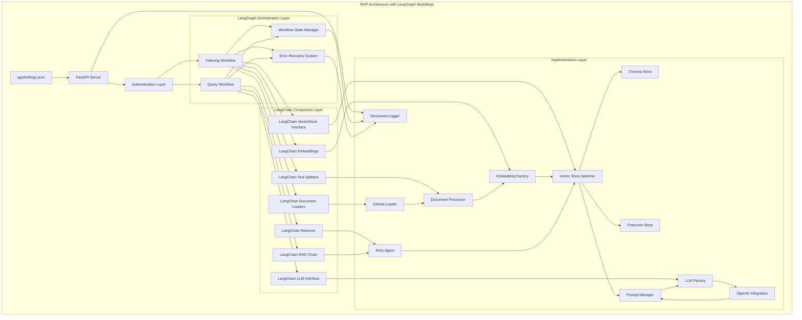

# Knowledge Graph Agent MVP Implementation Plan (2 Weeks)

**Project:** Knowledge Graph Agent  
**Timeline:** 2 Weeks (July 19 - August 2, 2025)  
**Target:** Minimum Viable Product (MVP)  
**Document Version:** 2.1
**Date Created:** July 19, 2025  
**Date Updated:** July 25, 2025

## Executive Summary

This implementation plan delivers a focused 2-week MVP for the Knowledge Graph Agent that provides core functionality: indexing GitHub repositories and enabling RAG-based querying through a REST API using stateful LangGraph workflows orchestrating LangChain components. The plan prioritizes working software with robust stateful processing over comprehensive features to meet the tight deadline while establishing a solid foundation for future enhancements.

## MVP Scope Definition

### In Scope (MVP Features)
- ✅ GitHub repository indexing from appSettings.json configuration (multiple repositories)
- ✅ GitHub integration for private repository access
- ✅ LangChain framework components: Document Loaders, Text Splitters, Vector Stores, LLM interfaces, Prompt Templates, and RAG Chains
- ✅ LangGraph workflows for stateful orchestration: complete indexing and query workflows with persistent state management, error recovery, and retry mechanisms
- ✅ LangGraph Indexing Workflow: stateful repository processing with progress tracking, error handling states, and automatic retry with exponential backoff
- ✅ LangGraph Query Workflow: adaptive RAG processing with query intent analysis, search strategy determination, response quality control, and fallback mechanisms
- ✅ Document chunking and embedding generation with configurable strategies (language-aware for .NET and React)
- ✅ Language-aware chunking support for .NET (C#) and React (JS/TS) files
- ✅ Metadata-enriched chunks: includes file_path, chunk_type, language, lines, tokens, and code symbols (e.g., class_name, function_name, component_name)
- ✅ Pinecone and Chroma vector storage with runtime switching (DATABASE_TYPE)
- ✅ RAG query processing with OpenAI integration
- ✅ LLM and Embedding factory patterns for provider abstraction
- ✅ REST API with authentication middleware (API key)
- ✅ Prompt Manager for context injection and formatting
- ✅ Environment-based configuration with comprehensive validation
- ✅ Structured logging and health monitoring
- ✅ Base agent architecture with extensible patterns
- ✅ Web UI chatbot interface

### Out of Scope (Post-MVP)
- ❌ Advanced chunking strategies (semantic, context-aware, AST-based)
- ❌ Multiple LLM provider support beyond OpenAI (Anthropic, Ollama, Azure OpenAI)
- ❌ Advanced authentication (OAuth, RBAC)
- ❌ Comprehensive monitoring and metrics dashboard
- ❌ Incremental indexing capabilities with Git diff detection
- ❌ Advanced error recovery mechanisms beyond basic retry
- ❌ Performance optimization and horizontal scaling
- ❌ GitHub Enterprise specific features
- ❌ LangGraph workflow visual tracing and history API
- ❌ Advanced workflow state persistence (database-backed state)

## Technical Architecture (MVP)

### System Overview


### Technology Stack
- **Backend Framework:** FastAPI with authentication middleware
- **AI/ML Framework:** LangChain (document loaders, text splitters, embeddings, vector stores, LLM interfaces, RAG chains) orchestrated by LangGraph workflows
- **Workflow Orchestration:** LangGraph for stateful workflow management, error recovery, and progress tracking
- **Repository Integration:** GitHub API integration with LangChain document loaders
- **Vector Database:** Chroma, Pinecone (runtime switchable via LangChain VectorStore interface)
- **LLM Provider:** OpenAI (GPT-4o-mini) via LangChain LLM interface and factory pattern
- **Embeddings:** OpenAI text-embedding-ada-002 via LangChain Embeddings interface and factory pattern
- **Configuration:** Pydantic with appSettings.json and environment variables
- **Logging:** Structured logging with configurable levels and workflow state tracking
- **Containerization:** Docker with production-ready configuration

## Project Structure (MVP-Aligned)

```
knowledge-graph-agent/
├── src/
│   ├── config/
│   │   ├── __init__.py
│   │   └── settings.py              # Environment-based configuration with validation
│   ├── loaders/
│   │   ├── __init__.py
│   │   └── github_loader.py         # GitHub integration using LangChain BaseLoader interface
│   ├── processors/
│   │   ├── __init__.py
│   │   ├── document_processor.py    # Document chunking using LangChain text splitters with metadata enrichment
│   │   ├── chunking_strategy.py     # Language-aware chunking strategies (.NET & React)
│   │   └── metadata_extractor.py    # Extract code symbols and metadata for LangChain documents
│   ├── vectorstores/
│   │   ├── __init__.py
│   │   ├── base_store.py           # LangChain VectorStore interface implementation
│   │   ├── chroma_store.py         # Chroma integration via LangChain Chroma wrapper
│   │   ├── pinecone_store.py       # Pinecone integration via LangChain Pinecone wrapper
│   │   └── store_factory.py        # Runtime switching using LangChain VectorStore interface
│   ├── llm/
│   │   ├── __init__.py
│   │   ├── llm_factory.py          # LangChain LLM interface factory pattern
│   │   ├── embedding_factory.py    # LangChain Embeddings interface factory pattern
│   │   └── openai_provider.py      # OpenAI integration via LangChain OpenAI wrappers
│   ├── agents/
│   │   ├── __init__.py
│   │   ├── base_agent.py           # Base agent using LangChain Runnable interface
│   │   └── rag_agent.py            # RAG implementation using LangChain RetrievalQA and components
│   ├── workflows/
│   │   ├── __init__.py
│   │   ├── base_workflow.py        # Base LangGraph workflow implementing LangChain Runnable interface
│   │   ├── indexing_workflow.py    # LangGraph stateful indexing workflow with state management and error recovery
│   │   ├── query_workflow.py       # LangGraph stateful query workflow with adaptive search and quality control
│   │   └── state_manager.py        # Workflow state persistence and management
│   ├── utils/
│   │   ├── __init__.py
│   │   ├── logging.py              # Structured logging with workflow state tracking
│   │   ├── helpers.py              # Utility functions
│   │   └── prompt_manager.py       # LangChain PromptTemplate integration for context injection
│   └── api/
│       ├── __init__.py
│       ├── main.py                 # FastAPI application entry point
│       ├── routes.py               # REST API endpoints
│       ├── models.py               # Pydantic request/response models
│       └── middleware.py           # Authentication middleware (API key)
├── web/
│   ├── Dockerfile                  # Container configuration
│   ├── index.html                  # Main chatbot UI interface
├── tests/
│   ├── __init__.py
│   ├── unit/                       # Unit tests for core components
│   │   ├── test_chunking.py        # Language-aware chunking tests with LangChain components
│   │   ├── test_metadata.py        # Metadata extraction tests for LangChain documents
│   │   ├── test_factories.py       # LangChain interface factory pattern tests
│   │   └── test_workflows.py       # LangGraph workflow unit tests
│   └── integration/                # Integration tests
│       ├── test_github_loader.py   # GitHub integration tests with LangChain loaders
│       ├── test_vectorstore.py     # LangChain vector store switching tests
│       ├── test_workflows.py       # Complete LangGraph workflow integration tests
│       └── test_langchain.py       # LangChain component integration tests
├── appSettings.json                # Multiple repository configuration
├── requirements.txt                # Core Python dependencies
├── requirements-dev.txt            # Development and testing dependencies
├── .env.example                    # Environment variables template
├── Dockerfile                      # Container configuration
├── docker-compose.yml              # Development environment
├── docker-compose.prod.yml         # Production environment
├── main.py                         # Application entry point
└── README.md                       # Quick start and configuration guide
```

## Implementation Timeline (MVP-Focused)

### Week 1: Core Infrastructure & Document Processing

#### **Day 1-2: Project Foundation & Configuration**

**Task 1.1: MVP Project Setup (4 hours)**
- Create MVP-aligned project directory structure with tests/
- Initialize Python project with core dependencies for MVP features
- Set up version control with .gitignore for Python/Docker
- Configure development environment with Docker support

**Task 1.2: Dependency Management & Environment (6 hours)**
- Create `requirements.txt` with MVP-focused dependencies:
  - fastapi[all] (REST API with authentication middleware)
  - langchain + langgraph (LangChain framework components with LangGraph stateful workflows)
  - langchain-community (additional LangChain integrations for GitHub, Chroma, Pinecone)
  - langchain-openai (LangChain OpenAI wrappers for LLM and embeddings)
  - chromadb + pinecone-client (vector storage backends)
  - openai (direct OpenAI API integration)
  - python-dotenv + pydantic (environment-based configuration)
  - uvicorn[standard] + httpx + python-multipart (web server and HTTP client)
- Create `requirements-dev.txt` with testing dependencies:
  - pytest + pytest-asyncio (testing framework with async support)
  - pytest-mock (mocking for LangChain components)
  - httpx (testing HTTP endpoints)
- Create comprehensive `.env.example` with all MVP configuration variables including LangGraph workflow settings

**Task 1.3: Environment-Based Configuration (8 hours)**
- Implement `src/config/settings.py` with comprehensive Pydantic validation
- Support for OpenAI, Chroma, Pinecone, and GitHub credentials
- AppSettings.json parser for multiple repository configuration
- Add DATABASE_TYPE runtime switcher for vector stores
- Configuration validation with detailed error messages
- Structured logging configuration with health monitoring support

#### **Day 3-4: GitHub Integration & Language-Aware Processing**

**Task 1.4: GitHub Integration with LangChain Loaders (12 hours)**
- Implement `src/loaders/github_loader.py` inheriting from LangChain BaseLoader interface
- GitHub API integration for multiple repositories from appSettings.json configuration
- Private repository access with GitHub token authentication
- LangChain Document creation with proper metadata structure
- Configurable file extensions from environment settings
- Metadata extraction (file_path, repository info, commit info, language detection) compatible with LangChain schema
- Error handling for API rate limits and network issues with retry mechanisms
- Batch processing for efficient repository indexing integrated with LangGraph workflow state
- Support multiple repositories from appSettings.json configuration
- Private repository access with GitHub token authentication
- Configurable file extensions from environment settings
- Metadata extraction (file_path, repository info, commit info, language detection)
- Error handling for API rate limits and network issues
- Batch processing for efficient repository indexing

**Task 1.5: LangChain Factory Patterns for LLM and Embeddings (10 hours)**
- Create `src/llm/llm_factory.py` implementing LangChain LLM interface abstraction
- Create `src/llm/embedding_factory.py` implementing LangChain Embeddings interface abstraction
- Implement `src/llm/openai_provider.py` using langchain-openai wrappers (ChatOpenAI, OpenAIEmbeddings)
- Support for multiple OpenAI model configurations via environment variables
- Error handling and retry logic for API failures with LangChain callback support
- Token usage tracking and monitoring for cost optimization
- Integration with LangGraph workflow context for state tracking

#### **Day 5-6: Language-Aware Document Processing & LangChain Vector Storage**

**Task 1.6: Language-Aware Document Processing with LangChain Integration (12 hours)**
- Create `src/processors/document_processor.py` using LangChain RecursiveCharacterTextSplitter and custom splitters
- Implement `src/processors/chunking_strategy.py` with language-aware strategies:
  - .NET (C#): Class and method-based chunking with AST parsing and LangChain Document metadata
  - React (JS/TS): Function and component-based chunking with JSX support and LangChain schema
  - Generic: LangChain RecursiveCharacterTextSplitter for other languages
- Create `src/processors/metadata_extractor.py` for code symbol extraction compatible with LangChain Document metadata
- Extract and preserve metadata per chunk as LangChain Document metadata:
  - `file_path`, `chunk_type`, `language`, `line_start`, `line_end`
  - `class_name`, `function_name`, `component_name`, `tokens`, `repository`
- Unit tests for language-aware chunking logic with LangChain Document validation
- Integration with LangGraph workflow state for progress tracking

**Task 1.7: LangChain Vector Storage with Runtime Switching (10 hours)**
- Implement `src/vectorstores/base_store.py` extending LangChain VectorStore interface
- Implement `src/vectorstores/chroma_store.py` using langchain-community Chroma wrapper
- Implement `src/vectorstores/pinecone_store.py` using langchain-community Pinecone wrapper  
- Create `src/vectorstores/store_factory.py` for runtime DATABASE_TYPE switching with LangChain interface
- Document embedding using LangChain Embeddings interface with metadata preservation
- Batch upsert functionality with error recovery and LangGraph workflow integration
- Connection management and health checks for both vector stores with LangChain callbacks
- Integration with LangGraph indexing workflow for state persistence

### Metadata Schema for Chunks

Each chunk will include structured metadata for retrieval relevance, traceability, and future enhancements:

```json
{
  "repository": "org/repo",
  "file_path": "src/services/UserService.cs",
  "chunk_type": "method",
  "language": "csharp",
  "class_name": "UserService",
  "function_name": "GetUserById",
  "line_start": 48,
  "line_end": 61,
  "tokens": 210
}
```

Metadata enables:
- Top-k filtering by file type, repository, or symbol
- Future support for incremental re-indexing
- Token usage auditing and embedding optimization

### Week 2: LangGraph Workflows & REST API with Authentication

#### **Day 7-8: LangGraph Stateful Workflows & Base Agent Architecture**

**Task 2.1: LangGraph Base Workflow Infrastructure (12 hours)**
- Create `src/workflows/base_workflow.py` implementing LangChain Runnable interface for LangGraph integration
- Create `src/workflows/state_manager.py` for workflow state persistence and management
- Implement workflow state schemas using TypedDict for indexing and query workflows:
  ```python
  class IndexingState(TypedDict):
      repositories: List[str]
      current_repo: str
      processed_files: int
      total_files: int
      errors: List[str]
      embeddings_generated: int
      status: str
  ```
- Error handling and retry logic infrastructure with exponential backoff
- Progress tracking and structured logging integration
- Workflow metadata tracking (ID, status, executed steps, duration)
- Integration with vector store factory for runtime switching context

**Task 2.2: LangGraph Indexing Workflow Implementation (14 hours)**
- Create `src/workflows/indexing_workflow.py` with complete stateful indexing workflow
- Implement all workflow states from the detailed flow:
  - **Initialize State** → **Load Repositories** → **Validate Repos**
  - **Load Files from GitHub** → **Process Documents** → **Language-Aware Chunking**
  - **Extract Metadata** → **Generate Embeddings** → **Store in Vector DB**
  - **Update Workflow State** → **Check Complete** → **Finalize Index**
- Implement error handling states:
  - **Handle File Errors**, **Handle Processing Errors**, **Handle Embedding Errors**, **Handle Storage Errors**
- State persistence with workflow database integration  
- Automatic retry mechanisms with exponential backoff for each error state
- Progress tracking with detailed status updates for long-running operations
- Parallel repository processing capabilities with state synchronization
- Integration with LangChain components (loaders, splitters, embeddings, vector stores)

**Task 2.3: LangGraph Query Workflow Implementation (12 hours)**
- Create `src/workflows/query_workflow.py` with adaptive RAG query processing workflow
- Implement all workflow states from the detailed flow:
  - **Parse Query** → **Validate Query** → **Analyze Query Intent**
  - **Determine Search Strategy** → **Vector Search** → **Filter & Rank Results**
  - **Check Sufficient Context** → **Expand Search Parameters** (if needed)
  - **Prepare LLM Context** → **Generate Contextual Prompt** → **Call LLM**
  - **Format Response** → **Response Quality Check** → **Return Success**
- Implement error handling and fallback states:
  - **Handle Retrieval Errors** → **Fallback Search Strategy**
  - **Handle LLM Errors** → **Retry LLM Call**
  - **Response Quality Control** → **Retry with Different Context**
- Query state tracking with context preservation throughout processing
- Adaptive search strategy adjustment based on initial results
- Response quality validation and automatic retry mechanisms
- Integration with LangChain RAG chain and retriever components

#### **Day 9: Base Agent Architecture & LangChain Integration**

**Task 2.4: Base Agent Architecture with LangChain Runnable (10 hours)**
- Create `src/agents/base_agent.py` implementing LangChain Runnable interface for workflow integration
- Implement `src/agents/rag_agent.py` using LangChain RetrievalQA and related components
- Integration with LangGraph query workflow for stateful processing
- LangChain OpenAI integration via factory pattern for response generation
- Context retrieval using LangChain retriever with configurable top-k results and metadata filtering
- Response formatting with source attribution and chunk metadata preservation
- Support for repository filtering and language-specific queries
- Integration with LangChain prompt templates for dynamic query composition

**Task 2.5: LangChain Prompt Manager Integration (8 hours)**
- Implement `src/utils/prompt_manager.py` using LangChain PromptTemplate components
- Design system prompt templates optimized for code queries with LangChain template syntax
- Dynamic prompt composition based on query type and retrieved context using LangChain template variables
- Context injection for retrieved LangChain documents with metadata preservation
- Response formatting templates with source citation using LangChain output parsers
- Handle edge cases (no results, insufficient context, token limits) with LangChain fallback strategies
- Integration with LangGraph query workflow for contextual prompt generation
#### **Day 10: REST API with Authentication Middleware**

**Task 2.6: REST API Implementation with LangGraph Integration (12 hours)**
- Create `src/api/main.py` with FastAPI application and LangGraph workflow integration
- Implement `src/api/routes.py` with comprehensive MVP endpoints:
  - `POST /index` - Trigger LangGraph indexing workflow for all repositories from appSettings.json
  - `POST /index/repository` - Trigger LangGraph indexing workflow for specific repository
  - `POST /query` - Execute LangGraph query workflow with adaptive RAG processing
  - `GET /repositories` - List indexed repositories with metadata from workflow state
  - `GET /health` - Health check with LangGraph workflow status and LangChain component health
  - `GET /stats` - Index statistics and repository metrics from workflow persistence
  - `GET /workflows/{workflow_id}/status` - Get LangGraph workflow execution status and progress
- Implement `src/api/models.py` with Pydantic request/response models for workflow integration
- Error handling and structured response formatting with workflow state information
- Request validation and input sanitization with LangChain document schema validation

**Task 2.7: Authentication Middleware & Workflow Monitoring (10 hours)**
- Implement `src/api/middleware.py` with API key authentication and workflow request tracking
- Authentication middleware for securing all endpoints including workflow status endpoints
- Request logging and response time tracking with LangGraph workflow execution metrics
- Rate limiting and request validation middleware with workflow queue management
- CORS configuration for future web interface integration
- Health monitoring endpoints with LangGraph workflow status and LangChain component connectivity
- Error response standardization and logging integration with workflow state persistence
- LangGraph workflow progress tracking endpoints with real-time status updates

#### **Day 11: Integration Testing & Documentation**

**Task 2.8: Comprehensive LangGraph & LangChain Integration Testing (10 hours)**
- End-to-end LangGraph workflow testing with multiple repositories from appSettings.json
- LangGraph indexing workflow state persistence and resume functionality testing
- LangGraph query workflow adaptive search and quality control validation
- Vector store runtime switching validation (Chroma ↔ Pinecone) with LangChain interface consistency
- LangChain component integration testing across the entire pipeline
- Language-aware chunking validation for .NET and React files with LangChain Document schema
- Metadata integrity testing: verify correct code symbol extraction in LangChain Document metadata
- Authentication middleware testing with API key validation and workflow access control
- RAG query accuracy verification with various query types using LangChain RetrievalQA
- Performance testing with concurrent requests and parallel repository indexing workflows
- LangGraph workflow error recovery and retry mechanism testing
- LangChain callback and logging integration validation

**Task 2.9: Documentation & Deployment Configuration (8 hours)**
- Create comprehensive `README.md` with MVP quick start guide including LangGraph workflow setup
- API documentation with detailed request/response examples and workflow status endpoints
- Environment configuration guide with all MVP variables including LangGraph workflow settings
- AppSettings.json configuration examples for multiple repositories with workflow considerations
- Docker setup with both development and production configurations for LangGraph persistence
- LangGraph workflow monitoring and debugging guide
- LangChain component integration documentation with troubleshooting
- Basic troubleshooting guide with common LangGraph workflow issues and LangChain component problems
- Deployment instructions for different environments with workflow state persistence and health checks


## API Specification

### Environment Configuration

```bash
# LLM Configuration
LLM_PROVIDER=openai
LLM_MODEL=gpt-4o-mini
LLM_API_BASE_URL=https://api.openai.com/v1 #Just use for ollama only

# LLM Models Configuration
OPENAI_API_KEY=your_openai_api_key

# Embedding Configuration
EMBEDDING_PROVIDER=openai
EMBEDDING_MODEL=text-embedding-ada-002
EMBEDDING_BATCH_SIZE=50
MAX_TOKENS_PER_BATCH=250000

# Vector Database Configuration
DATABASE_TYPE=chroma #This configuration to allow switch vector store between chroma and pinecone
CHROMA_HOST=localhost
CHROMA_PORT=8000
CHROMA_COLLECTION_NAME=knowledge-base-graph

PINECONE_API_KEY=pinecone-api-key
PINECONE_COLLECTION_NAME=knowledge-base-graph

# GitHub Configuration
GITHUB_TOKEN=your_github_token
GITHUB_FILE_EXTENSIONS=[".cs",".csproj",".py",".php",".js",".jsx",".ts",".tsx",".html",".cshtml",".md", ".txt",".json",".yml",".yaml",".csv","dockerfile", ".config",".sh",".bash"]

# Application Configuration
APP_ENV=development #production
LOG_LEVEL=INFO #DEBUG
CHUNK_SIZE=1000
CHUNK_OVERLAP=200
MAX_TOKENS=4000
TEMPERATURE=0.7

# LangGraph Workflow Configuration
WORKFLOW_STATE_PERSISTENCE=true
WORKFLOW_RETRY_ATTEMPTS=3
WORKFLOW_RETRY_DELAY_SECONDS=5
WORKFLOW_TIMEOUT_SECONDS=3600
WORKFLOW_PARALLEL_REPOS=2
WORKFLOW_STATE_BACKEND=memory #database for production

# LangChain Configuration  
LANGCHAIN_TRACING=false #true for debugging
LANGCHAIN_API_KEY=your_langsmith_api_key #optional for LangSmith tracing
LANGCHAIN_PROJECT=knowledge-graph-agent #optional project name for LangSmith
```

### Core API Endpoints

#### 1. Index Multiple Repositories (LangGraph Workflow)
```http
POST /index
Content-Type: application/json
Authorization: Bearer your-api-key

{
  "repositories": "all",
  "force_reindex": false,
  "parallel_processing": true
}

Response:
{
  "status": "success",
  "message": "Indexing workflows started successfully",
  "workflow_id": "workflow_12345",
  "results": [
    {
      "repository": "example-repo",
      "url": "https://github.com/example/repo",
      "workflow_status": "in_progress",
      "documents_processed": 42,
      "chunks_created": 156,
      "embeddings_stored": 156,
      "current_state": "STORE_VECTORS",
      "progress_percentage": 75
    }
  ],
  "total_processing_time_ms": 45000,
  "langchain_components_used": ["GitHubLoader", "RecursiveCharacterTextSplitter", "OpenAIEmbeddings", "ChromaVectorStore"]
}
```

#### 2. Index Specific Repository (LangGraph Workflow)
```http
POST /index/repository
Content-Type: application/json
Authorization: Bearer your-api-key

{
  "repository_url": "https://github.com/owner/repo",
  "branch": "main",
  "force_reindex": true
}

Response:
{
  "status": "success",
  "message": "Repository indexing workflow started successfully",
  "workflow_id": "workflow_67890",
  "repository": "owner/repo",
  "workflow_status": "completed",
  "documents_processed": 42,
  "chunks_created": 156,
  "embeddings_stored": 156,
  "processing_time_ms": 15000,
  "workflow_states_executed": ["INIT", "LOAD_REPOS", "VALIDATE_REPOS", "LOAD_FILES", "PROCESS_DOCS", "CHUNK_DOCS", "EXTRACT_META", "GENERATE_EMBED", "STORE_VECTORS", "FINALIZE"],
  "langchain_components_used": ["GitHubLoader", "RecursiveCharacterTextSplitter", "OpenAIEmbeddings", "PineconeVectorStore"]
}
```

#### 3. Query Knowledge Base (LangGraph Workflow)
```http
POST /query
Content-Type: application/json
Authorization: Bearer your-api-key

{
  "question": "How does the authentication work in this codebase?",
  "max_results": 5,
  "repository_filter": ["example-repo"],
  "include_source_code": true,
  "adaptive_search": true
}

Response:
{
  "status": "success",
  "workflow_id": "query_workflow_abc123",
  "answer": "Based on the codebase analysis using adaptive search strategy...",
  "search_strategy_used": "hybrid_semantic_keyword",
  "context_expansion_performed": true,
  "response_quality_score": 0.89,
  "sources": [
    {
      "repository": "example-repo",
      "file_path": "src/auth/authentication.py",
      "chunk_text": "def authenticate_user(username, password)...",
      "relevance_score": 0.95,
      "chunk_metadata": {
        "class_name": "AuthenticationService",
        "function_name": "authenticate_user",
        "language": "python",
        "line_start": 15,
        "line_end": 35
      }
    }
  ],
  "query_time_ms": 1250,
  "workflow_states_executed": ["PARSE", "VALIDATE", "ANALYZE", "DETERMINE_STRATEGY", "RETRIEVE", "FILTER_RESULTS", "PREPARE_CONTEXT", "GENERATE_PROMPT", "LLM_CALL", "FORMAT_RESPONSE", "VALIDATE_RESPONSE"],
  "langchain_components_used": ["ChromaRetriever", "PromptTemplate", "ChatOpenAI", "RetrievalQA"],
  "vector_store_used": "chroma"
}
```
#### 4. Workflow Status Endpoint (New)
```http
GET /workflows/{workflow_id}/status
Authorization: Bearer your-api-key

Response:
{
  "status": "success",
  "workflow_id": "workflow_12345",
  "workflow_type": "indexing",
  "current_state": "GENERATE_EMBED",
  "status": "in_progress",
  "progress_percentage": 65,
  "start_time": "2025-07-25T10:30:00Z",
  "estimated_completion": "2025-07-25T10:45:00Z",
  "repositories_processed": 2,
  "total_repositories": 3,
  "current_repository": "owner/repo2",
  "files_processed": 89,
  "chunks_created": 334,
  "embeddings_generated": 298,
  "errors": [],
  "langchain_components_active": ["OpenAIEmbeddings", "ChromaVectorStore"],
  "retry_count": 0,
  "last_state_update": "2025-07-25T10:42:15Z"
}
```

#### 5. List Repositories
```http
GET /repositories
Authorization: Bearer your-api-key

Response:
{
  "status": "success",
  "repositories": [
    {
      "name": "example-repo",
      "url": "https://github.com/example/repo",
      "indexed_at": "2025-07-25T10:30:00Z",
      "document_count": 42,
      "chunk_count": 156,
      "status": "indexed",
      "last_indexing_workflow_id": "workflow_12345",
      "indexing_duration_ms": 45000,
      "langchain_components_used": ["GitHubLoader", "RecursiveCharacterTextSplitter", "OpenAIEmbeddings", "ChromaVectorStore"]
    }
  ]
}
```

#### 6. Health Check
```http
GET /health

Response:
{
  "status": "healthy",
  "services": {
    "vector_store": {
      "type": "chroma",
      "status": "connected",
      "response_time_ms": 45,
      "langchain_integration": "active"
    },
    "llm_provider": {
      "type": "openai", 
      "status": "connected",
      "model": "gpt-4o-mini",
      "langchain_integration": "active"
    },
    "embedding_provider": {
      "type": "openai",
      "status": "connected", 
      "model": "text-embedding-ada-002",
      "langchain_integration": "active"
    },
    "langgraph_workflows": {
      "status": "active",
      "active_workflows": 2,
      "completed_workflows": 15,
      "failed_workflows": 0
    }
  },
  "index_stats": {
    "total_vectors": 156,
    "total_repositories": 3,
    "last_updated": "2025-07-25T10:30:00Z"
  }
}
```

#### 7. Index Statistics
```http
GET /stats
Authorization: Bearer your-api-key

Response:
{
  "status": "success",
  "statistics": {
    "total_repositories": 3,
    "total_documents": 128,
    "total_chunks": 467,
    "total_embeddings": 467,
    "storage_used_mb": 2.4,
    "repositories": [
      {
        "name": "example-repo",
        "documents": 42,
        "chunks": 156,
        "last_indexed": "2025-07-25T10:30:00Z",
        "indexing_workflow_id": "workflow_12345",
        "langchain_components": ["GitHubLoader", "RecursiveCharacterTextSplitter", "OpenAIEmbeddings", "ChromaVectorStore"]
      }
    ],
    "workflow_statistics": {
      "total_workflows_executed": 18,
      "successful_workflows": 17,
      "failed_workflows": 1,
      "average_indexing_time_ms": 35000,
      "average_query_time_ms": 1500
    },
    "langchain_usage": {
      "total_documents_processed": 467,
      "total_llm_calls": 234,
      "total_embedding_calls": 467,
      "vector_store_operations": 623
    }
  }
}
```

## Success Criteria

### Functional Requirements
- ✅ Successfully index multiple GitHub repositories from appSettings.json using LangGraph indexing workflows
- ✅ Process and embed documents in both Chroma and Pinecone with runtime switching via LangChain VectorStore interface
- ✅ LangGraph workflow execution for stateful indexing and adaptive query processing with persistent state management
- ✅ Return relevant results for code-related queries with proper source attribution using LangChain RetrievalQA components
- ✅ API responds within 10 seconds for typical queries processed through LangGraph query workflow
- ✅ Authentication layer protecting all endpoints including workflow status monitoring
- ✅ Handle error scenarios gracefully with LangGraph error recovery and retry mechanisms
- ✅ LangGraph workflow state persistence and resumption capabilities
- ✅ LangChain component integration across the entire pipeline (loaders, splitters, embeddings, vector stores, LLMs)

### Quality Gates
- ✅ End-to-end LangGraph workflow execution with multiple repositories from appSettings.json
- ✅ Vector store switching (Chroma ↔ Pinecone) works seamlessly via LangChain interface consistency
- ✅ LangGraph indexing workflow executes successfully with state management, error handling, and progress tracking
- ✅ LangGraph query workflow executes successfully with adaptive search, quality control, and fallback mechanisms
- ✅ API returns structured responses with comprehensive source attribution including workflow execution metadata
- ✅ Authentication middleware properly secures endpoints including workflow status endpoints
- ✅ System handles at least 20 concurrent requests with parallel LangGraph workflow execution
- ✅ Comprehensive logging implemented for debugging and monitoring including LangGraph workflow state tracking
- ✅ Docker deployment works in both development and production environments with workflow state persistence
- ✅ LangChain component health checks and integration validation across all interfaces

### Performance Targets (MVP)
- **Query Response Time:** < 10 seconds (95th percentile) including LangGraph query workflow execution
- **Indexing Speed:** 100+ files per minute per repository through LangGraph indexing workflow
- **API Availability:** > 95% uptime during testing including workflow orchestration
- **Relevance Quality:** > 70% of queries return useful results via LangChain RetrievalQA components
- **Vector Store Switching:** < 2 seconds failover time with LangChain interface consistency
- **Authentication Overhead:** < 100ms per request including workflow access control
- **Workflow State Persistence:** < 500ms state save/restore operations
- **LangGraph Workflow Recovery:** < 30 seconds from failure to retry attempt

## Risk Management

### Technical Risks & Mitigation

| Risk | Impact | Probability | Mitigation Strategy |
|------|--------|-------------|-------------------|
| LangGraph workflow complexity and state management | High | Medium | Start with simple workflows, implement incremental state persistence, thorough testing of state transitions |
| LangChain interface compatibility across components | High | Medium | Use stable LangChain versions, implement adapter patterns, comprehensive integration testing |
| GitHub integration complexity with LangChain loaders | Medium | Medium | Use proven LangChain GitHub integration patterns, implement fallback mechanisms |
| Vector store switching reliability via LangChain interface | High | Low | Thorough testing of both Chroma and Pinecone with LangChain wrappers, implement health checks |
| LangGraph workflow error recovery and retry mechanisms | High | Medium | Implement comprehensive error handling states, exponential backoff, state persistence for recovery |
| GitHub API rate limits affecting workflow execution | High | Medium | Implement exponential backoff in workflow states, use test repositories, monitor quotas, workflow pause/resume |
| Multiple repository indexing performance with stateful workflows | Medium | Medium | Implement parallel processing within workflows, batch operations, workflow state optimization |
| Authentication implementation scope with workflow access control | Medium | High | Use simple API key authentication, avoid complex OAuth, secure workflow status endpoints |
| OpenAI API failures during LangChain LLM calls | Medium | Low | Add comprehensive retry mechanisms in workflow states, graceful fallbacks, LangChain callback error handling |
| LangGraph and LangChain integration complexity | High | Medium | Early integration testing, modular implementations, use LangChain Runnable interface for workflow integration |
| Workflow state persistence backend selection | Medium | Medium | Start with in-memory state for MVP, design for future database backend, implement state serialization |
| LangChain component version conflicts | Medium | Low | Pin specific versions, test upgrade paths, maintain compatibility matrix |
| Scope creep beyond MVP features | High | High | Strict adherence to updated MVP feature list focused on core LangGraph workflows |

### Timeline Risks & Mitigation

| Risk | Impact | Probability | Mitigation Strategy |
|------|--------|-------------|-------------------|
| Feature complexity underestimated | High | Medium | Choose simplest implementation approach |
| Testing time insufficient | Medium | High | Combine development and testing activities |
| Deployment issues | Medium | Medium | Test deployment early and often |
| Documentation delays | Low | Medium | Minimal but sufficient documentation |

## Testing Strategy

### Unit Testing (Enhanced for MVP)
- Core business logic validation including LangChain component wrappers
- LangGraph workflow state transition testing with mock components
- Configuration loading and validation including workflow settings
- LangChain interface compliance testing (Document, VectorStore, LLM, Embeddings)
- Basic error handling verification including workflow error states
- Language-aware chunking logic with LangChain Document schema validation
- Test coverage target: > 70% for critical paths including workflow logic

### Integration Testing
- GitHub API integration with LangChain document loaders using test repositories  
- Chroma and Pinecone vector operations with LangChain wrapper consistency testing
- OpenAI API integration with LangChain LLM and embedding interfaces using development quotas
- End-to-end LangGraph workflow execution with state persistence validation
- LangGraph indexing workflow with multiple repositories and error recovery testing
- LangGraph query workflow with adaptive search and quality control validation
- API workflow integration testing with authentication and workflow status endpoints

### LangGraph Workflow Testing
- **Indexing Workflow States**: Test each state transition (INIT → LOAD_REPOS → VALIDATE_REPOS → ... → FINALIZE)
- **Query Workflow States**: Test adaptive flow (PARSE → VALIDATE → ANALYZE → ... → RETURN_SUCCESS)
- **Error Recovery**: Test all error handling states and retry mechanisms
- **State Persistence**: Test workflow interruption and resumption scenarios
- **Parallel Processing**: Test concurrent repository processing with state synchronization
- **Workflow Timeouts**: Test workflow timeout handling and cleanup

### LangChain Component Testing
- **Document Loaders**: Test GitHub loader with various repository structures
- **Text Splitters**: Test language-aware chunking with metadata preservation
- **Vector Stores**: Test Chroma/Pinecone switching with consistent interfaces
- **LLM Integration**: Test OpenAI calls through LangChain interfaces
- **RAG Chain**: Test RetrievalQA with various query patterns

### Manual Testing Scenarios
1. **Repository Indexing**: Index a small public repository through LangGraph indexing workflow
2. **Query Processing**: Ask various types of code-related questions through LangGraph query workflow  
3. **Error Handling**: Test with invalid inputs, network failures, and workflow interruptions
4. **Performance**: Basic load testing with concurrent requests and parallel workflow execution
5. **Workflow Monitoring**: Test workflow status endpoints and progress tracking
6. **Vector Store Switching**: Test runtime switching between Chroma and Pinecone during operations

## Post-MVP Roadmap

### Week 3-4: Enhanced LangGraph Workflows & Multi-Provider Support
- Advanced authentication (OAuth, role-based access) with workflow-aware permissions
- Multi-provider LLM support (Anthropic, Ollama, Azure OpenAI) via enhanced LangChain factory patterns
- Advanced chunking strategies (semantic, context-aware, AST-based) integrated with LangChain text splitters
- Performance optimization and caching for LangGraph workflow execution
- Incremental indexing capabilities with Git diff detection and LangGraph state management
- Web user interface for repository management and workflow monitoring
- LangGraph visual workflow tracing and history API with LangSmith integration
- Database-backed workflow state persistence (PostgreSQL, Redis) replacing in-memory state
- Enhanced LangChain callback system for comprehensive observability

### Week 5-6: Production Readiness & Advanced Workflows
- Comprehensive monitoring and metrics dashboard for LangGraph workflow performance
- Advanced error handling and recovery mechanisms with workflow state analysis
- Horizontal scaling and load balancing for LangGraph workflow execution
- Security hardening and penetration testing including workflow endpoint security
- Backup and disaster recovery procedures for workflow state and vector stores
- API rate limiting and quota management with workflow-aware throttling
- Advanced LangGraph workflow patterns (conditional flows, parallel execution, workflow composition)
- LangChain agent framework integration for multi-step reasoning workflows

### Week 7-8: Advanced Capabilities & Enterprise Features
- GitHub Enterprise specific features with enhanced LangChain GitHub integration
- Advanced query types and filters (semantic search, code similarity) via enhanced LangGraph query workflows
- Analytics and usage metrics with reporting for workflow performance and LangChain component usage
- Integration with CI/CD pipelines for automated indexing workflows
- Code change detection and automatic re-indexing via LangGraph change detection workflows
- Multi-language support for international teams with enhanced LangChain text processing
- Custom LangChain component development for domain-specific processing
- LangGraph workflow marketplace for reusable workflow templates

## Getting Started

### Prerequisites
- Python 3.9+
- Docker and Docker Compose
- GitHub account with API access and personal access token
- Choice of vector database:
  - **Chroma**: Local setup (included in Docker Compose)
  - **Pinecone**: Account with API key and index setup
- OpenAI account with API access

### Quick Setup
1. Clone repository: `git clone <repository-url>`
2. Install dependencies: `pip install -r requirements.txt`
3. Configure appSettings.json with your repository URLs
4. Copy `.env.example` to `.env` and configure all required variables
5. Choose vector database by setting `DATABASE_TYPE=chroma` or `DATABASE_TYPE=pinecone`
6. Run with Docker: `docker-compose up -d` or locally: `python main.py`
7. Use `POST /index` endpoint to index all repositories from appSettings.json
8. Use `POST /query` endpoint to ask questions about the indexed codebases

### Sample Repository Configuration (appSettings.json)
We recommend starting with small, well-documented repositories:
```json
{
  "repositories": [
    {
      "name": "sample-python-app",
      "url": "https://github.com/your-org/sample-python-app",
      "description": "A sample Python application with good documentation",
      "branch": "main"
    }
  ]
}
```

**Repository Criteria:**
- **Size:** < 200 files per repository for initial testing
- **Languages:** Python, JavaScript, C#, or other supported languages
- **Documentation:** Good README and code comments
- **Complexity:** Moderate (demonstrates various patterns without being overwhelming)

## Conclusion

This 2-week MVP implementation plan delivers a comprehensive Knowledge Graph Agent that demonstrates significant value while establishing a robust foundation for future development. The updated plan incorporates all requirements from the knowledge-graph-overview.md including:

- **LangChain with LangGraph workflows** for sophisticated AI agent orchestration
- **GitHub integration** for reliable repository access
- **Multiple repository support** via appSettings.json configuration
- **Runtime vector store switching** between Chroma and Pinecone
- **Factory patterns for LLM and embedding providers** enabling future extensibility
- **Authentication layer** with API key security
- **Comprehensive API endpoints** for full repository and query management

The success of this MVP will be measured by its ability to accurately answer complex questions about multiple indexed codebases, provide seamless switching between vector stores, and deliver a production-ready API with proper authentication and monitoring. The LangGraph workflows ensure reliable and observable processing, while the factory patterns provide a solid foundation for supporting additional LLM providers and embedding models in future iterations.

## Conclusion

This updated implementation plan reflects the comprehensive integration of LangChain components orchestrated by LangGraph workflows, providing a robust foundation for stateful AI agent operations. The architecture ensures reliable, observable, and maintainable workflows while leveraging the rich LangChain ecosystem.

### Key Updates Made (July 25, 2025):

#### **Enhanced Architecture Integration**
- **LangGraph Workflows**: Detailed stateful indexing and query workflows with comprehensive error handling and state persistence
- **LangChain Components**: Full integration of document loaders, text splitters, embeddings, vector stores, LLM interfaces, and RAG chains
- **Workflow Orchestration**: LangGraph managing LangChain components with persistent state and automatic recovery

#### **Updated Implementation Timeline**
- **Extended Tasks**: Increased time allocation for LangGraph workflow complexity (12-14 hours for workflow tasks)
- **Additional Dependencies**: Added langchain-community, langchain-openai, and LangChain-specific testing libraries
- **New Components**: Added base_workflow.py, state_manager.py, and enhanced testing structure

#### **Enhanced API Capabilities**
- **Workflow Status Endpoints**: New `/workflows/{workflow_id}/status` endpoint for real-time workflow monitoring
- **Enhanced Responses**: API responses now include workflow execution metadata, LangChain component usage, and state information
- **Workflow Configuration**: Added LangGraph workflow settings to environment configuration

#### **Comprehensive Testing Strategy**
- **LangGraph Workflow Testing**: Dedicated testing for all workflow states and transitions
- **LangChain Integration Testing**: Component-level integration validation across the entire pipeline
- **State Persistence Testing**: Workflow interruption and resumption scenario validation

#### **Risk Management Updates**
- **LangGraph Complexity**: New risks around workflow state management and error recovery
- **LangChain Integration**: Interface compatibility and version management considerations
- **Enhanced Mitigation**: Strategies for workflow-specific challenges and component integration

Post-MVP development will focus on advanced LangGraph workflow patterns, multi-provider LangChain support, and enterprise-grade features, building upon the robust stateful architecture established in this initial implementation.