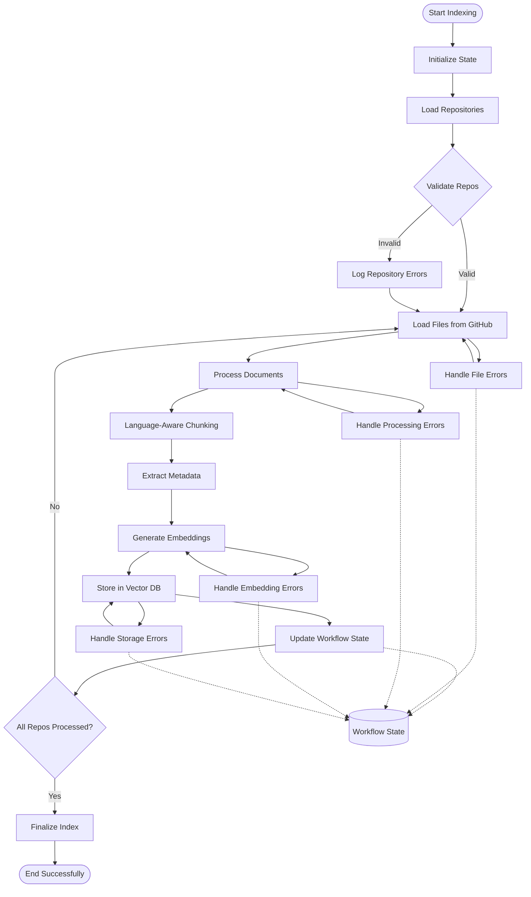
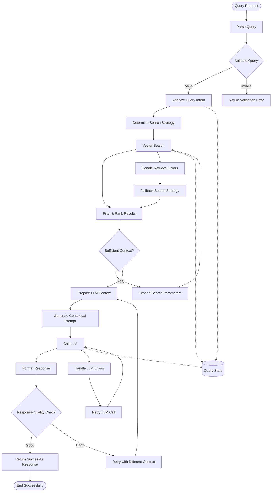

# LangGraph Workflows - Detailed Flow Analysis

## Overview

This document clarifies the specific LangGraph workflows and LangChain usage in the Knowledge Graph Agent project.

## LangGraph Workflow Architecture

### 1. LangGraph Indexing Workflow

The **Indexing Workflow** handles the stateful process of loading, processing, and storing repository content:



**Key LangGraph Features Used:**
- **State Management**: Tracks progress across repositories, files processed, errors encountered
- **Error Recovery**: Automatic retry mechanisms with exponential backoff
- **Progress Tracking**: Persistent state allows resuming interrupted indexing
- **Parallel Processing**: Multiple repositories can be processed concurrently

### 2. LangGraph Query Workflow

The **Query Workflow** handles the stateful RAG query processing:



**Key LangGraph Features Used:**
- **Query State Tracking**: Maintains context throughout the query processing
- **Adaptive Search**: Adjusts search strategy based on initial results
- **Response Quality Control**: Validates and retries poor responses
- **Error Recovery**: Handles vector DB and LLM failures gracefully

## LangChain Usage in the Project

### **Where do we use LangChain?**

LangChain is used throughout the project as the foundational framework:

```mermaid
flowchart TB
    %% LangChain Components
    subgraph "LangChain Framework Integration"
        
        subgraph "Document Processing (LangChain)"
            LC_LOADERS[LangChain Document Loaders]
            LC_SPLITTERS[LangChain Text Splitters]
            LC_EMBEDDINGS[LangChain Embeddings]
        end
        
        subgraph "Vector Stores (LangChain)"
            LC_VECTORSTORE[LangChain VectorStore Interface]
            LC_CHROMA[LangChain Chroma Integration]
            LC_PINECONE[LangChain Pinecone Integration]
        end
        
        subgraph "LLM Integration (LangChain)"
            LC_LLM[LangChain LLM Interface]
            LC_OPENAI[LangChain OpenAI Integration]
            LC_PROMPTS[LangChain Prompt Templates]
        end
        
        subgraph "RAG Chain (LangChain)"
            LC_RETRIEVER[LangChain Retriever]
            LC_RAG_CHAIN[LangChain RAG Chain]
            LC_RUNNABLE[LangChain Runnable Interface]
        end
    end
    
    %% LangGraph Orchestration
    subgraph "LangGraph Workflows"
        LG_INDEX_WORKFLOW[Indexing Workflow]
        LG_QUERY_WORKFLOW[Query Workflow]
        LG_STATE[Workflow State Management]
    end
    
    %% Project Components
    subgraph "Project Implementation"
        GITHUB_LOADER[GitHub Loader]
        DOC_PROCESSOR[Document Processor]
        VECTOR_FACTORY[Vector Store Factory]
        RAG_AGENT[RAG Agent]
        API_ROUTES[API Routes]
    end
    
    %% Connections
    LC_LOADERS --> GITHUB_LOADER
    LC_SPLITTERS --> DOC_PROCESSOR
    LC_EMBEDDINGS --> DOC_PROCESSOR
    
    LC_VECTORSTORE --> VECTOR_FACTORY
    LC_CHROMA --> VECTOR_FACTORY
    LC_PINECONE --> VECTOR_FACTORY
    
    LC_LLM --> RAG_AGENT
    LC_OPENAI --> RAG_AGENT
    LC_PROMPTS --> RAG_AGENT
    
    LC_RETRIEVER --> RAG_AGENT
    LC_RAG_CHAIN --> RAG_AGENT
    LC_RUNNABLE --> RAG_AGENT
    
    LG_INDEX_WORKFLOW --> GITHUB_LOADER
    LG_INDEX_WORKFLOW --> DOC_PROCESSOR
    LG_INDEX_WORKFLOW --> VECTOR_FACTORY
    
    LG_QUERY_WORKFLOW --> RAG_AGENT
    LG_QUERY_WORKFLOW --> VECTOR_FACTORY
    
    RAG_AGENT --> API_ROUTES
```



### Specific LangChain Components Used:

#### 1. **Document Processing Chain**
```python
# LangChain components in src/loaders/github_loader.py
from langchain.document_loaders import BaseLoader
from langchain.schema import Document

# LangChain components in src/processors/document_processor.py  
from langchain.text_splitter import RecursiveCharacterTextSplitter
from langchain.embeddings import OpenAIEmbeddings
```

#### 2. **Vector Store Integration**
```python
# LangChain components in src/vectorstores/
from langchain.vectorstores import Chroma, Pinecone
from langchain.vectorstores.base import VectorStore
```

#### 3. **LLM and RAG Chain**
```python
# LangChain components in src/agents/rag_agent.py
from langchain.llms import OpenAI
from langchain.chains import RetrievalQA
from langchain.prompts import PromptTemplate
from langchain.schema.runnable import Runnable
```

#### 4. **Integration with LangGraph**
```python
# LangChain Runnable integration with LangGraph workflows
from langgraph import StateGraph
from langchain.schema.runnable import Runnable

# Workflows inherit from Runnable for seamless integration
class IndexingWorkflow(Runnable):
    # LangChain components orchestrated by LangGraph
```

## Key Architectural Decisions

### 1. **Why LangGraph + LangChain?**
- **LangChain**: Provides rich ecosystem of components (loaders, splitters, vector stores, LLMs)
- **LangGraph**: Adds stateful workflow orchestration and error recovery capabilities
- **Integration**: LangGraph workflows orchestrate LangChain components with persistent state

### 2. **Workflow State Management**
```python
# Example workflow state structure
class IndexingState(TypedDict):
    repositories: List[str]
    current_repo: str
    processed_files: int
    total_files: int
    errors: List[str]
    embeddings_generated: int
    status: str
```

### 3. **Error Recovery and Retry Logic**
- **LangGraph**: Manages retry logic and state persistence
- **LangChain**: Provides underlying component reliability
- **Combined**: Robust error handling with automatic recovery

## Benefits of This Architecture

1. **Stateful Processing**: LangGraph maintains state across long-running operations
2. **Component Reusability**: LangChain components are orchestrated by workflows
3. **Error Recovery**: Automatic retry and recovery mechanisms
4. **Scalability**: Parallel processing within workflows
5. **Observability**: Complete workflow tracing and state inspection
6. **Extensibility**: Easy to add new steps or modify existing workflows

This architecture ensures reliable, observable, and maintainable AI agent workflows while leveraging the rich LangChain ecosystem.
