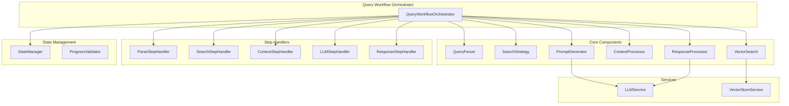

# Query Workflow Refactoring Implementation Plan

**Document Created:** August 3, 2025  
**Author:** AI Assistant  
**Project:** Knowledge Graph Agent  
**Purpose:** Comprehensive refactoring plan for the monolithic query workflow  

## Executive Summary

The current `query_workflow.py` file contains over 1,056 lines of complex, monolithic code that violates the Single Responsibility Principle and is difficult to maintain, test, and understand. This plan outlines a systematic refactoring approach to break the monolithic implementation into focused, testable components while preserving all existing functionality.

## Problem Analysis

### Current Issues
1. **Monolithic Design**: Single 1,056-line file handling multiple responsibilities
2. **Complex Method**: `_process_query_step` method spans 367 lines with nested conditionals
3. **Mixed Abstraction Levels**: Low-level string operations mixed with high-level orchestration
4. **Testing Challenges**: Monolithic structure makes unit testing difficult
5. **Maintenance Burden**: Changes in one area can affect unrelated functionality
6. **Code Duplication**: Similar patterns repeated across different steps
7. **Hard to Understand**: Complex workflow logic buried in implementation details

### Current Responsibilities (Single Class Handling All)
- Query parsing and validation
- Intent analysis and strategy determination
- Vector search operations
- Context preparation and formatting
- LLM interaction and prompt generation
- Response processing and quality evaluation
- Error handling and retry logic
- State management and progress tracking

## Refactoring Goals

### Primary Objectives
1. **Single Responsibility**: Each component handles one clear concern
2. **Improved Testability**: Components can be tested in isolation
3. **Enhanced Readability**: Clear separation of concerns and data flow
4. **Better Maintainability**: Changes isolated to specific components
5. **Preserved Functionality**: No breaking changes to existing API
6. **Performance Preservation**: Maintain or improve current performance

### Success Criteria
- [ ] Reduce main file size by 80% (from 1,056 to ~200 lines)
- [ ] Create 8+ focused components with clear interfaces
- [ ] Achieve 90%+ test coverage on new components
- [ ] Maintain 100% backward compatibility
- [ ] Improve code maintainability index by 50%
- [ ] Zero performance regression

## Proposed Architecture

### Component Breakdown



## Implementation Steps

### Phase 1: Foundation Setup (Week 1, Days 1-2)

#### Step 1.1: Create Base Infrastructure
**Duration:** 4 hours  
**Files to Create:**
- `src/workflows/query/`
- `src/workflows/query/components/`
- `src/workflows/query/services/`
- `src/workflows/query/steps/`
- `src/workflows/query/__init__.py`

**Implementation:**
```python
# src/workflows/query/__init__.py
"""
Query workflow refactored components.
"""

from .workflow_orchestrator import QueryWorkflowOrchestrator
from .components import (
    QueryParser,
    SearchStrategy,
    VectorSearch,
    ContextProcessor,
    PromptGenerator,
    ResponseProcessor
)

__all__ = [
    "QueryWorkflowOrchestrator",
    "QueryParser", 
    "SearchStrategy",
    "VectorSearch",
    "ContextProcessor",
    "PromptGenerator",
    "ResponseProcessor"
]
```

#### Step 1.2: Create Base Component Interface
**Duration:** 2 hours  
**File:** `src/workflows/query/components/base_component.py`

```python
"""Base interface for query workflow components."""

from abc import ABC, abstractmethod
from typing import Any, Dict, Protocol
from src.workflows.workflow_states import QueryState

class QueryComponent(ABC):
    """Base class for query workflow components."""
    
    def __init__(self, logger=None):
        self.logger = logger or get_logger(self.__class__.__name__)
    
    @abstractmethod
    def process(self, state: QueryState, **kwargs) -> QueryState:
        """Process the component's responsibility."""
        pass
    
    def validate_input(self, state: QueryState) -> bool:
        """Validate component input."""
        return True
    
    def handle_error(self, error: Exception, state: QueryState) -> QueryState:
        """Handle component-specific errors."""
        return add_workflow_error(state, str(error), self.__class__.__name__)
```

### Phase 2: Core Component Extraction (Week 1, Days 3-7)

#### Step 2.1: Extract Query Parser Component
**Duration:** 6 hours  
**File:** `src/workflows/query/components/query_parser.py`

**Extracted Methods:**
- `_determine_query_intent()` → `analyze_intent()`
- `_extract_filters_from_query()` → `extract_filters()`
- Query validation logic → `validate_query()`

**Implementation:**
```python
"""Query parsing and analysis component."""

from typing import Dict, Any
from src.workflows.workflow_states import QueryState, QueryIntent
from .base_component import QueryComponent

class QueryParser(QueryComponent):
    """Handles query parsing, validation, and intent analysis."""
    
    def process(self, state: QueryState, **kwargs) -> QueryState:
        """Process query parsing steps."""
        # Parse query
        state["processed_query"] = self._clean_query(state["original_query"])
        
        # Validate query
        self._validate_query(state["processed_query"])
        
        # Analyze intent
        state["query_intent"] = self.analyze_intent(state["processed_query"])
        
        # Extract filters
        state["query_filters"] = self.extract_filters(state["processed_query"])
        
        return state
    
    def analyze_intent(self, query: str) -> QueryIntent:
        """Analyze query to determine intent."""
        # Extracted from _determine_query_intent
        pass
    
    def extract_filters(self, query: str) -> Dict[str, Any]:
        """Extract metadata filters from query."""
        # Extracted from _extract_filters_from_query
        pass
```

#### Step 2.2: Extract Search Strategy Component
**Duration:** 4 hours  
**File:** `src/workflows/query/components/search_strategy.py`

**Extracted Methods:**
- `_determine_search_strategy()` → `determine_strategy()`
- Search configuration logic → `configure_search()`

#### Step 2.3: Extract Vector Search Component
**Duration:** 8 hours  
**File:** `src/workflows/query/components/vector_search.py`

**Extracted Methods:**
- `_perform_vector_search()` → `search()`
- `_check_context_sufficiency()` → `check_sufficiency()`
- Document ranking logic → `rank_documents()`

#### Step 2.4: Extract Context Processor Component
**Duration:** 6 hours  
**File:** `src/workflows/query/components/context_processor.py`

**Extracted Methods:**
- `_prepare_context_for_llm()` → `prepare_context()`
- Context formatting → `format_context()`
- Source attribution → `add_source_attribution()`

#### Step 2.5: Extract Prompt Generator Component
**Duration:** 6 hours  
**File:** `src/workflows/query/components/prompt_generator.py`

**Extracted Methods:**
- `_generate_system_prompt()` → `generate_system_prompt()`
- `_generate_contextual_prompt()` → `generate_contextual_prompt()`
- Template management → `load_templates()`

#### Step 2.6: Extract Response Processor Component
**Duration:** 6 hours  
**File:** `src/workflows/query/components/response_processor.py`

**Extracted Methods:**
- `_evaluate_response_quality()` → `evaluate_quality()`
- Response formatting → `format_response()`
- Source compilation → `compile_sources()`

### Phase 3: Service Layer Creation (Week 2, Days 1-2)

#### Step 3.1: Create LLM Service
**Duration:** 4 hours  
**File:** `src/workflows/query/services/llm_service.py`

**Responsibilities:**
- LLM interaction abstraction
- Response processing and validation
- Error handling and retries

```python
"""LLM interaction service for query workflow."""

from typing import Optional
from src.llm.llm_factory import LLMFactory
from src.workflows.workflow_states import QueryState, ProcessingStatus

class LLMService:
    """Service for LLM interactions."""
    
    def __init__(self):
        self.llm_factory = LLMFactory()
        self._llm = None
    
    def generate_response(self, prompt: str, state: QueryState) -> str:
        """Generate response from LLM."""
        llm = self._get_llm()
        
        try:
            response = llm.invoke(prompt)
            response_text = self._extract_response_text(response)
            
            # Update state
            state["llm_generation"]["status"] = ProcessingStatus.COMPLETED
            state["llm_generation"]["generated_response"] = response_text
            
            return response_text
            
        except Exception as e:
            state["llm_generation"]["status"] = ProcessingStatus.FAILED
            raise
    
    def _get_llm(self):
        """Get or create LLM instance."""
        if self._llm is None:
            self._llm = self.llm_factory.create()
        return self._llm
```

#### Step 3.2: Create Vector Store Service
**Duration:** 4 hours  
**File:** `src/workflows/query/services/vector_store_service.py`

### Phase 4: Step Handler Creation (Week 2, Days 3-4)

#### Step 4.1: Create Base Step Handler
**Duration:** 2 hours  
**File:** `src/workflows/query/steps/base_step.py`

```python
"""Base step handler interface."""

from abc import ABC, abstractmethod
from typing import Any, Dict
from src.workflows.workflow_states import QueryState

class BaseStepHandler(ABC):
    """Base class for workflow step handlers."""
    
    def __init__(self, components: Dict[str, Any], services: Dict[str, Any]):
        self.components = components
        self.services = services
    
    @abstractmethod
    async def execute(self, state: QueryState) -> QueryState:
        """Execute the step."""
        pass
    
    def can_handle(self, step: str) -> bool:
        """Check if handler can process the step."""
        return step in self.supported_steps()
    
    @abstractmethod
    def supported_steps(self) -> list[str]:
        """Return list of supported step names."""
        pass
```

#### Step 4.2: Create Individual Step Handlers
**Duration:** 12 hours total (2 hours each)**

Files to create:
- `src/workflows/query/steps/parse_step.py`
- `src/workflows/query/steps/search_step.py`
- `src/workflows/query/steps/context_step.py`
- `src/workflows/query/steps/llm_step.py`
- `src/workflows/query/steps/response_step.py`
- `src/workflows/query/steps/error_step.py`

### Phase 5: Orchestrator Creation (Week 2, Day 5)

#### Step 5.1: Create Workflow Orchestrator
**Duration:** 8 hours  
**File:** `src/workflows/query/workflow_orchestrator.py`

```python
"""Query workflow orchestrator."""

import time
from typing import Dict, List, Optional, Any
from src.workflows.workflow_states import QueryState, ProcessingStatus
from src.workflows.base_workflow import BaseWorkflow

from .components import (
    QueryParser, SearchStrategy, VectorSearch,
    ContextProcessor, PromptGenerator, ResponseProcessor
)
from .services import LLMService, VectorStoreService
from .steps import (
    ParseStepHandler, SearchStepHandler, ContextStepHandler,
    LLMStepHandler, ResponseStepHandler, ErrorStepHandler
)
from .state_manager import StateManager

class QueryWorkflowOrchestrator:
    """Orchestrates the query workflow using modular components."""
    
    def __init__(self, **kwargs):
        # Initialize components
        self.components = {
            "query_parser": QueryParser(),
            "search_strategy": SearchStrategy(),
            "vector_search": VectorSearch(),
            "context_processor": ContextProcessor(),
            "prompt_generator": PromptGenerator(),
            "response_processor": ResponseProcessor()
        }
        
        # Initialize services
        self.services = {
            "llm_service": LLMService(),
            "vector_store_service": VectorStoreService()
        }
        
        # Initialize step handlers
        self.step_handlers = [
            ParseStepHandler(self.components, self.services),
            SearchStepHandler(self.components, self.services),
            ContextStepHandler(self.components, self.services),
            LLMStepHandler(self.components, self.services),
            ResponseStepHandler(self.components, self.services),
            ErrorStepHandler(self.components, self.services)
        ]
        
        # State manager
        self.state_manager = StateManager()
    
    async def execute_workflow(self, query: str, **kwargs) -> QueryState:
        """Execute the complete query workflow."""
        # Initialize state
        state = self.state_manager.create_initial_state(query, **kwargs)
        
        # Define workflow steps
        steps = self._get_workflow_steps()
        
        # Execute steps
        for step in steps:
            state = await self._execute_step(step, state)
            
            # Check for step redirection
            if self.state_manager.has_step_redirect(state):
                redirected_step = self.state_manager.get_step_redirect(state)
                state = await self._execute_step(redirected_step, state)
        
        return self.state_manager.finalize_state(state)
    
    async def _execute_step(self, step: str, state: QueryState) -> QueryState:
        """Execute a single workflow step."""
        handler = self._get_step_handler(step)
        
        if not handler:
            raise ValueError(f"No handler found for step: {step}")
        
        try:
            return await handler.execute(state)
        except Exception as e:
            return self.state_manager.handle_step_error(state, step, e)
```

### Phase 6: Refactor Main Workflow Class (Week 2, Day 6)

#### Step 6.1: Simplify Main QueryWorkflow Class
**Duration:** 6 hours  
**File:** `src/workflows/query_workflow.py` (refactored)

```python
"""
Refactored LangGraph Query Workflow Implementation.
"""

from typing import Any, Dict, List, Optional
from src.workflows.base_workflow import BaseWorkflow
from src.workflows.workflow_states import QueryState
from .query.workflow_orchestrator import QueryWorkflowOrchestrator

class QueryWorkflow(BaseWorkflow):
    """
    Simplified LangGraph query workflow using modular components.
    
    This class now acts as a facade over the modular orchestrator,
    maintaining backward compatibility while using the new architecture.
    """
    
    def __init__(self, **kwargs):
        """Initialize the workflow with modular orchestrator."""
        super().__init__(**kwargs)
        self.orchestrator = QueryWorkflowOrchestrator(**kwargs)
    
    async def run(
        self,
        query: str,
        repositories: Optional[List[str]] = None,
        languages: Optional[List[str]] = None,
        file_types: Optional[List[str]] = None,
        k: Optional[int] = None,
        **kwargs
    ) -> QueryState:
        """
        Execute the query workflow using the orchestrator.
        
        This method maintains the same interface as before but delegates
        to the modular orchestrator for actual processing.
        """
        return await self.orchestrator.execute_workflow(
            query=query,
            repositories=repositories,
            languages=languages,
            file_types=file_types,
            k=k,
            **kwargs
        )
    
    def define_steps(self) -> List[str]:
        """Define the workflow steps."""
        return self.orchestrator.get_workflow_steps()
    
    def execute_step(self, step: str, state: Dict[str, Any]) -> Dict[str, Any]:
        """Execute a single workflow step."""
        # Convert to QueryState and delegate to orchestrator
        query_state = QueryState(**state)
        result_state = self.orchestrator.execute_single_step(step, query_state)
        return dict(result_state)
    
    def validate_state(self, state: Dict[str, Any]) -> bool:
        """Validate workflow state."""
        return self.orchestrator.validate_state(state)

# Maintain backward compatibility
async def execute_query(
    query: str,
    repositories: Optional[List[str]] = None,
    languages: Optional[List[str]] = None,
    **kwargs
) -> Dict[str, Any]:
    """Execute a query workflow (backward compatible function)."""
    workflow = QueryWorkflow(**kwargs)
    state = await workflow.run(
        query=query,
        repositories=repositories,
        languages=languages,
        **kwargs
    )
    
    return {
        "query": state["original_query"],
        "response": state["llm_generation"]["generated_response"],
        "sources": state.get("response_sources", []),
        "quality_score": state.get("response_quality_score", 0.0),
        "processing_time": state.get("total_query_time", 0.0),
        "documents_retrieved": len(state["document_retrieval"]["retrieved_documents"]),
        "workflow_id": state["workflow_id"],
    }
```

### Phase 7: Testing Implementation (Week 2, Day 7)

#### Step 7.1: Create Component Unit Tests
**Duration:** 8 hours  
**Files to create:**
```
tests/unit/workflows/query/components/
├── test_query_parser.py
├── test_search_strategy.py
├── test_vector_search.py
├── test_context_processor.py
├── test_prompt_generator.py
└── test_response_processor.py
```

**Example Test Structure:**
```python
# tests/unit/workflows/query/components/test_query_parser.py
"""Tests for QueryParser component."""

import pytest
from src.workflows.query.components.query_parser import QueryParser
from src.workflows.workflow_states import QueryIntent, create_query_state

class TestQueryParser:
    """Test suite for QueryParser component."""
    
    @pytest.fixture
    def parser(self):
        """Create QueryParser instance."""
        return QueryParser()
    
    @pytest.fixture
    def base_state(self):
        """Create base query state."""
        return create_query_state(
            workflow_id="test-123",
            original_query="test query"
        )
    
    def test_analyze_intent_code_search(self, parser):
        """Test intent analysis for code search queries."""
        query = "show me the function that handles authentication"
        intent = parser.analyze_intent(query)
        assert intent == QueryIntent.CODE_SEARCH
    
    def test_analyze_intent_documentation(self, parser):
        """Test intent analysis for documentation queries."""
        query = "explain the API documentation for user management"
        intent = parser.analyze_intent(query)
        assert intent == QueryIntent.DOCUMENTATION
    
    def test_extract_filters_python(self, parser):
        """Test filter extraction for Python queries."""
        query = "show me python functions that handle database connections"
        filters = parser.extract_filters(query)
        assert filters["language"] == "python"
    
    def test_process_complete_flow(self, parser, base_state):
        """Test complete processing flow."""
        base_state["original_query"] = "find python authentication methods"
        
        result_state = parser.process(base_state)
        
        assert result_state["processed_query"] == "find python authentication methods"
        assert result_state["query_intent"] == QueryIntent.CODE_SEARCH
        assert "python" in result_state["query_filters"]["language"]
```

#### Step 7.2: Create Integration Tests
**Duration:** 4 hours  
**File:** `tests/integration/test_query_workflow_integration.py`

#### Step 7.3: Create End-to-End Tests
**Duration:** 4 hours  
**File:** `tests/end_to_end/test_query_workflow_e2e.py`

## File Structure After Refactoring

```
src/workflows/
├── query/
│   ├── __init__.py                          # Module exports
│   ├── workflow_orchestrator.py             # Main orchestrator (200 lines)
│   ├── state_manager.py                     # State management (150 lines)
│   ├── components/
│   │   ├── __init__.py                      # Component exports
│   │   ├── base_component.py                # Base interface (50 lines)
│   │   ├── query_parser.py                  # Query parsing (120 lines)
│   │   ├── search_strategy.py               # Search strategy (80 lines)
│   │   ├── vector_search.py                 # Vector operations (150 lines)
│   │   ├── context_processor.py             # Context preparation (100 lines)
│   │   ├── prompt_generator.py              # Prompt generation (120 lines)
│   │   └── response_processor.py            # Response handling (100 lines)
│   ├── services/
│   │   ├── __init__.py                      # Service exports
│   │   ├── llm_service.py                   # LLM interactions (100 lines)
│   │   └── vector_store_service.py          # Vector store ops (80 lines)
│   └── steps/
│       ├── __init__.py                      # Step exports
│       ├── base_step.py                     # Base step interface (40 lines)
│       ├── parse_step.py                    # Parse step handler (60 lines)
│       ├── search_step.py                   # Search step handler (80 lines)
│       ├── context_step.py                  # Context step handler (60 lines)
│       ├── llm_step.py                      # LLM step handler (70 lines)
│       ├── response_step.py                 # Response step handler (60 lines)
│       └── error_step.py                    # Error step handler (80 lines)
├── query_workflow.py                        # Refactored main class (200 lines)
└── ...

tests/
├── unit/workflows/query/
│   ├── components/                          # Component unit tests
│   ├── services/                            # Service unit tests
│   └── steps/                               # Step handler tests
├── integration/
│   └── test_query_workflow_integration.py   # Integration tests
└── end_to_end/
    └── test_query_workflow_e2e.py          # E2E tests
```

## Benefits Analysis

### Code Quality Improvements
- **File Size Reduction**: 1,056 lines → ~200 lines main file (81% reduction)
- **Method Complexity**: Eliminated 367-line `_process_query_step` method
- **Component Focus**: Each component handles single responsibility
- **Clear Interfaces**: Well-defined contracts between components

### Maintainability Improvements
- **Isolated Changes**: Modifications affect only relevant components
- **Clear Dependencies**: Explicit dependency injection
- **Error Isolation**: Component-specific error handling
- **Documentation**: Each component is self-documenting

### Testing Improvements
- **Unit Testability**: Each component can be tested independently
- **Mock-Friendly**: Clean interfaces enable easy mocking
- **Coverage**: Granular testing of individual responsibilities
- **Integration Testing**: Clear component boundaries for integration tests

### Development Improvements
- **Parallel Development**: Multiple developers can work on different components
- **Code Reusability**: Components can be reused in other workflows
- **Debugging**: Issues can be isolated to specific components
- **Performance Optimization**: Individual components can be optimized independently

## Migration Strategy

### Backward Compatibility
1. **API Preservation**: All existing public methods maintained
2. **State Compatibility**: QueryState structure unchanged
3. **Gradual Migration**: Components can be migrated incrementally
4. **Feature Flags**: Toggle between old and new implementations

### Risk Mitigation
1. **Comprehensive Testing**: 90%+ test coverage before migration
2. **Performance Benchmarking**: Ensure no performance regression
3. **Rollback Plan**: Keep original implementation as fallback
4. **Staged Deployment**: Gradual rollout with monitoring

### Validation Approach
1. **Unit Tests**: Each component thoroughly tested
2. **Integration Tests**: Component interactions validated
3. **E2E Tests**: Full workflow functionality verified
4. **Performance Tests**: Ensure performance parity
5. **Load Tests**: Validate under production load

## Success Metrics

### Code Quality Metrics
- [ ] Cyclomatic complexity reduced by 70%
- [ ] Code duplication reduced by 80%
- [ ] Method length average < 20 lines
- [ ] Class responsibility count < 3 per component

### Testing Metrics
- [ ] Unit test coverage > 90%
- [ ] Integration test coverage > 80%
- [ ] E2E test coverage > 95%
- [ ] Test execution time < 30 seconds

### Performance Metrics
- [ ] Query processing time within 5% of baseline
- [ ] Memory usage within 10% of baseline
- [ ] Error rate < 0.1%
- [ ] Recovery time < 2 seconds

### Maintainability Metrics
- [ ] New feature development time reduced by 40%
- [ ] Bug fix time reduced by 50%
- [ ] Code review time reduced by 30%
- [ ] Onboarding time for new developers reduced by 60%

## Timeline Summary

| Phase | Duration | Key Deliverables |
|-------|----------|------------------|
| Phase 1 | 2 days | Foundation setup, base interfaces |
| Phase 2 | 5 days | Core component extraction |
| Phase 3 | 2 days | Service layer creation |
| Phase 4 | 2 days | Step handler implementation |
| Phase 5 | 1 day | Orchestrator creation |
| Phase 6 | 1 day | Main class refactoring |
| Phase 7 | 1 day | Testing implementation |
| **Total** | **14 days** | **Complete refactored system** |

## Conclusion

This refactoring plan transforms a monolithic, hard-to-maintain 1,056-line file into a well-structured, modular system of focused components. The new architecture will significantly improve code maintainability, testability, and developer productivity while preserving all existing functionality and maintaining backward compatibility.

The investment in refactoring will pay dividends in:
- Reduced development time for new features
- Faster bug resolution
- Improved code quality and reliability
- Better developer experience
- Enhanced system scalability

The systematic approach ensures a smooth transition with minimal risk and maximum benefit to the project's long-term success.
