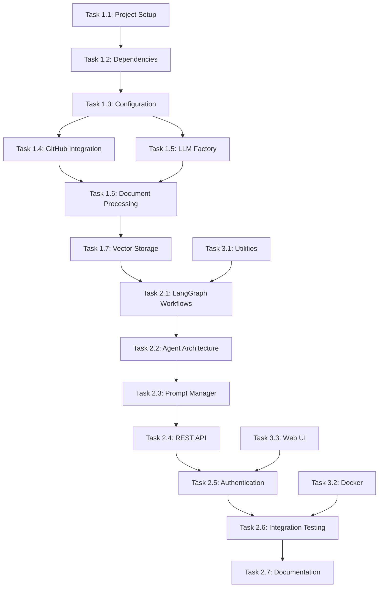

# Knowledge Graph Agent MVP - TODO List

**Project:** Knowledge Graph Agent MVP  
**Timeline:** 2 Weeks (July 19 - August 2, 2025)  
**Document Created:** July 24, 2025  
**Status:** Planning Phase

## Task Status Legend
- ⭕ **Not Started** - Task not yet begun
- 🔄 **In Progress** - Task currently being worked on
- ✅ **Completed** - Task finished and tested
- ⚠️ **Blocked** - Task waiting for dependencies or external factors
- 🔍 **Review** - Task completed but needs review/testing

---

## Week 1: Core Infrastructure & Document Processing

### **Day 1-2: Project Foundation & Configuration**

#### Task 1.1: MVP Project Setup (4 hours) ⭕
- [ ] Create MVP-aligned project directory structure with tests/
- [ ] Initialize Python project with core dependencies for MVP features
- [ ] Set up version control with .gitignore for Python/Docker
- [ ] Configure development environment with Docker support
- [ ] Create initial project structure as per implementation plan
- [ ] Verify directory structure matches the defined architecture

**Deliverables:**
- Complete project directory structure
- Initialized Git repository with proper .gitignore
- Basic Docker configuration files

#### Task 1.2: Dependency Management & Environment (6 hours) ⭕
- [ ] Create `requirements.txt` with MVP-focused dependencies:
  - [ ] fastapi[all] (REST API with authentication middleware)
  - [ ] langchain + langgraph (LangChain framework with workflows)
  - [ ] chromadb + pinecone-client (vector storage with runtime switching)
  - [ ] openai (OpenAI integration for RAG)
  - [ ] python-dotenv + pydantic (environment-based configuration)
  - [ ] uvicorn[standard] + httpx + python-multipart
- [ ] Create `requirements-dev.txt` with testing dependencies
- [ ] Create comprehensive `.env.example` with all MVP configuration variables
- [ ] Test dependency installation and compatibility
- [ ] Document version constraints and compatibility requirements

**Deliverables:**
- requirements.txt with all production dependencies
- requirements-dev.txt with development/testing dependencies
- .env.example with comprehensive configuration template

#### Task 1.3: Environment-Based Configuration (8 hours) ⭕
- [ ] Implement `src/config/settings.py` with comprehensive Pydantic validation
- [ ] Support for OpenAI, Chroma, Pinecone, and GitHub credentials
- [ ] AppSettings.json parser for multiple repository configuration
- [ ] Add DATABASE_TYPE runtime switcher for vector stores
- [ ] Configuration validation with detailed error messages
- [ ] Structured logging configuration with health monitoring support
- [ ] Unit tests for configuration loading and validation
- [ ] Error handling for missing or invalid configuration

**Deliverables:**
- src/config/settings.py with Pydantic models
- AppSettings.json configuration parser
- Configuration validation with comprehensive error messages
- Unit tests for configuration module

### **Day 3-4: GitHub Integration & Language-Aware Processing**

#### Task 1.4: GitHub Integration for Multiple Repositories (10 hours) ⭕
- [ ] Implement `src/loaders/github_loader.py` with GitHub API integration
- [ ] Support multiple repositories from appSettings.json configuration
- [ ] Private repository access with GitHub token authentication
- [ ] Configurable file extensions from environment settings
- [ ] Metadata extraction (file_path, repository info, commit info, language detection)
- [ ] Error handling for API rate limits and network issues
- [ ] Batch processing for efficient repository indexing
- [ ] Progress tracking and logging for repository loading
- [ ] Unit tests for GitHub loader functionality
- [ ] Integration tests with actual GitHub repositories

**Deliverables:**
- src/loaders/github_loader.py with full GitHub API integration
- Support for multiple repositories from configuration
- Comprehensive error handling and rate limiting
- Unit and integration tests

#### Task 1.5: LLM and Embedding Factory Patterns (8 hours) ⭕
- [ ] Create `src/llm/llm_factory.py` for LLM provider abstraction
- [ ] Create `src/llm/embedding_factory.py` for embedding provider abstraction
- [ ] Implement `src/llm/openai_provider.py` for OpenAI-specific integration
- [ ] Support for multiple OpenAI model configurations via environment
- [ ] Error handling and retry logic for API failures
- [ ] Token usage tracking and monitoring for cost optimization
- [ ] Unit tests for factory patterns and provider implementations
- [ ] Mock testing for API interactions

**Deliverables:**
- src/llm/llm_factory.py with provider abstraction
- src/llm/embedding_factory.py with embedding abstraction
- src/llm/openai_provider.py with OpenAI integration
- Comprehensive error handling and retry mechanisms
- Unit tests with mocking for API calls

### **Day 5: Language-Aware Document Processing & Vector Storage**

#### Task 1.6: Language-Aware Document Processing with Metadata (10 hours) ⭕
- [ ] Create `src/processors/document_processor.py` with metadata enrichment
- [ ] Implement `src/processors/chunking_strategy.py` with language-aware strategies:
  - [ ] .NET (C#): Class and method-based chunking with symbol extraction
  - [ ] React (JS/TS): Function and component-based chunking with JSX support
  - [ ] Generic: Recursive character splitter for other languages
- [ ] Create `src/processors/metadata_extractor.py` for code symbol extraction
- [ ] Extract and preserve metadata per chunk:
  - [ ] `file_path`, `chunk_type`, `language`, `line_start`, `line_end`
  - [ ] `class_name`, `function_name`, `component_name`, `tokens`, `repository`
- [ ] Unit tests for language-aware chunking logic
- [ ] Integration tests with sample code files
- [ ] Performance testing for large file processing

**Deliverables:**
- src/processors/document_processor.py with metadata enrichment
- src/processors/chunking_strategy.py with language-specific strategies
- src/processors/metadata_extractor.py for code symbol extraction
- Comprehensive metadata schema implementation
- Unit tests for all processing components

#### Task 1.7: Vector Storage with Runtime Switching (8 hours) ⭕
- [ ] Implement `src/vectorstores/base_store.py` for vector store abstraction
- [ ] Implement `src/vectorstores/chroma_store.py` for Chroma integration
- [ ] Implement `src/vectorstores/pinecone_store.py` for Pinecone integration
- [ ] Create `src/vectorstores/store_factory.py` for runtime DATABASE_TYPE switching
- [ ] Document embedding using factory pattern with metadata preservation
- [ ] Batch upsert functionality with error recovery
- [ ] Connection management and health checks for both vector stores
- [ ] Unit tests for vector store implementations
- [ ] Integration tests for runtime switching

**Deliverables:**
- src/vectorstores/base_store.py with store abstraction
- src/vectorstores/chroma_store.py with Chroma implementation
- src/vectorstores/pinecone_store.py with Pinecone implementation
- src/vectorstores/store_factory.py for runtime switching
- Comprehensive error handling and health checks
- Unit and integration tests

---

## Week 2: LangGraph Workflows & REST API with Authentication

### **Day 6-7: LangGraph Stateful Workflows & Base Agent Architecture**

#### Task 2.1: LangGraph Stateful Workflows (10 hours) ⭕
- [ ] Create `src/workflows/indexing_workflow.py` for stateful indexing workflow
- [ ] Create `src/workflows/query_workflow.py` for stateful query workflow  
- [ ] Implement state management for workflow execution with persistence
- [ ] Error handling and retry logic within LangGraph workflows
- [ ] Progress tracking and structured logging for long-running indexing
- [ ] Workflow metadata tracking (ID, status, executed steps, duration)
- [ ] Integration with vector store factory for runtime switching
- [ ] Debug mode support: expose workflow state and chunk metadata
- [ ] Unit tests for workflow logic
- [ ] Integration tests for end-to-end workflow execution

**Deliverables:**
- src/workflows/indexing_workflow.py with stateful indexing
- src/workflows/query_workflow.py with stateful querying
- State management and persistence mechanisms
- Comprehensive error handling and retry logic
- Unit and integration tests

#### Task 2.2: Base Agent Architecture & RAG Implementation (10 hours) ⭕
- [ ] Create `src/agents/base_agent.py` with extensible patterns
- [ ] Implement `src/agents/rag_agent.py` with RAG query processing
- [ ] Integration with LangGraph workflows for stateful processing
- [ ] OpenAI integration via LLM factory for response generation
- [ ] Context retrieval with configurable top-k results and metadata filtering
- [ ] Response formatting with source attribution and chunk metadata
- [ ] Support for repository filtering and language-specific queries
- [ ] Unit tests for agent implementations
- [ ] Integration tests for RAG functionality

**Deliverables:**
- src/agents/base_agent.py with extensible architecture
- src/agents/rag_agent.py with RAG implementation
- Integration with LangGraph workflows
- Context retrieval and response formatting
- Unit and integration tests

#### Task 2.3: Prompt Manager for Context Injection (6 hours) ⭕
- [ ] Implement `src/utils/prompt_manager.py` with context injection
- [ ] Design system prompt templates optimized for code queries
- [ ] Dynamic prompt composition based on query type and retrieved context
- [ ] Context injection for retrieved documents with metadata preservation
- [ ] Response formatting templates with source citation
- [ ] Handle edge cases (no results, insufficient context, token limits)
- [ ] Unit tests for prompt generation and formatting
- [ ] Integration tests with various query types

**Deliverables:**
- src/utils/prompt_manager.py with context injection
- System prompt templates for code queries
- Dynamic prompt composition logic
- Edge case handling
- Unit and integration tests

### **Day 8-9: REST API with Authentication Middleware**

#### Task 2.4: REST API Implementation (12 hours) ⭕
- [ ] Create `src/api/main.py` with FastAPI application
- [ ] Implement `src/api/routes.py` with comprehensive MVP endpoints:
  - [ ] `POST /index` - Index all repositories from appSettings.json
  - [ ] `POST /index/repository` - Index specific repository
  - [ ] `POST /query` - RAG query processing with OpenAI integration
  - [ ] `GET /repositories` - List indexed repositories with metadata
  - [ ] `GET /health` - Health check with service status and monitoring
  - [ ] `GET /stats` - Index statistics and repository metrics
- [ ] Implement `src/api/models.py` with Pydantic request/response models
- [ ] Error handling and structured response formatting
- [ ] Request validation and input sanitization
- [ ] API documentation with OpenAPI/Swagger
- [ ] Unit tests for API endpoints
- [ ] Integration tests for API functionality

**Deliverables:**
- src/api/main.py with FastAPI application
- src/api/routes.py with all MVP endpoints
- src/api/models.py with Pydantic models
- Comprehensive error handling and validation
- API documentation
- Unit and integration tests

#### Task 2.5: Authentication Middleware & Health Monitoring (8 hours) ⭕
- [ ] Implement `src/api/middleware.py` with API key authentication
- [ ] Authentication middleware for securing all endpoints
- [ ] Request logging and response time tracking with structured logging
- [ ] Rate limiting and request validation middleware
- [ ] CORS configuration for future web interface integration
- [ ] Health monitoring endpoints with vector store and LLM status
- [ ] Error response standardization and logging integration
- [ ] Unit tests for middleware functionality
- [ ] Integration tests for authentication flow

**Deliverables:**
- src/api/middleware.py with authentication middleware
- Request logging and monitoring
- Rate limiting and CORS configuration
- Health monitoring implementation
- Unit and integration tests

### **Day 10: Integration Testing & Documentation**

#### Task 2.6: Comprehensive Integration Testing (8 hours) ⭕
- [ ] End-to-end workflow testing with multiple repositories from appSettings.json
- [ ] Vector store runtime switching validation (Chroma ↔ Pinecone)
- [ ] LangGraph stateful workflow execution and state persistence testing
- [ ] Language-aware chunking validation for .NET and React files
- [ ] Metadata integrity testing: verify correct code symbol extraction
- [ ] Authentication middleware testing with API key validation
- [ ] RAG query accuracy verification with various query types
- [ ] Performance testing with concurrent requests and repository indexing
- [ ] Error scenario testing (network failures, API limits, invalid inputs)
- [ ] Load testing with multiple concurrent users

**Deliverables:**
- Comprehensive integration test suite
- Performance benchmarks and validation
- Error scenario test coverage
- Load testing results and analysis

#### Task 2.7: Documentation & Deployment Configuration (8 hours) ⭕
- [ ] Create comprehensive `README.md` with MVP quick start guide
- [ ] API documentation with detailed request/response examples
- [ ] Environment configuration guide with all MVP variables
- [ ] AppSettings.json configuration examples for multiple repositories
- [ ] Docker setup with both development and production configurations
- [ ] Basic troubleshooting guide with common issues and solutions
- [ ] Deployment instructions for different environments with health checks
- [ ] Code documentation and inline comments
- [ ] Architecture documentation with diagrams

**Deliverables:**
- Comprehensive README.md with quick start guide
- Complete API documentation
- Environment and deployment configuration guides
- Docker configurations for dev and production
- Troubleshooting and deployment guides

---

## Additional Tasks and Utilities

### Task 3.1: Utility Components (4 hours) ⭕
- [ ] Implement `src/utils/logging.py` with structured logging
- [ ] Implement `src/utils/helpers.py` with utility functions
- [ ] Create application entry point `main.py`
- [ ] Set up logging configuration and formatters
- [ ] Implement health check utilities
- [ ] Unit tests for utility components

**Deliverables:**
- src/utils/logging.py with structured logging
- src/utils/helpers.py with utility functions
- main.py application entry point
- Unit tests for utilities

### Task 3.2: Docker and Deployment Configuration (4 hours) ⭕
- [ ] Create `Dockerfile` for containerization
- [ ] Create `docker-compose.yml` for development environment
- [ ] Create `docker-compose.prod.yml` for production environment
- [ ] Configure environment variables and secrets management
- [ ] Test Docker builds and container execution
- [ ] Create deployment scripts and health checks

**Deliverables:**
- Dockerfile with optimized build configuration
- docker-compose.yml for development
- docker-compose.prod.yml for production
- Deployment and health check scripts

### Task 3.3: Web UI Chatbot Interface (6 hours) ⭕
- [ ] Create `web/index.html` with chatbot interface
- [ ] Implement JavaScript for API communication
- [ ] Design responsive UI for code queries
- [ ] Add syntax highlighting for code responses
- [ ] Implement chat history and session management
- [ ] Test UI functionality with API endpoints

**Deliverables:**
- web/index.html with complete chatbot interface
- JavaScript for API integration
- Responsive design with code highlighting
- Session management functionality

---

## Success Criteria Validation

### Functional Requirements Testing ⭕
- [ ] Successfully index multiple GitHub repositories from appSettings.json
- [ ] Process and embed documents in both Chroma and Pinecone with runtime switching
- [ ] LangGraph workflow execution for indexing and query processing
- [ ] Return relevant results for code-related queries with proper source attribution
- [ ] API responds within 10 seconds for typical queries
- [ ] Authentication layer protecting all endpoints
- [ ] Handle error scenarios gracefully with structured responses

### Quality Gates Validation ⭕
- [ ] End-to-end workflow works with multiple repositories from appSettings.json
- [ ] Vector store switching (Chroma ↔ Pinecone) works seamlessly
- [ ] LangGraph workflows execute successfully with state management
- [ ] API returns structured responses with comprehensive source attribution
- [ ] Authentication middleware properly secures endpoints
- [ ] System handles at least 20 concurrent requests
- [ ] Comprehensive logging implemented for debugging and monitoring
- [ ] Docker deployment works in both development and production environments

### Performance Targets Validation ⭕
- [ ] Query Response Time: < 10 seconds (95th percentile)
- [ ] Indexing Speed: 100+ files per minute per repository
- [ ] API Availability: > 95% uptime during testing
- [ ] Relevance Quality: > 70% of queries return useful results
- [ ] Vector Store Switching: < 2 seconds failover time
- [ ] Authentication Overhead: < 100ms per request

---

## Task Dependencies

## Notes and Considerations

### Development Best Practices
- Follow Python PEP 8 coding standards
- Implement comprehensive error handling and logging
- Write unit tests for all core components
- Use type hints and proper documentation
- Follow the factory pattern for extensibility
- Implement proper separation of concerns

### Testing Strategy
- Unit tests for individual components
- Integration tests for component interactions
- End-to-end tests for complete workflows
- Performance tests for scalability validation
- Error scenario tests for robustness

### Risk Mitigation
- Start with simple implementations and iterate
- Test early and often, especially integrations
- Maintain clear documentation throughout development
- Use proven patterns and libraries
- Implement comprehensive logging for debugging

---

**Total Estimated Hours:** 118 hours  
**Timeline:** 10 working days (2 weeks)  
**Average Hours per Day:** ~12 hours

This todo list provides a comprehensive breakdown of all tasks needed to complete the Knowledge Graph Agent MVP according to the implementation plan. Each task includes specific deliverables and can be tracked independently while maintaining proper dependencies.
