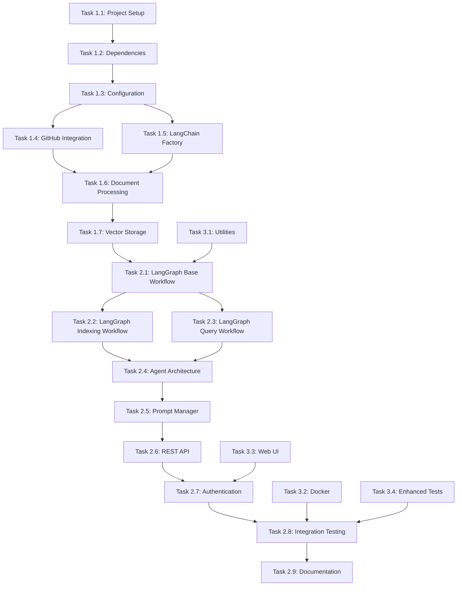

# Knowledge Graph Agent MVP - TODO List

**Project:** Knowledge Graph Agent MVP  
**Timeline:** 2 Weeks (July 19 - August 2, 2025)  
**Document Created:** July 24, 2025  
**Status:** Planning Phase

## Task Status Legend
- ⭕ **Not Started** - Task not yet begun
- 🔄 **In Progress** - Task currently being worked on
- ✅ **Completed** - Task finished and tested
- ⚠️ **Blocked** - Task waiting for dependencies or external factors
- 🔍 **Review** - Task completed but needs review/testing

---

## Week 1: Core Infrastructure & Document Processing

### **Day 1-2: Project Foundation & Configuration**

#### Task 1.1: MVP Project Setup (4 hours) ✅
- [x] Create MVP-aligned project directory structure with tests/
- [x] Initialize Python project with core dependencies for MVP features
- [x] Set up version control with .gitignore for Python/Docker
- [x] Configure development environment with Docker support
- [x] Create initial project structure as per implementation plan
- [x] Verify directory structure matches the defined architecture

**Deliverables:**
- Complete project directory structure
- Initialized Git repository with proper .gitignore
- Basic Docker configuration files

#### Task 1.2: Dependency Management & Environment (6 hours) ✅
- [x] Create `requirements.txt` with MVP-focused dependencies:
  - [x] fastapi[all] (REST API with authentication middleware)
  - [x] langchain + langgraph (LangChain framework components with LangGraph stateful workflows)
  - [x] langchain-community (additional LangChain integrations for GitHub, Chroma, Pinecone)
  - [x] langchain-openai (LangChain OpenAI wrappers for LLM and embeddings)
  - [x] chromadb + pinecone-client (vector storage backends)
  - [x] openai (direct OpenAI API integration)
  - [x] python-dotenv + pydantic (environment-based configuration)
  - [x] uvicorn[standard] + httpx + python-multipart (web server and HTTP client)
- [x] Create `requirements-dev.txt` with testing dependencies:
  - [x] pytest + pytest-asyncio (testing framework with async support)
  - [x] pytest-mock (mocking for LangChain components)
  - [x] httpx (testing HTTP endpoints)
- [x] Create comprehensive `.env.example` with all MVP configuration variables including LangGraph workflow settings
- [x] Test dependency installation and compatibility
- [x] Document version constraints and compatibility requirements

**Deliverables:**
- requirements.txt with all production dependencies
- requirements-dev.txt with development/testing dependencies
- .env.example with comprehensive configuration template

#### Task 1.3: Environment-Based Configuration (8 hours) ✅
- [x] Implement `src/config/settings.py` with comprehensive Pydantic validation
- [x] Support for OpenAI, Chroma, Pinecone, and GitHub credentials
- [x] AppSettings.json parser for multiple repository configuration
- [x] Add DATABASE_TYPE runtime switcher for vector stores
- [x] Configuration validation with detailed error messages
- [x] Structured logging configuration with health monitoring support
- [x] Unit tests for configuration loading and validation
- [x] Error handling for missing or invalid configuration

**Deliverables:**
- src/config/settings.py with Pydantic models
- AppSettings.json configuration parser
- Configuration validation with comprehensive error messages
- Unit tests for configuration module

### **Day 3-4: GitHub Integration & Language-Aware Processing**

#### Task 1.4: GitHub Integration with LangChain Loaders (12 hours) ✅
- [x] Implement `src/loaders/github_loader.py` inheriting from LangChain BaseLoader interface
- [x] GitHub API integration for multiple repositories from appSettings.json configuration
- [x] Private repository access with GitHub token authentication
- [x] LangChain Document creation with proper metadata structure
- [x] Configurable file extensions from environment settings
- [x] Metadata extraction (file_path, repository info, commit info, language detection) compatible with LangChain schema
- [x] Error handling for API rate limits and network issues with retry mechanisms
- [x] Batch processing for efficient repository indexing integrated with LangGraph workflow state
- [x] Progress tracking and logging for repository loading
- [x] Unit tests for GitHub loader functionality with LangChain Document validation
- [x] Integration tests with actual GitHub repositories

**Deliverables:**
- src/loaders/github_loader.py with full GitHub API integration
- Support for multiple repositories from configuration
- Comprehensive error handling and rate limiting
- Unit and integration tests

#### Task 1.5: LangChain Factory Patterns for LLM and Embeddings (10 hours) ✅
- [x] Create `src/llm/llm_factory.py` implementing LangChain LLM interface abstraction
- [x] Create `src/llm/embedding_factory.py` implementing LangChain Embeddings interface abstraction
- [x] Implement `src/llm/openai_provider.py` using langchain-openai wrappers (ChatOpenAI, OpenAIEmbeddings)
- [x] Support for multiple OpenAI model configurations via environment variables
- [x] Error handling and retry logic for API failures with LangChain callback support
- [x] Token usage tracking and monitoring for cost optimization
- [x] Integration with LangGraph workflow context for state tracking
- [x] Unit tests for factory patterns and provider implementations with LangChain interface compliance
- [x] Mock testing for API interactions

**Deliverables:**
- src/llm/llm_factory.py with provider abstraction
- src/llm/embedding_factory.py with embedding abstraction
- src/llm/openai_provider.py with OpenAI integration
- Comprehensive error handling and retry mechanisms
- Unit tests with mocking for API calls

### **Day 5: Language-Aware Document Processing & Vector Storage**

#### Task 1.6: Language-Aware Document Processing with LangChain Integration (12 hours) ✅
- [x] Create `src/processors/document_processor.py` using LangChain RecursiveCharacterTextSplitter and custom splitters
- [x] Implement `src/processors/chunking_strategy.py` with language-aware strategies:
  - [x] .NET (C#): Class and method-based chunking with AST parsing and LangChain Document metadata
  - [x] React (JS/TS): Function and component-based chunking with JSX support and LangChain schema
  - [x] Generic: LangChain RecursiveCharacterTextSplitter for other languages
- [x] Create `src/processors/metadata_extractor.py` for code symbol extraction compatible with LangChain Document metadata
- [x] Extract and preserve metadata per chunk as LangChain Document metadata:
  - [x] `file_path`, `chunk_type`, `language`, `line_start`, `line_end`
  - [x] `class_name`, `function_name`, `component_name`, `tokens`, `repository`
- [x] Unit tests for language-aware chunking logic with LangChain Document validation
- [x] Integration with LangGraph workflow state for progress tracking
- [x] Performance testing for large file processing

**Deliverables:**
- src/processors/document_processor.py with metadata enrichment
- src/processors/chunking_strategy.py with language-specific strategies
- src/processors/metadata_extractor.py for code symbol extraction
- Comprehensive metadata schema implementation
- Unit tests for all processing components

#### Task 1.7: LangChain Vector Storage with Runtime Switching (10 hours) ✅
- [x] Implement `src/vectorstores/base_store.py` extending LangChain VectorStore interface
- [x] Implement `src/vectorstores/chroma_store.py` using langchain-community Chroma wrapper
- [x] Implement `src/vectorstores/pinecone_store.py` using langchain-community Pinecone wrapper
- [x] Create `src/vectorstores/store_factory.py` for runtime DATABASE_TYPE switching with LangChain interface
- [x] Document embedding using LangChain Embeddings interface with metadata preservation
- [x] Batch upsert functionality with error recovery and LangGraph workflow integration
- [x] Connection management and health checks for both vector stores with LangChain callbacks
- [x] Integration with LangGraph indexing workflow for state persistence
- [x] Unit tests for vector store implementations with LangChain interface compliance
- [x] Integration tests for runtime switching

**Deliverables:**
- src/vectorstores/base_store.py with store abstraction
- src/vectorstores/chroma_store.py with Chroma implementation
- src/vectorstores/pinecone_store.py with Pinecone implementation
- src/vectorstores/store_factory.py for runtime switching
- Comprehensive error handling and health checks
- Unit and integration tests

---

## Week 2: LangGraph Workflows & REST API with Authentication

### **Day 6-7: LangGraph Stateful Workflows & Base Agent Architecture**

#### Task 2.1: LangGraph Base Workflow Infrastructure (12 hours) ✅
- [x] Create `src/workflows/base_workflow.py` implementing LangChain Runnable interface for LangGraph integration
- [x] Create `src/workflows/state_manager.py` for workflow state persistence and management
- [x] Implement workflow state schemas using TypedDict for indexing and query workflows:
  ```python
  class IndexingState(TypedDict):
      repositories: List[str]
      current_repo: str
      processed_files: int
      total_files: int
      errors: List[str]
      embeddings_generated: int
      status: str
  ```
- [x] Error handling and retry logic infrastructure with exponential backoff
- [x] Progress tracking and structured logging integration
- [x] Workflow metadata tracking (ID, status, executed steps, duration)
- [x] Integration with vector store factory for runtime switching context
- [x] Unit tests for workflow logic
- [x] Integration tests for end-to-end workflow execution

**Deliverables:**
- src/workflows/base_workflow.py with LangChain Runnable interface ✅
- src/workflows/state_manager.py with state persistence ✅
- src/workflows/workflow_states.py with TypedDict schemas ✅
- State management and persistence mechanisms ✅
- Comprehensive error handling and retry logic ✅
- Unit and integration tests ✅

#### Task 2.2: LangGraph Indexing Workflow Implementation (14 hours) ⭕
- [ ] Create `src/workflows/indexing_workflow.py` with complete stateful indexing workflow
- [ ] Implement all workflow states from the detailed flow:
  - [ ] **Initialize State** → **Load Repositories** → **Validate Repos**
  - [ ] **Load Files from GitHub** → **Process Documents** → **Language-Aware Chunking**
  - [ ] **Extract Metadata** → **Generate Embeddings** → **Store in Vector DB**
  - [ ] **Update Workflow State** → **Check Complete** → **Finalize Index**
- [ ] Implement error handling states:
  - [ ] **Handle File Errors**, **Handle Processing Errors**, **Handle Embedding Errors**, **Handle Storage Errors**
- [ ] State persistence with workflow database integration  
- [ ] Automatic retry mechanisms with exponential backoff for each error state
- [ ] Progress tracking with detailed status updates for long-running operations
- [ ] Parallel repository processing capabilities with state synchronization
- [ ] Integration with LangChain components (loaders, splitters, embeddings, vector stores)
- [ ] Unit tests for indexing workflow logic
- [ ] Integration tests for complete indexing workflow execution

**Deliverables:**
- src/workflows/indexing_workflow.py with stateful indexing
- Complete workflow state implementation with error recovery
- Parallel processing capabilities
- LangChain component integration
- Unit and integration tests

#### Task 2.3: LangGraph Query Workflow Implementation (12 hours) ⭕
- [ ] Create `src/workflows/query_workflow.py` with adaptive RAG query processing workflow
- [ ] Implement all workflow states from the detailed flow:
  - [ ] **Parse Query** → **Validate Query** → **Analyze Query Intent**
  - [ ] **Determine Search Strategy** → **Vector Search** → **Filter & Rank Results**
  - [ ] **Check Sufficient Context** → **Expand Search Parameters** (if needed)
  - [ ] **Prepare LLM Context** → **Generate Contextual Prompt** → **Call LLM**
  - [ ] **Format Response** → **Response Quality Check** → **Return Success**
- [ ] Implement error handling and fallback states:
  - [ ] **Handle Retrieval Errors** → **Fallback Search Strategy**
  - [ ] **Handle LLM Errors** → **Retry LLM Call**
  - [ ] **Response Quality Control** → **Retry with Different Context**
- [ ] Query state tracking with context preservation throughout processing
- [ ] Adaptive search strategy adjustment based on initial results
- [ ] Response quality validation and automatic retry mechanisms
- [ ] Integration with LangChain RAG chain and retriever components
- [ ] Unit tests for query workflow logic
- [ ] Integration tests for complete query workflow execution

**Deliverables:**
- src/workflows/query_workflow.py with adaptive RAG processing
- Complete workflow state implementation with quality control
- Adaptive search and response quality mechanisms
- LangChain component integration
- Unit and integration tests

### **Day 8-9: Base Agent Architecture & LangChain Integration**

#### Task 2.4: Base Agent Architecture with LangChain Runnable (10 hours) ⭕
- [ ] Create `src/agents/base_agent.py` implementing LangChain Runnable interface for workflow integration
- [ ] Implement `src/agents/rag_agent.py` using LangChain RetrievalQA and related components
- [ ] Integration with LangGraph query workflow for stateful processing
- [ ] LangChain OpenAI integration via factory pattern for response generation
- [ ] Context retrieval using LangChain retriever with configurable top-k results and metadata filtering
- [ ] Response formatting with source attribution and chunk metadata preservation
- [ ] Support for repository filtering and language-specific queries
- [ ] Integration with LangChain prompt templates for dynamic query composition
- [ ] Unit tests for agent implementations
- [ ] Integration tests for RAG functionality

**Deliverables:**
- src/agents/base_agent.py with LangChain Runnable interface
- src/agents/rag_agent.py with LangChain RetrievalQA integration
- Integration with LangGraph workflows
- Context retrieval and response formatting
- Unit and integration tests

#### Task 2.5: LangChain Prompt Manager Integration (8 hours) ⭕
- [ ] Implement `src/utils/prompt_manager.py` using LangChain PromptTemplate components
- [ ] Design system prompt templates optimized for code queries with LangChain template syntax
- [ ] Dynamic prompt composition based on query type and retrieved context using LangChain template variables
- [ ] Context injection for retrieved LangChain documents with metadata preservation
- [ ] Response formatting templates with source citation using LangChain output parsers
- [ ] Handle edge cases (no results, insufficient context, token limits) with LangChain fallback strategies
- [ ] Integration with LangGraph query workflow for contextual prompt generation
- [ ] Unit tests for prompt generation and formatting
- [ ] Integration tests with various query types

**Deliverables:**
- src/utils/prompt_manager.py with LangChain PromptTemplate integration
- System prompt templates for code queries
- Dynamic prompt composition logic
- Edge case handling with LangChain fallback strategies
- Unit and integration tests

### **Day 10: REST API with Authentication Middleware**

#### Task 2.6: REST API Implementation with LangGraph Integration (12 hours) ⭕
- [ ] Create `src/api/main.py` with FastAPI application and LangGraph workflow integration
- [ ] Implement `src/api/routes.py` with comprehensive MVP endpoints:
  - [ ] `POST /index` - Trigger LangGraph indexing workflow for all repositories from appSettings.json
  - [ ] `POST /index/repository` - Trigger LangGraph indexing workflow for specific repository
  - [ ] `POST /query` - Execute LangGraph query workflow with adaptive RAG processing
  - [ ] `GET /repositories` - List indexed repositories with metadata from workflow state
  - [ ] `GET /health` - Health check with LangGraph workflow status and LangChain component health
  - [ ] `GET /stats` - Index statistics and repository metrics from workflow persistence
  - [ ] `GET /workflows/{workflow_id}/status` - Get LangGraph workflow execution status and progress
- [ ] Implement `src/api/models.py` with Pydantic request/response models for workflow integration
- [ ] Error handling and structured response formatting with workflow state information
- [ ] Request validation and input sanitization with LangChain document schema validation
- [ ] API documentation with OpenAPI/Swagger
- [ ] Unit tests for API endpoints
- [ ] Integration tests for API functionality

**Deliverables:**
- src/api/main.py with FastAPI application and LangGraph integration
- src/api/routes.py with all MVP endpoints including workflow status
- src/api/models.py with Pydantic models for workflow integration
- Comprehensive error handling and validation
- API documentation
- Unit and integration tests

#### Task 2.7: Authentication Middleware & Workflow Monitoring (10 hours) ⭕
- [ ] Implement `src/api/middleware.py` with API key authentication and workflow request tracking
- [ ] Authentication middleware for securing all endpoints including workflow status endpoints
- [ ] Request logging and response time tracking with LangGraph workflow execution metrics
- [ ] Rate limiting and request validation middleware with workflow queue management
- [ ] CORS configuration for future web interface integration
- [ ] Health monitoring endpoints with LangGraph workflow status and LangChain component connectivity
- [ ] Error response standardization and logging integration with workflow state persistence
- [ ] LangGraph workflow progress tracking endpoints with real-time status updates
- [ ] Unit tests for middleware functionality
- [ ] Integration tests for authentication flow

**Deliverables:**
- src/api/middleware.py with authentication middleware and workflow tracking
- Request logging and monitoring with workflow metrics
- Rate limiting and CORS configuration
- Health monitoring implementation with LangGraph workflow status
- Unit and integration tests

### **Day 11: Integration Testing & Documentation**

#### Task 2.8: Comprehensive LangGraph & LangChain Integration Testing (10 hours) ⭕
- [ ] End-to-end LangGraph workflow testing with multiple repositories from appSettings.json
- [ ] LangGraph indexing workflow state persistence and resume functionality testing
- [ ] LangGraph query workflow adaptive search and quality control validation
- [ ] Vector store runtime switching validation (Chroma ↔ Pinecone) with LangChain interface consistency
- [ ] LangChain component integration testing across the entire pipeline
- [ ] Language-aware chunking validation for .NET and React files with LangChain Document schema
- [ ] Metadata integrity testing: verify correct code symbol extraction in LangChain Document metadata
- [ ] Authentication middleware testing with API key validation and workflow access control
- [ ] RAG query accuracy verification with various query types using LangChain RetrievalQA
- [ ] Performance testing with concurrent requests and parallel repository indexing workflows
- [ ] LangGraph workflow error recovery and retry mechanism testing
- [ ] LangChain callback and logging integration validation
- [ ] Load testing with multiple concurrent users

**Deliverables:**
- Comprehensive integration test suite with LangGraph workflow validation
- Performance benchmarks and validation
- Error scenario test coverage with workflow recovery testing
- Load testing results and analysis

#### Task 2.9: Documentation & Deployment Configuration (8 hours) ⭕
- [ ] Create comprehensive `README.md` with MVP quick start guide including LangGraph workflow setup
- [ ] API documentation with detailed request/response examples and workflow status endpoints
- [ ] Environment configuration guide with all MVP variables including LangGraph workflow settings
- [ ] AppSettings.json configuration examples for multiple repositories with workflow considerations
- [ ] Docker setup with both development and production configurations for LangGraph persistence
- [ ] LangGraph workflow monitoring and debugging guide
- [ ] LangChain component integration documentation with troubleshooting
- [ ] Basic troubleshooting guide with common LangGraph workflow issues and LangChain component problems
- [ ] Deployment instructions for different environments with workflow state persistence and health checks
- [ ] Code documentation and inline comments
- [ ] Architecture documentation with diagrams

**Deliverables:**
- Comprehensive README.md with LangGraph workflow quick start
- Complete API documentation with workflow endpoints
- Environment and deployment configuration guides for LangGraph persistence
- Docker configurations for dev and production
- Troubleshooting and deployment guides with workflow-specific guidance

---

## Additional Tasks and Utilities

### Task 3.1: Utility Components (4 hours) ⭕
- [ ] Implement `src/utils/logging.py` with structured logging and workflow state tracking
- [ ] Implement `src/utils/helpers.py` with utility functions
- [ ] Create application entry point `main.py`
- [ ] Set up logging configuration and formatters with LangGraph workflow integration
- [ ] Implement health check utilities for LangChain components
- [ ] Unit tests for utility components

**Deliverables:**
- src/utils/logging.py with structured logging and workflow state tracking
- src/utils/helpers.py with utility functions
- main.py application entry point with LangGraph workflow support
- Unit tests for utilities

### Task 3.2: Docker and Deployment Configuration (4 hours) ⭕
- [ ] Create `Dockerfile` for containerization with LangGraph workflow persistence
- [ ] Create `docker-compose.yml` for development environment with LangChain dependencies
- [ ] Create `docker-compose.prod.yml` for production environment with workflow state persistence
- [ ] Configure environment variables and secrets management for LangGraph workflows
- [ ] Test Docker builds and container execution with LangGraph workflow support
- [ ] Create deployment scripts and health checks for LangChain components

**Deliverables:**
- Dockerfile with optimized build configuration and LangGraph support
- docker-compose.yml for development with LangChain dependencies
- docker-compose.prod.yml for production with workflow state persistence
- Deployment and health check scripts for LangGraph workflows

### Task 3.3: Web UI Chatbot Interface (6 hours) ⭕
- [ ] Create `web/index.html` with chatbot interface for LangGraph workflow interaction
- [ ] Implement JavaScript for API communication with workflow status endpoints
- [ ] Design responsive UI for code queries with workflow progress display
- [ ] Add syntax highlighting for code responses from LangChain components
- [ ] Implement chat history and session management with workflow tracking
- [ ] Test UI functionality with API endpoints including workflow status monitoring

**Deliverables:**
- web/index.html with complete chatbot interface and workflow status display
- JavaScript for API integration with workflow endpoints
- Responsive design with code highlighting and workflow progress
- Session management functionality with workflow tracking

### Task 3.4: Enhanced Test Structure for LangGraph & LangChain (6 hours) ⭕
- [ ] Create `tests/unit/test_workflows.py` for LangGraph workflow unit tests
- [ ] Create `tests/unit/test_langchain.py` for LangChain component unit tests
- [ ] Create `tests/integration/test_workflows.py` for complete LangGraph workflow integration tests
- [ ] Create `tests/integration/test_langchain.py` for LangChain component integration tests
- [ ] Implement workflow state testing utilities and fixtures
- [ ] Add test data and mock repositories for workflow testing
- [ ] Create workflow test scenarios for error recovery and retry mechanisms

**Deliverables:**
- Complete test structure for LangGraph workflows and LangChain components
- Test utilities and fixtures for workflow state testing
- Mock repositories and test data for integration testing
- Workflow-specific test scenarios and error recovery validation

---

## Success Criteria Validation

### Functional Requirements Testing ⭕
- [ ] Successfully index multiple GitHub repositories from appSettings.json using LangGraph indexing workflows
- [ ] Process and embed documents in both Chroma and Pinecone with runtime switching via LangChain VectorStore interface
- [ ] LangGraph workflow execution for stateful indexing and adaptive query processing with persistent state management
- [ ] Return relevant results for code-related queries with proper source attribution using LangChain RetrievalQA components
- [ ] API responds within 10 seconds for typical queries processed through LangGraph query workflow
- [ ] Authentication layer protecting all endpoints including workflow status monitoring
- [ ] Handle error scenarios gracefully with LangGraph error recovery and retry mechanisms
- [ ] LangGraph workflow state persistence and resumption capabilities
- [ ] LangChain component integration across the entire pipeline (loaders, splitters, embeddings, vector stores, LLMs)

### Quality Gates Validation ⭕
- [ ] End-to-end LangGraph workflow execution with multiple repositories from appSettings.json
- [ ] Vector store switching (Chroma ↔ Pinecone) works seamlessly via LangChain interface consistency
- [ ] LangGraph indexing workflow executes successfully with state management, error handling, and progress tracking
- [ ] LangGraph query workflow executes successfully with adaptive search, quality control, and fallback mechanisms
- [ ] API returns structured responses with comprehensive source attribution including workflow execution metadata
- [ ] Authentication middleware properly secures endpoints including workflow status endpoints
- [ ] System handles at least 20 concurrent requests with parallel LangGraph workflow execution
- [ ] Comprehensive logging implemented for debugging and monitoring including LangGraph workflow state tracking
- [ ] Docker deployment works in both development and production environments with workflow state persistence
- [ ] LangChain component health checks and integration validation across all interfaces

### Performance Targets Validation ⭕
- [ ] Query Response Time: < 10 seconds (95th percentile) including LangGraph query workflow execution
- [ ] Indexing Speed: 100+ files per minute per repository through LangGraph indexing workflow
- [ ] API Availability: > 95% uptime during testing including workflow orchestration
- [ ] Relevance Quality: > 70% of queries return useful results via LangChain RetrievalQA components
- [ ] Vector Store Switching: < 2 seconds failover time with LangChain interface consistency
- [ ] Authentication Overhead: < 100ms per request including workflow access control
- [ ] Workflow State Persistence: < 500ms state save/restore operations
- [ ] LangGraph Workflow Recovery: < 30 seconds from failure to retry attempt

## Environment Configuration (.env.example)

Add the following comprehensive environment configuration based on the implementation plan:

```bash
# LLM Configuration
LLM_PROVIDER=openai
LLM_MODEL=gpt-4o-mini
LLM_API_BASE_URL=https://api.openai.com/v1 #Just use for ollama only

# LLM Models Configuration
OPENAI_API_KEY=your_openai_api_key

# Embedding Configuration
EMBEDDING_PROVIDER=openai
EMBEDDING_MODEL=text-embedding-ada-002
EMBEDDING_BATCH_SIZE=50
MAX_TOKENS_PER_BATCH=250000

# Vector Database Configuration
DATABASE_TYPE=chroma #This configuration to allow switch vector store between chroma and pinecone
CHROMA_HOST=localhost
CHROMA_PORT=8000
CHROMA_COLLECTION_NAME=knowledge-base-graph

PINECONE_API_KEY=pinecone-api-key
PINECONE_COLLECTION_NAME=knowledge-base-graph

# GitHub Configuration
GITHUB_TOKEN=your_github_token
GITHUB_FILE_EXTENSIONS=[".cs",".csproj",".py",".php",".js",".jsx",".ts",".tsx",".html",".cshtml",".md", ".txt",".json",".yml",".yaml",".csv","dockerfile", ".config",".sh",".bash"]

# Application Configuration
APP_ENV=development #production
LOG_LEVEL=INFO #DEBUG
CHUNK_SIZE=1000
CHUNK_OVERLAP=200
MAX_TOKENS=4000
TEMPERATURE=0.7

# LangGraph Workflow Configuration
WORKFLOW_STATE_PERSISTENCE=true
WORKFLOW_RETRY_ATTEMPTS=3
WORKFLOW_RETRY_DELAY_SECONDS=5
WORKFLOW_TIMEOUT_SECONDS=3600
WORKFLOW_PARALLEL_REPOS=2
WORKFLOW_STATE_BACKEND=memory #database for production

# LangChain Configuration  
LANGCHAIN_TRACING=false #true for debugging
LANGCHAIN_API_KEY=your_langsmith_api_key #optional for LangSmith tracing
LANGCHAIN_PROJECT=knowledge-graph-agent #optional project name for LangSmith
```

---

## Metadata Schema for Chunks

Each chunk will include structured metadata for retrieval relevance, traceability, and future enhancements:

```json
{
  "repository": "org/repo",
  "file_path": "src/services/UserService.cs",
  "chunk_type": "method",
  "language": "csharp",
  "class_name": "UserService",
  "function_name": "GetUserById",
  "line_start": 48,
  "line_end": 61,
  "tokens": 210
}
```

Metadata enables:
- Top-k filtering by file type, repository, or symbol
- Future support for incremental re-indexing
- Token usage auditing and embedding optimization

---

## Task Dependencies



## Notes and Considerations

### Development Best Practices
- Follow Python PEP 8 coding standards
- Implement comprehensive error handling and logging
- Write unit tests for all core components
- Use type hints and proper documentation
- Follow the factory pattern for extensibility
- Implement proper separation of concerns

### Testing Strategy
- Unit tests for individual components
- Integration tests for component interactions
- End-to-end tests for complete workflows
- Performance tests for scalability validation
- Error scenario tests for robustness

### Risk Mitigation
- Start with simple implementations and iterate
- Test early and often, especially integrations
- Maintain clear documentation throughout development
- Use proven patterns and libraries
- Implement comprehensive logging for debugging

---

**Total Estimated Hours:** 140 hours  
**Timeline:** 11 working days (2+ weeks)  
**Average Hours per Day:** ~12.7 hours

This comprehensive todo list provides a detailed breakdown of all tasks needed to complete the Knowledge Graph Agent MVP according to the updated implementation plan. Each task includes specific deliverables focused on LangGraph workflows and LangChain component integration, and can be tracked independently while maintaining proper dependencies. The plan emphasizes stateful workflow processing, comprehensive error handling, and seamless integration between LangChain components orchestrated by LangGraph workflows.
