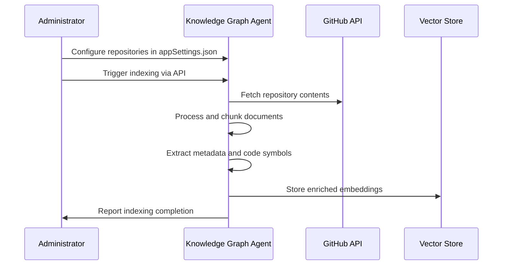
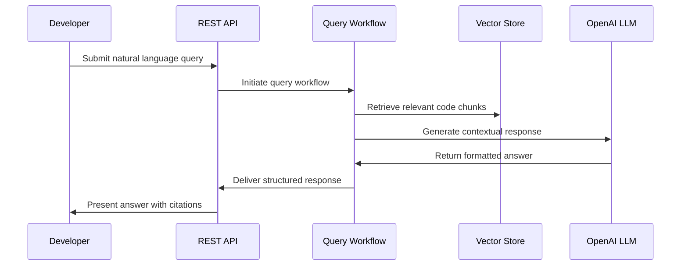

# Product Context - Knowledge Graph Agent

**Document Created:** July 30, 2025  
**Last Updated:** July 30, 2025  

## Why This Project Exists

### Core Problem
Software development teams spend significant time exploring and understanding codebases, especially when:
- Onboarding new developers to complex systems
- Working with unfamiliar repositories or legacy code
- Seeking specific implementation patterns across multiple projects
- Understanding architectural decisions and code relationships
- Finding relevant documentation scattered across repositories

### Pain Points Addressed
1. **Context Switching Overhead**: Developers waste time navigating between multiple tools, documentation sources, and code files
2. **Knowledge Fragmentation**: Technical knowledge is scattered across README files, comments, documentation, and institutional memory
3. **Slow Codebase Discovery**: Manual exploration of large repositories is time-consuming and inefficient
4. **Onboarding Friction**: New team members struggle to understand complex system architecture and implementation details
5. **Lost Tribal Knowledge**: Critical implementation insights exist only in developers' minds and are lost when team members leave

## Problems It Solves

### For Individual Developers
- **Instant Code Understanding**: Ask natural language questions about any part of the codebase
- **Pattern Discovery**: Find implementation examples and architectural patterns across repositories
- **Context Preservation**: Get comprehensive explanations that include relevant code context and relationships
- **Efficient Navigation**: Skip manual file exploration and go directly to relevant information

### For Development Teams
- **Knowledge Democratization**: Make expert-level codebase knowledge accessible to all team members
- **Accelerated Onboarding**: New developers can quickly understand complex systems through conversational queries
- **Cross-Repository Insights**: Discover patterns and dependencies across multiple projects
- **Documentation Enhancement**: Automatically surface relevant code context alongside formal documentation

### For Organizations
- **Reduced Onboarding Time**: Faster integration of new team members
- **Improved Code Discoverability**: Better utilization of existing code and patterns
- **Knowledge Retention**: Preserve architectural insights and implementation decisions
- **Development Velocity**: Faster feature development through better code understanding

## How It Should Work

### User Experience Flow

#### Repository Indexing Process

#### Query Processing Flow

### Core Interactions

#### Natural Language Querying
Users should be able to ask questions like:
- "How does the authentication system work in this repository?"
- "Show me examples of how React components are structured here"
- "What are the main dependencies and how are they used?"
- "How is error handling implemented across the codebase?"
- "What design patterns are used for data processing?"

#### Intelligent Response Generation
The system should provide:
- **Contextual Answers**: Responses that directly address the query with relevant code examples
- **Source Citations**: Clear references to specific files and line numbers
- **Related Information**: Suggestions for follow-up queries or related concepts
- **Code Snippets**: Actual code examples that illustrate the explanation
- **Architectural Context**: How individual components fit into the larger system

### Expected Behaviors

#### Indexing Behavior
- **Comprehensive Processing**: Index all relevant files (code, documentation, configuration)
- **Language Awareness**: Apply appropriate chunking strategies for different programming languages
- **Metadata Enrichment**: Extract and store code symbols, file relationships, and context
- **Error Resilience**: Handle repository access issues, large files, and processing failures gracefully
- **Progress Tracking**: Provide clear feedback on indexing status and completion

#### Query Behavior
- **Intent Understanding**: Interpret user questions accurately regardless of phrasing
- **Context Synthesis**: Combine information from multiple sources to provide comprehensive answers
- **Relevance Ranking**: Prioritize the most relevant information for each query
- **Response Formatting**: Present information in clear, structured, and actionable formats
- **Fallback Handling**: Provide helpful responses even when exact matches aren't found

## User Experience Goals

### Primary Experience Principles
1. **Conversational Interface**: Natural language interaction that feels intuitive
2. **Immediate Value**: Quick, accurate responses that save development time
3. **Progressive Disclosure**: Start with concise answers, allow drilling down for details
4. **Source Transparency**: Always show where information comes from
5. **Learning Enhancement**: Help users understand codebases, don't just provide answers

### Success Indicators
- Users can find relevant code information in under 30 seconds
- Natural language queries return accurate, contextual responses 90%+ of the time
- New team members reduce onboarding time by 50% using the system
- Developers prefer using the agent over manual code exploration
- Query responses include actionable information with proper code context

### User Journey Optimization
- **Discovery**: Easy exploration of available repositories and capabilities
- **Learning**: Gradual understanding of effective query patterns
- **Productivity**: Seamless integration into daily development workflows
- **Expertise**: Advanced users can leverage the system for complex architectural insights

This product context drives all technical decisions and ensures the Knowledge Graph Agent delivers genuine value to software development teams by transforming how they interact with and understand complex codebases.
