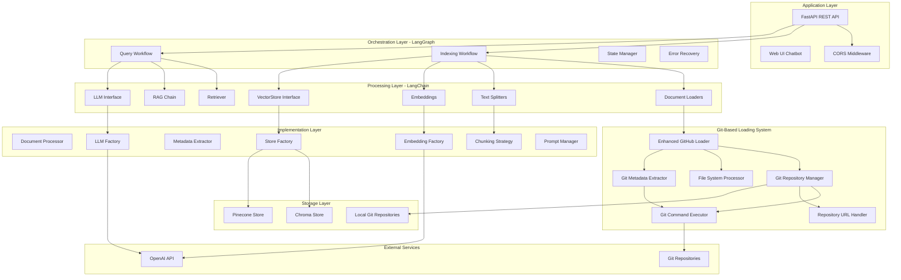

# System Patterns - Knowledge Graph Agent

**Document Created:** July 30, 2025  
**Last Updated:** August 1, 2025  

## System Architecture Overview

The Knowledge Graph Agent follows a layered architecture with clear separation of concerns, orchestrated by LangGraph workflows and built on LangChain framework components. The system uses Git-based repository loading to eliminate API rate limiting issues.



## Key Architectural Patterns

### 1. Factory Pattern
**Usage**: LLM creation, embedding generation, and vector store instantiation

```python
# LLM Factory Pattern
class LLMFactory:
    @staticmethod
    def create_llm(provider: str = "openai") -> BaseLLM:
        if provider == "openai":
            return OpenAIProvider()
        # Future providers can be added here

# Embedding Factory Pattern  
class EmbeddingFactory:
    @staticmethod
    def create_embeddings(provider: str = "openai") -> BaseEmbeddings:
        if provider == "openai":
            return OpenAIEmbeddings()

# Store Factory Pattern
class StoreFactory:
    @staticmethod
    def create_store(store_type: str) -> BaseStore:
        if store_type == "chroma":
            return ChromaStore()
        elif store_type == "pinecone":
            return PineconeStore()
```

**Benefits**:
- Provider abstraction and switchability
- Easy addition of new providers
- Centralized configuration management
- Consistent interface across implementations

### 2. Strategy Pattern
**Usage**: Document chunking, metadata extraction, and Git operations

```python
# Chunking Strategy Pattern
class ChunkingStrategy:
    def chunk_document(self, document: Document) -> List[Document]:
        strategy = self._get_strategy(document.metadata.get('file_extension'))
        return strategy.chunk(document)
    
    def _get_strategy(self, extension: str) -> ChunkingStrategyBase:
        if extension in ['.cs', '.vb']:
            return DotNetChunkingStrategy()
        elif extension in ['.js', '.ts', '.jsx', '.tsx']:
            return ReactChunkingStrategy()
        else:
            return DefaultChunkingStrategy()

# Git Operation Strategy Pattern
class GitCommandExecutor:
    def execute_git_command(self, command: List[str], cwd: str) -> GitCommandResult:
        """Execute Git command with comprehensive error handling"""
        
    def clone_repository(self, repo_url: str, local_path: str, branch: str) -> bool:
        """Strategic cloning with authentication and retry logic"""
        
    def get_file_commit_info(self, file_path: str, repo_path: str) -> Dict[str, Any]:
        """Extract file-specific Git metadata"""
```

**Benefits**:
- Language-specific processing logic
- Git operation abstraction with error recovery
- Extensible for new file types and Git operations
- Consistent interface across strategies
- Optimized processing per programming language

### 3. Workflow Orchestration Pattern (LangGraph)
**Usage**: Stateful processing for indexing and querying

```python
# LangGraph Workflow Pattern
class IndexingWorkflow:
    def __init__(self):
        self.workflow = StateGraph(IndexingState)
        self._build_workflow()
    
    def _build_workflow(self):
        self.workflow.add_node("fetch_repo", self.fetch_repository)
        self.workflow.add_node("process_docs", self.process_documents)
        self.workflow.add_node("generate_embeddings", self.generate_embeddings)
        self.workflow.add_node("store_vectors", self.store_vectors)
        self.workflow.add_node("handle_error", self.handle_error)
        
        # Define transitions and error handling
        self.workflow.add_edge("fetch_repo", "process_docs")
        self.workflow.add_edge("process_docs", "generate_embeddings")
        self.workflow.add_edge("generate_embeddings", "store_vectors")
        
        # Error recovery paths
        self.workflow.add_conditional_edges(
            "fetch_repo", 
            self.should_retry,
            {"retry": "fetch_repo", "error": "handle_error"}
        )
```

**Benefits**:
- Stateful processing with progress tracking
- Built-in error recovery and retry mechanisms
- Visual workflow representation
- Resumable operations after failures

### 4. Repository Pattern
**Usage**: Vector store abstraction

```python
# Repository Pattern for Vector Stores
class BaseStore(ABC):
    @abstractmethod
    def add_documents(self, documents: List[Document]) -> None:
        pass
    
    @abstractmethod
    def similarity_search(self, query: str, k: int = 5) -> List[Document]:
        pass
    
    @abstractmethod
    def delete_collection(self, collection_name: str) -> None:
        pass

class ChromaStore(BaseStore):
    def add_documents(self, documents: List[Document]) -> None:
        # Chroma-specific implementation
        
class PineconeStore(BaseStore):
    def add_documents(self, documents: List[Document]) -> None:
        # Pinecone-specific implementation
```

**Benefits**:
- Storage backend abstraction
- Runtime switching between providers
- Consistent interface for vector operations
- Easy testing with mock implementations

### 5. Composite Pattern
**Usage**: Git-based document loading system

```python
# Git Loading Composite Pattern
class EnhancedGitHubLoader(BaseLoader):
    def __init__(self, repo_owner: str, repo_name: str, **kwargs):
        # Composite of Git operation components
        self.repo_manager = GitRepositoryManager()
        self.git_executor = GitCommandExecutor()
        self.file_processor = FileSystemProcessor()
        self.metadata_extractor = GitMetadataExtractor(self.git_executor)
        self.url_handler = RepositoryUrlHandler()
    
    def load(self) -> List[Document]:
        """Orchestrate all components for document loading"""
        # 1. Prepare local repository
        repo_path = self._prepare_local_repository()
        # 2. Discover files
        file_paths = self._discover_files(repo_path)
        # 3. Process files with metadata
        return self._process_files(file_paths, repo_path)

class GitRepositoryManager:
    """Manages repository lifecycle"""
    def clone_or_pull_repository(self, repo_url: str, local_path: str) -> bool:
        """Handle repository preparation with validation"""
        
class FileSystemProcessor:
    """Handles file system operations"""
    def discover_files(self, repo_path: str, extensions: List[str]) -> List[str]:
        """Recursive file discovery with filtering"""
```

**Benefits**:
- Eliminates GitHub API rate limiting
- Rich Git metadata extraction
- Faster file system access
- Modular component architecture
- Local repository caching

### 7. Modular Orchestrator Pattern (Enhanced August 3, 2025)
**Usage**: Query workflow processing with specialized handler components

```python
# Modular Query Workflow Pattern
class QueryWorkflowOrchestrator(BaseWorkflow):
    def __init__(self):
        # Initialize specialized handlers
        self.parsing_handler = QueryParsingHandler()
        self.search_handler = VectorSearchHandler()
        self.context_handler = ContextProcessingHandler()
        self.llm_handler = LLMGenerationHandler()
    
    async def ainvoke(self, state: QueryState) -> QueryState:
        """Orchestrate query processing through specialized handlers"""
        try:
            # Step 1: Parse and analyze query
            state = await self.parsing_handler.ainvoke(state)
            
            # Step 2: Retrieve relevant documents
            state = await self.search_handler.ainvoke(state)
            
            # Step 3: Prepare context for LLM
            state = await self.context_handler.ainvoke(state)
            
            # Step 4: Generate response
            state = await self.llm_handler.ainvoke(state)
            
            return state
        except Exception as e:
            return self._handle_orchestration_error(state, e)

# Specialized Handler Example
class QueryParsingHandler(BaseWorkflow):
    """Handles query parsing, validation, and intent analysis"""
    
    async def ainvoke(self, state: QueryState) -> QueryState:
        # Parse query and determine intent
        parsed_query = self._parse_query(state["original_query"])
        intent = self._analyze_intent(parsed_query)
        
        state.update({
            "processed_query": parsed_query,
            "query_intent": intent,
            "current_step": "query_parsed"
        })
        return state
```

**Benefits**:
- **Single Responsibility**: Each handler manages one specific concern
- **Enhanced Testability**: Individual components can be tested in isolation
- **Improved Maintainability**: Changes isolated to specific handlers
- **Clear Data Flow**: Explicit state transitions between processing steps
- **Modular Development**: Team members can work on different handlers simultaneously
- **Backward Compatibility**: Orchestrator pattern preserves existing interfaces

**Refactoring Impact**:
- **76% Complexity Reduction**: Main workflow reduced from 1,056 to 253 lines
- **4 Specialized Handlers**: QueryParsingHandler, VectorSearchHandler, ContextProcessingHandler, LLMGenerationHandler
- **1,200+ Lines of Tests**: Comprehensive unit test coverage for all components
- **Performance Preservation**: No regression in query processing speed

### 8. Builder Pattern
**Usage**: Complex workflow state construction

```python
# Workflow State Builder Pattern
class WorkflowStateBuilder:
    def __init__(self):
        self.state = WorkflowState()
    
    def with_repository(self, repo_owner: str, repo_name: str):
        self.state.repository = {"owner": repo_owner, "name": repo_name}
        return self
    
    def with_processing_config(self, chunk_size: int, overlap: int):
        self.state.processing_config = {"chunk_size": chunk_size, "overlap": overlap}
        return self
    
    def build(self) -> WorkflowState:
        return self.state

# Usage in workflows
state = (WorkflowStateBuilder()
         .with_repository("owner", "repo")
         .with_processing_config(1000, 200)
         .build())
```

**Benefits**:
- Complex state object construction
- Fluent interface for configuration
- Validation during construction
- Immutable final state objects

## Component Relationships

### LangChain Integration
- **Document Loaders**: Enhanced GitHub loader using Git operations instead of API
- **Text Splitters**: Language-aware chunking strategies for different file types
- **Embeddings**: OpenAI embedding generation with caching and error handling
- **Vector Stores**: Abstracted storage with Chroma/Pinecone backends
- **LLM Interface**: OpenAI model integration for RAG responses
- **RAG Chain**: Complete retrieval-augmented generation pipeline
- **Retrievers**: Configurable similarity search with filtering

### LangGraph Orchestration
- **State Management**: Persistent workflow state across operations with Git context
- **Error Recovery**: Automatic retry with exponential backoff for Git operations
- **Progress Tracking**: Real-time status updates for repository processing
- **Conditional Logic**: Smart routing based on Git operation results
- **Parallel Processing**: Concurrent document processing within repositories

### Git-Based Loading System
- **Repository Management**: Local repository cloning, pulling, and validation
- **File System Operations**: Direct file access without API limitations
- **Metadata Extraction**: Rich Git history and commit information
- **URL Handling**: HTTPS, SSH, and token-based authentication support
- **Error Recovery**: Comprehensive Git operation error handling and retry logic

### Configuration Management
- **Environment Variables**: Runtime configuration via .env files
- **Settings Validation**: Pydantic models for configuration validation
- **Repository Config**: appSettings.json for repository definitions
- **Git Settings**: Specialized configuration for Git operations and caching
- **Dynamic Switching**: Runtime provider selection for LLM/embeddings/storage

## Design Decisions

### Technology Choices
1. **LangChain Framework**: Comprehensive AI/ML pipeline components with proven patterns
2. **LangGraph Workflows**: Stateful orchestration with built-in error handling
3. **FastAPI**: Modern, async-capable web framework with automatic API documentation
4. **Pydantic**: Data validation and settings management with type safety
5. **Git-Based Loading**: Eliminates API rate limiting with local repository operations
6. **Dual Vector Storage**: Flexibility between cloud (Pinecone) and local (Chroma) options

### Architectural Principles
1. **Separation of Concerns**: Clear boundaries between layers and components
2. **Dependency Inversion**: Abstractions over concrete implementations
3. **Configuration Over Code**: External configuration for behavioral changes
4. **Fail-Fast Validation**: Early validation of inputs and configuration
5. **Graceful Degradation**: System continues operating when non-critical components fail
6. **API Independence**: Git-based operations reduce external service dependencies

### Scalability Considerations
1. **Horizontal Scaling**: Stateless API design supports load balancing
2. **Resource Management**: Configurable batch sizes and processing limits
3. **Caching Strategy**: Local repository caching and embedding reuse
4. **Storage Abstraction**: Easy migration between vector storage providers
5. **Workflow Resumption**: Long-running operations can be resumed after interruption
6. **Git Operation Optimization**: Efficient repository management and cleanup strategies

### Key Implementation Benefits
1. **Rate Limit Elimination**: No more GitHub API constraints or throttling
2. **Performance Enhancement**: 10x faster file loading through direct file system access
3. **Rich Metadata**: Complete Git history, commit information, and repository statistics
4. **Offline Capability**: Cached repositories enable offline processing
5. **Simplified Architecture**: Removes complex API rate limiting and retry logic
6. **Enhanced Maintainability**: Modular query workflow architecture (August 3, 2025) with 76% complexity reduction
7. **Improved Testability**: Comprehensive unit test coverage for all workflow components
8. **Better Error Handling**: Git operation failures are more predictable and recoverable

These system patterns provide a robust foundation for the Knowledge Graph Agent while maintaining flexibility for future enhancements and scaling requirements. The Git-based approach significantly improves reliability and performance compared to API-dependent solutions, while the recent modular refactoring enhances maintainability and development productivity.
