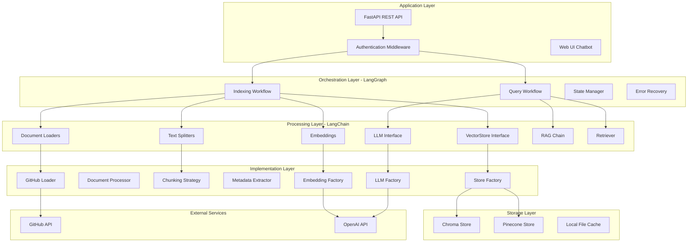

# System Patterns - Knowledge Graph Agent

**Document Created:** July 30, 2025  
**Last Updated:** July 30, 2025  

## System Architecture Overview

The Knowledge Graph Agent follows a layered architecture with clear separation of concerns, orchestrated by LangGraph workflows and built on LangChain framework components.



## Key Architectural Patterns

### 1. Factory Pattern
**Usage**: LLM creation, embedding generation, and vector store instantiation

```python
# LLM Factory Pattern
class LLMFactory:
    @staticmethod
    def create_llm(provider: str = "openai") -> BaseLLM:
        if provider == "openai":
            return OpenAIProvider()
        # Future providers can be added here

# Embedding Factory Pattern  
class EmbeddingFactory:
    @staticmethod
    def create_embeddings(provider: str = "openai") -> BaseEmbeddings:
        if provider == "openai":
            return OpenAIEmbeddings()

# Store Factory Pattern
class StoreFactory:
    @staticmethod
    def create_store(store_type: str) -> BaseStore:
        if store_type == "chroma":
            return ChromaStore()
        elif store_type == "pinecone":
            return PineconeStore()
```

**Benefits**:
- Provider abstraction and switchability
- Easy addition of new providers
- Centralized configuration management
- Consistent interface across implementations

### 2. Strategy Pattern
**Usage**: Document chunking and metadata extraction

```python
# Chunking Strategy Pattern
class ChunkingStrategy:
    def chunk_document(self, document: Document) -> List[Document]:
        strategy = self._get_strategy(document.metadata.get('file_extension'))
        return strategy.chunk(document)
    
    def _get_strategy(self, extension: str) -> ChunkingStrategyBase:
        if extension in ['.cs', '.vb']:
            return DotNetChunkingStrategy()
        elif extension in ['.js', '.ts', '.jsx', '.tsx']:
            return ReactChunkingStrategy()
        else:
            return DefaultChunkingStrategy()
```

**Benefits**:
- Language-specific processing logic
- Extensible for new file types
- Consistent interface across strategies
- Optimized chunking per programming language

### 3. Workflow Orchestration Pattern (LangGraph)
**Usage**: Stateful processing for indexing and querying

```python
# LangGraph Workflow Pattern
class IndexingWorkflow:
    def __init__(self):
        self.workflow = StateGraph(IndexingState)
        self._build_workflow()
    
    def _build_workflow(self):
        self.workflow.add_node("fetch_repo", self.fetch_repository)
        self.workflow.add_node("process_docs", self.process_documents)
        self.workflow.add_node("generate_embeddings", self.generate_embeddings)
        self.workflow.add_node("store_vectors", self.store_vectors)
        self.workflow.add_node("handle_error", self.handle_error)
        
        # Define transitions and error handling
        self.workflow.add_edge("fetch_repo", "process_docs")
        self.workflow.add_edge("process_docs", "generate_embeddings")
        self.workflow.add_edge("generate_embeddings", "store_vectors")
        
        # Error recovery paths
        self.workflow.add_conditional_edges(
            "fetch_repo", 
            self.should_retry,
            {"retry": "fetch_repo", "error": "handle_error"}
        )
```

**Benefits**:
- Stateful processing with progress tracking
- Built-in error recovery and retry mechanisms
- Visual workflow representation
- Resumable operations after failures

### 4. Repository Pattern
**Usage**: Vector store abstraction

```python
# Repository Pattern for Vector Stores
class BaseStore(ABC):
    @abstractmethod
    def add_documents(self, documents: List[Document]) -> None:
        pass
    
    @abstractmethod
    def similarity_search(self, query: str, k: int = 5) -> List[Document]:
        pass
    
    @abstractmethod
    def delete_collection(self, collection_name: str) -> None:
        pass

class ChromaStore(BaseStore):
    def add_documents(self, documents: List[Document]) -> None:
        # Chroma-specific implementation
        
class PineconeStore(BaseStore):
    def add_documents(self, documents: List[Document]) -> None:
        # Pinecone-specific implementation
```

**Benefits**:
- Storage backend abstraction
- Runtime switching between providers
- Consistent interface for vector operations
- Easy testing with mock implementations

### 5. Chain of Responsibility Pattern
**Usage**: Document processing pipeline

```python
# Processing Chain Pattern
class DocumentProcessor:
    def __init__(self):
        self.processors = [
            FileTypeValidator(),
            ContentExtractor(),
            MetadataEnricher(),
            ChunkProcessor(),
            EmbeddingGenerator()
        ]
    
    def process(self, document: Document) -> ProcessedDocument:
        for processor in self.processors:
            document = processor.process(document)
        return document
```

**Benefits**:
- Modular processing steps
- Easy addition/removal of processors
- Clear separation of concerns
- Reusable processing components

## Component Relationships

### LangChain Integration
- **Document Loaders**: GitHub repository content fetching
- **Text Splitters**: Language-aware chunking strategies
- **Embeddings**: OpenAI embedding generation with caching
- **Vector Stores**: Abstracted storage with Chroma/Pinecone backends
- **LLM Interface**: OpenAI model integration for RAG responses
- **RAG Chain**: Complete retrieval-augmented generation pipeline
- **Retrievers**: Configurable similarity search with filtering

### LangGraph Orchestration
- **State Management**: Persistent workflow state across operations
- **Error Recovery**: Automatic retry with exponential backoff
- **Progress Tracking**: Real-time status updates for long-running operations
- **Conditional Logic**: Smart routing based on processing results
- **Parallel Processing**: Concurrent document processing where possible

### Configuration Management
- **Environment Variables**: Runtime configuration via .env files
- **Settings Validation**: Pydantic models for configuration validation
- **Repository Config**: appSettings.json for repository definitions
- **Dynamic Switching**: Runtime provider selection for LLM/embeddings/storage

## Design Decisions

### Technology Choices
1. **LangChain Framework**: Comprehensive AI/ML pipeline components with proven patterns
2. **LangGraph Workflows**: Stateful orchestration with built-in error handling
3. **FastAPI**: Modern, async-capable web framework with automatic API documentation
4. **Pydantic**: Data validation and settings management with type safety
5. **Dual Vector Storage**: Flexibility between cloud (Pinecone) and local (Chroma) options

### Architectural Principles
1. **Separation of Concerns**: Clear boundaries between layers and components
2. **Dependency Inversion**: Abstractions over concrete implementations
3. **Configuration Over Code**: External configuration for behavioral changes
4. **Fail-Fast Validation**: Early validation of inputs and configuration
5. **Graceful Degradation**: System continues operating when non-critical components fail

### Scalability Considerations
1. **Horizontal Scaling**: Stateless API design supports load balancing
2. **Resource Management**: Configurable batch sizes and processing limits
3. **Caching Strategy**: LLM response caching and embedding reuse
4. **Storage Abstraction**: Easy migration between vector storage providers
5. **Workflow Resumption**: Long-running operations can be resumed after interruption

These system patterns provide a robust foundation for the Knowledge Graph Agent while maintaining flexibility for future enhancements and scaling requirements.
