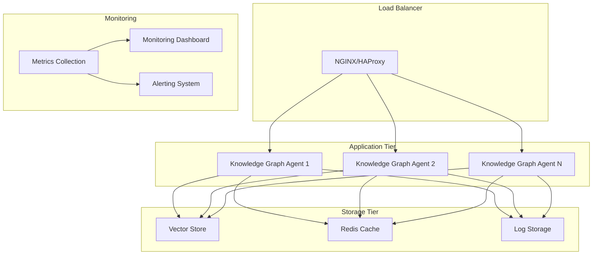

# [TASK009] - Production Deployment Configuration

**Status:** Pending  
**Added:** August 2, 2025  
**Updated:** August 2, 2025

## Original Request
Optimize and configure the Knowledge Graph Agent for production deployment with proper security, monitoring, and scalability considerations.

## Thought Process
The Knowledge Graph Agent has achieved complete backend implementation with sophisticated architecture, but requires production-ready configuration and deployment optimization. Current deployment status:

1. **Development Configuration**: Current setup optimized for development with basic Docker configuration
2. **Production Requirements**: Need security hardening, performance optimization, and monitoring integration
3. **Scalability Considerations**: System should support production load and horizontal scaling
4. **Security Hardening**: Production-grade security configuration and credential management

### Production Deployment Requirements
1. **Docker Optimization**: Multi-stage builds, minimal images, security hardening
2. **Environment Security**: Secure credential management and environment variable handling
3. **Monitoring Integration**: Comprehensive logging, metrics collection, and health monitoring
4. **Performance Optimization**: Production-ready configuration for optimal performance
5. **Scalability Configuration**: Support for horizontal scaling and load balancing

### Current State Analysis
- **Existing Docker Setup**: Basic docker-compose.yml for development
- **Environment Configuration**: .env file structure in place
- **Security**: API key authentication implemented, needs production hardening
- **Monitoring**: Basic health checks implemented, needs comprehensive monitoring
- **Documentation**: Technical documentation exists, needs production deployment guide

## Implementation Plan

### Phase 1: Docker Production Optimization
- **Multi-Stage Dockerfile**: Optimize build process with separated build and runtime stages
- **Minimal Runtime Images**: Use slim base images for reduced attack surface and size
- **Security Hardening**: Non-root user, proper file permissions, and security scanning
- **Build Optimization**: Layer caching, dependency optimization, and build time reduction

### Phase 2: Environment and Security Hardening
- **Secret Management**: Implement secure credential management (Docker secrets, environment encryption)
- **Environment Validation**: Production environment variable validation and defaults
- **Security Configuration**: HTTPS enforcement, secure headers, and CORS configuration
- **Authentication Enhancement**: Production-ready API key management and rotation

### Phase 3: Monitoring and Logging Integration
- **Structured Logging**: Enhanced logging with structured formats and correlation IDs
- **Metrics Collection**: Performance metrics, resource usage, and application metrics
- **Health Monitoring**: Comprehensive health checks for all system components
- **Alerting Configuration**: Critical error alerts and performance threshold monitoring

### Phase 4: Performance and Scalability Configuration
- **Resource Optimization**: Memory limits, CPU allocation, and resource management
- **Caching Strategy**: Production caching for embeddings, queries, and metadata
- **Database Configuration**: Optimized vector storage configuration for production
- **Load Balancing**: Configuration for horizontal scaling and traffic distribution

### Phase 5: Deployment Automation and Documentation
- **CI/CD Integration**: Automated build, test, and deployment pipeline
- **Infrastructure as Code**: Docker Compose or Kubernetes configuration for production
- **Backup and Recovery**: Data backup strategies and disaster recovery procedures
- **Production Documentation**: Complete deployment guide and operational procedures

## Progress Tracking

**Overall Status:** Pending - 0% Complete

### Subtasks
| ID | Description | Status | Updated | Notes |
|----|-------------|--------|---------|-------|
| 1.1 | Multi-stage Dockerfile optimization | Not Started | | Separate build and runtime stages |
| 1.2 | Minimal runtime image configuration | Not Started | | Use slim base images for security |
| 1.3 | Docker security hardening | Not Started | | Non-root user, permissions, scanning |
| 1.4 | Build process optimization | Not Started | | Layer caching and dependency optimization |
| 2.1 | Secret management implementation | Not Started | | Secure credential handling |
| 2.2 | Production environment validation | Not Started | | Environment variable validation |
| 2.3 | Security configuration enhancement | Not Started | | HTTPS, headers, CORS hardening |
| 2.4 | Authentication system hardening | Not Started | | Production API key management |
| 3.1 | Structured logging implementation | Not Started | | Enhanced logging with correlation |
| 3.2 | Metrics collection setup | Not Started | | Performance and resource metrics |
| 3.3 | Comprehensive health monitoring | Not Started | | All component health checks |
| 3.4 | Alerting configuration | Not Started | | Critical alerts and thresholds |
| 4.1 | Resource optimization configuration | Not Started | | Memory, CPU, and resource limits |
| 4.2 | Production caching strategy | Not Started | | Embeddings and query caching |
| 4.3 | Vector storage optimization | Not Started | | Production database configuration |
| 4.4 | Load balancing configuration | Not Started | | Horizontal scaling support |
| 5.1 | CI/CD pipeline integration | Not Started | | Automated deployment pipeline |
| 5.2 | Infrastructure as Code setup | Not Started | | Production deployment configuration |
| 5.3 | Backup and recovery procedures | Not Started | | Data protection strategies |
| 5.4 | Production documentation | Not Started | | Deployment and operational guides |

## Progress Log
*No progress entries yet - task not started*

## Production Configuration Requirements

### Docker Production Optimization
```dockerfile
# Multi-stage build example
FROM python:3.11-slim as builder
# Build dependencies and application

FROM python:3.11-slim as runtime
# Minimal runtime with only necessary components
```

### Security Configuration
- **HTTPS Enforcement**: SSL/TLS termination and redirect configuration
- **Secure Headers**: CSP, HSTS, X-Frame-Options, and other security headers
- **API Rate Limiting**: Production-appropriate rate limits and throttling
- **Credential Management**: Secure storage and rotation of API keys and secrets

### Monitoring and Observability
- **Application Metrics**: Request rates, response times, error rates
- **System Metrics**: CPU, memory, disk usage, and network performance
- **Business Metrics**: Repository indexing rates, query success rates, user activity
- **Log Aggregation**: Centralized logging with structured formats and correlation

### Performance Optimization
- **Resource Limits**: Appropriate memory and CPU limits for containers
- **Caching Strategy**: Redis or in-memory caching for frequently accessed data
- **Database Optimization**: Vector storage configuration for production workloads
- **Connection Pooling**: Efficient connection management for external services

### Scalability Configuration
- **Horizontal Scaling**: Load balancer configuration and session management
- **Database Scaling**: Vector storage replication and sharding strategies
- **Microservice Architecture**: Service separation and inter-service communication
- **Resource Monitoring**: Auto-scaling triggers and performance thresholds

## Production Deployment Architecture



## Deployment Options

### Option 1: Docker Compose (Recommended for Small-Medium Scale)
- **Benefits**: Simple deployment, easy configuration, cost-effective
- **Best For**: Single server deployment, development staging, small teams
- **Configuration**: Enhanced docker-compose.yml with production optimizations

### Option 2: Kubernetes (Recommended for Large Scale)
- **Benefits**: Auto-scaling, high availability, enterprise features
- **Best For**: Large-scale deployment, enterprise environments, high availability requirements
- **Configuration**: Kubernetes manifests with proper resource management

### Option 3: Cloud Platform (AWS ECS, Azure Container Instances)
- **Benefits**: Managed infrastructure, cloud-native features, integrated monitoring
- **Best For**: Cloud-first organizations, managed service preference
- **Configuration**: Cloud-specific deployment templates

## Success Criteria
- **Security Hardened**: Production-grade security configuration and credential management
- **Performance Optimized**: Resource-efficient configuration with appropriate limits and caching
- **Monitoring Ready**: Comprehensive observability with metrics, logs, and alerts
- **Scalability Enabled**: Configuration supporting horizontal scaling and load distribution
- **Documentation Complete**: Comprehensive deployment guide and operational procedures
- **Automated Deployment**: CI/CD pipeline ready for automated production deployment

## Risk Assessment
- **Low Risk**: Current system is well-architected and production-ready at code level
- **Medium Risk**: Configuration optimization requires careful testing and validation
- **High Value**: Production readiness enables real-world deployment and user access
- **Dependencies**: May require additional infrastructure components (Redis, monitoring tools)

This task will prepare the sophisticated Knowledge Graph Agent for production deployment with enterprise-grade configuration and operational readiness.
